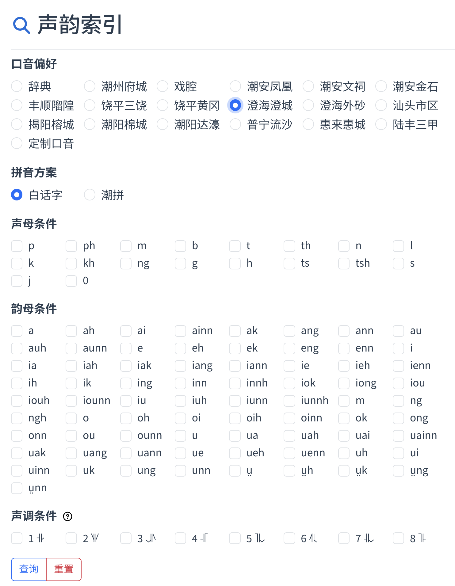
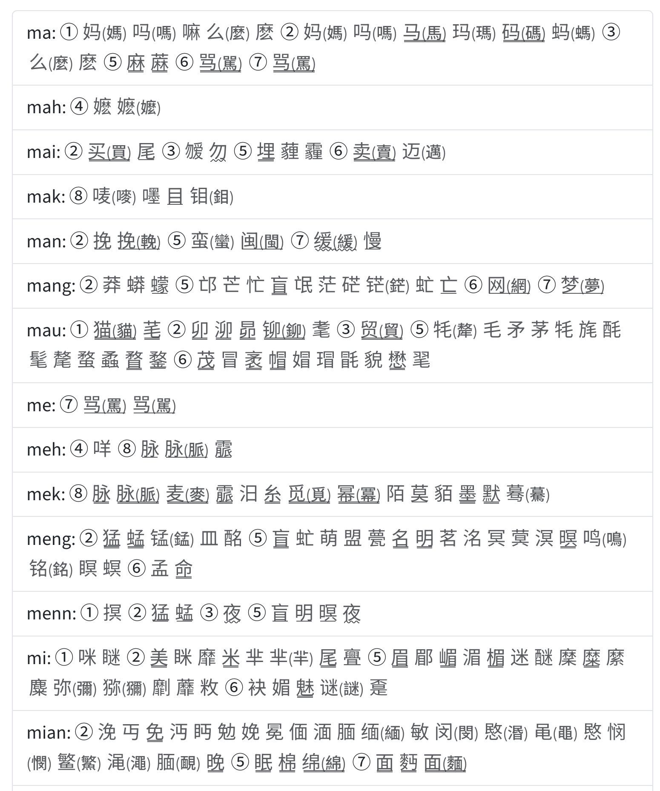
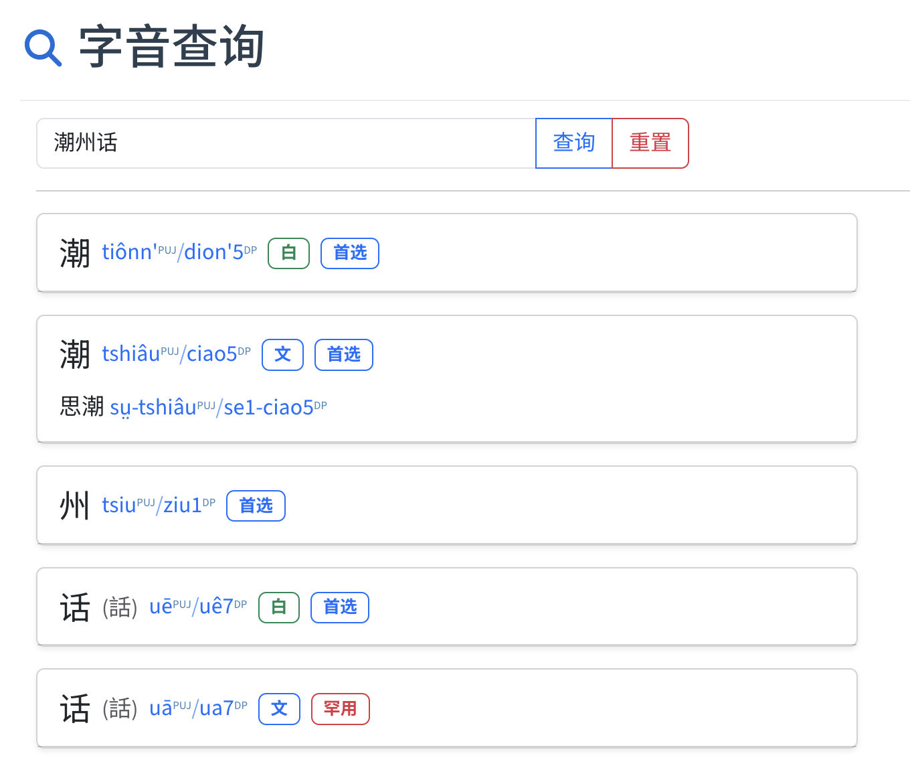
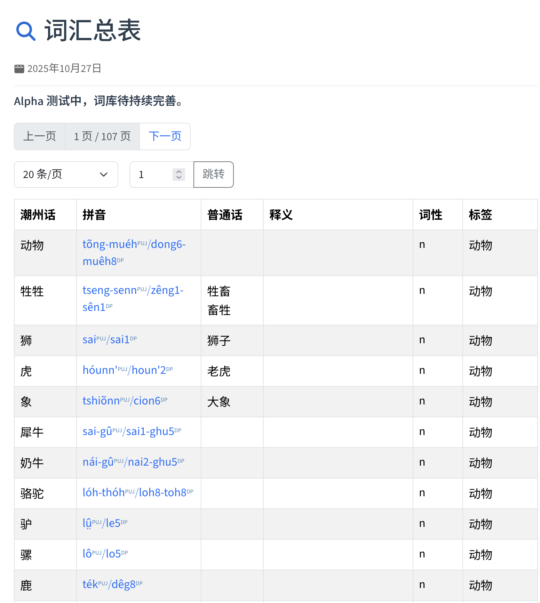
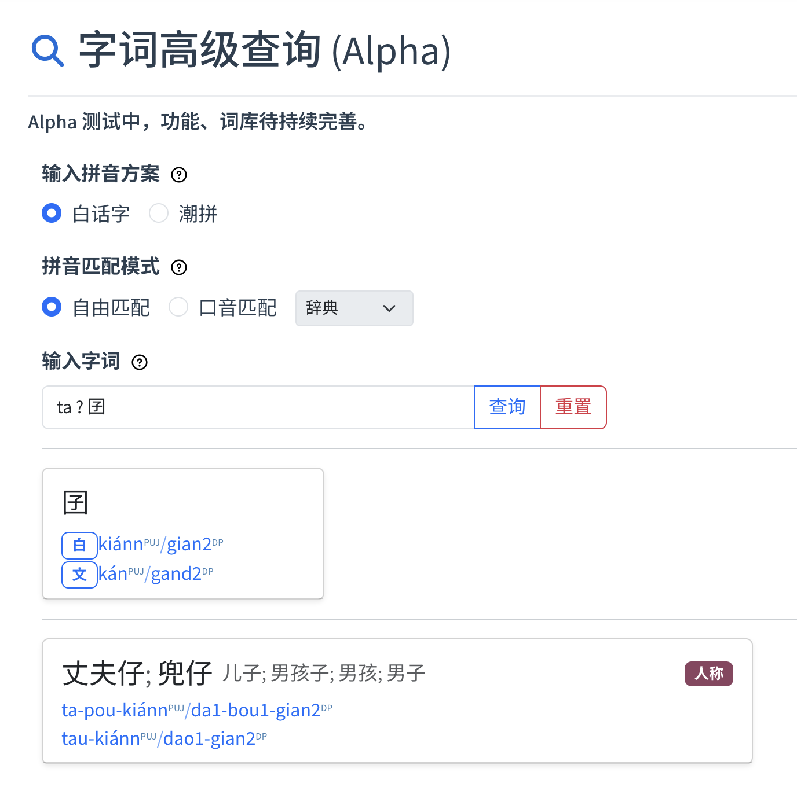
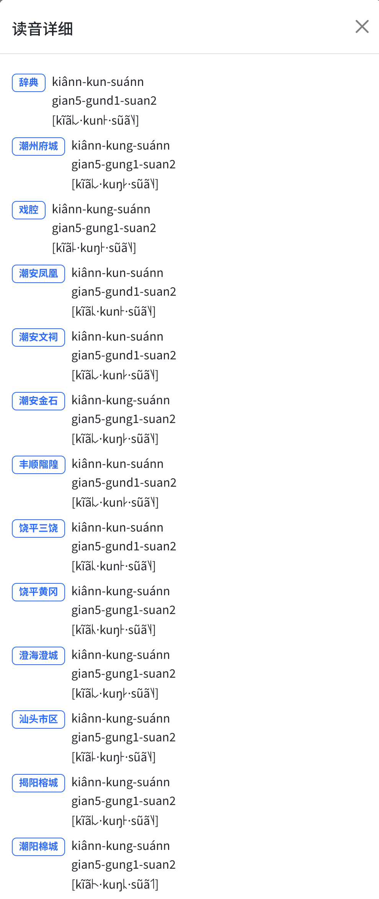

# PUJDICT

**潮汕方言白话字辞典/Péh-Uē-Jī dictionary of the Teochew-Swatow dialect**

开发中，欢迎参与提议和订正。
字典条目及使用方式参见[此文档](./src/.vuepress/public/data/README.md)。

## 项目现状

- 功能方面：已基本完成字查音、音查字、词汇搜索，兼容多地口音，支持白话字和潮拼两种拼音方案。
- 数据方面：
  - 字表：完成了字表以及字音的校对，标注了每个字音的使用频率（首选、常用、少用、罕用四档），有多个字音的，标注了每个字音的类型（白读、文读、俗读三类），同时记录了现有字典不录的大量文读音。
  - 口音：已录包含今天三个市中心、传统的潮州八县等多地口音（潮州、汕头、揭阳，潮安、饶平、丰顺、澄海、潮阳、普宁、惠来、陆丰等），并建模了相应的口音规则，也添加了单字调和变调数据用于支持实际调值的显示。
  - 词表：暂不完善，目前只有一个 2000 词左右的小型词库用于各项功能的验证，待后续持续扩充。

## 功能展示

1. 字音索引查询，可选口音，筛选声母、韵母、声调条件。

2. 字音索引结果，可按需获取同音字表。单下划线为白读，双下划线为文读，波浪线为俗读。

3. 字音查询，提示文/白/俗音，并标注了选音建议（使用频率）。字义原则上只标注与普通话不一致的多音字用法。

4. 现有词库总表，待持续扩充。

5. 字词混合查询，支持拼音汉字混查、多种口音混查、异体字混查。卡片中展示潮州话写法以及普通话相应表达。

6. 读音详情，含各地口音（可调整数量），潮拼、白话字、国际音标。

## 开源协议

本仓库中的代码类文件以 AGPL 3.0 协议开源，文档类文件以 CC-BY-SA 4.0 协议开源。方言文化应是属于所有人的文化遗产，本着弘扬和发展优秀传统文化的精神，不为我们家乡方言相关知识的传播设限，开发者、读者可在**同样保持知识内容和源码开源**的基础上使用本仓库中的内容。
