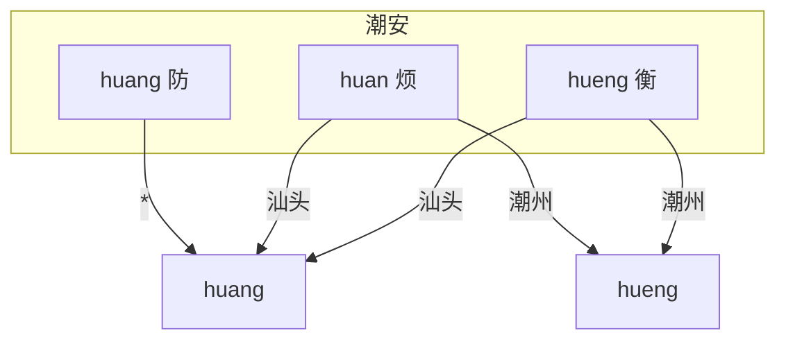
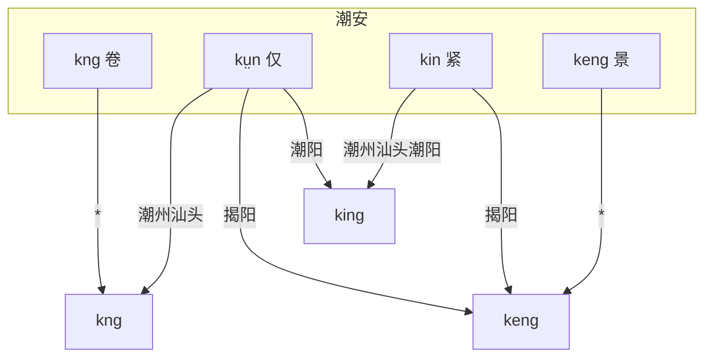

# 白话字拼音方案

## 为什么使用白话字

目前市面上多数潮州话字典采用的拼音方案为广东省教育部门于 1960 年 9 月公布的“潮州话拼音方案”，简称“潮拼”。
该套拼音方案以汕头市的潮州话语音为基础，兼顾汉语拼音方案的转写习惯，也给出了一些不同地区口音的转写规则，例如 -io, -iam
在潮州音中转写为 -iê, -iem，等等。

但是，现有的潮州话辞典，通常只是以汕头或潮州的口音为标准音进行记录，
问题在于，汕头和潮州地区的口音（主要是韵母的变化），到其他地区的口音并不是一对一映射，因而遇到其他地区口音的别音只能另外标注。
此外还存在一部分无法标注别音的情况——今天潮州话仍有部分地区保留“前鼻音”韵尾 -n，
而现代潮州音和汕头音都没有该韵尾，潮拼方案中也没有该韵尾（潮拼方案中 -n 被用于表示鼻化韵），导致一部分字无法转写到保留前鼻音韵尾的口音中。
下图以潮安（凤凰）地区为例，展示部分字例在到其他地区的转读情况（由于存在 -n 韵尾，拼音采用白话字标注，声调略）。

可以看到，从潮安的口音转到潮州、汕头、揭阳、潮阳等地的口音，是一种“降维操作”，各地的每个转读后的音节对应着潮安地区的多个音节，因此，从转读后的音是无法直接推回潮安地区的读音的。

在《潮州音字典》（吴重华、林适民主编，1957
年出版）中，记录了潮安、澄海、饶平、揭阳、潮阳等地区的不同口音，该字典也记录了潮安地区完整保留了韵母“安”/“红”、“嫣”/“央”，“冤”/“汪”等“前后鼻音”的对立。
不过，该字典出版于潮州话拼音方案公布前，字典中使用反切法注音，不太适合学习和交流。

为了更好地兼顾潮汕各地发音，本辞典主要采用白话字（Péh-Uē-Jī, PUJ）拼音方案进行注音。
辞典所记录的通用白话字避免了重复记音，兼顾各地的发音习惯，并参考台罗方案，对传统白话字进行了改进。
改进后的通用白话字适用于标注潮州话任意地区的读音，各地可按各自的语言习惯转读，转读规则均为一对一映射（具体参见后文转读规则）。

白话字不是一种新的拉丁化方案，早在 19 世纪末就被许多来华传教士用于记录包括潮州话在内的各地闽南语发音。
本辞典所用白话字拼音，主要参考了林雄成《汕头方言手册》中的拼音，以及台湾省教育部门发布的《台湾闽南语罗马字拼音方案》（简称“台罗”）。

## 声母

现代潮州话共有 17 个声母（加上零声母一共 18 个），潮汕各地在声母上不存在明显差异。

| 例字       | 白话字 | 潮拼 | 国际音标 |
|----------|-----|----|------|
| 波^1^     | p   | b  | p    |
| 颇        | ph  | p  | pʰ   |
| 毛        | m   | m  | m    |
| 无^2^     | b   | bh | b    |
| 多        | t   | d  | t    |
| 胎        | th  | t  | tʰ   |
| 娜^3^     | n   | n  | n    |
| 罗        | l   | l  | l    |
| 哥        | k   | g  | k    |
| 戈        | kh  | k  | kʰ   |
| 俄        | ng  | ng | ŋ    |
| 鹅        | g   | gh | ɡ    |
| 何        | h   | h  | h    |
| 之^4^     | ts  | z  | ts   |
| 徐        | tsh | c  | tsʰ  |
| 思        | s   | s  | s    |
| 而^5^     | j   | r  | dz   |
| (零声母)^6^ |     |    | ʔ    |

::: note

1. 在汕头、潮阳、普宁、惠来、陆丰等地（主要是西部和南部一些地区），近年来出现了声母 p, ph, m, b, h 在接元音 u
   时，读为唇齿音 [p̪f], [p̪fʰ], [ɱ], [b̪v], [ɸ]/[f] 的现象，例如：飞 <TPuj puj="pfue1"/>，梅 <TPuj puj="bvue5"/>，
   皮 <TPuj puj="pfhue5"/>，糜 <TPuj puj="mvue5"/>，化 <TPuj puj="fue3"/>。
   但唇齿音目前还在扩散过程中，仅在 u 元音之前作为声母的自由变体，并没有产生音位对立，因此本辞典拼音中不予区分，依然记为 p,
   ph, m, b, h。

2. 与其他闽南语方言类似，潮州话中的浊塞音 [b], [ɡ] 实际上音值接近于 [ᵐb], [ᵑɡ]，即鼻冠音，是来源于 [m], [ŋ]
   的塞化，并非来源于中古全浊塞音（学界以“罗包规则”解释沿海闽语中的鼻冠音和鼻音的对立，参见【沈瑞清2023】）。在后接阳声韵时，潮州话中
   m/b, ng/g, n/l 这几对声母的选取，绝大多数情况下是唯一的：m/b 只取 m，b 只以 bu- 的形式出现；ng/g 只取 ng；n/l 如果接 ong
   只取 l，接其他 -ng 尾以及 -m/-n 尾时根据中古泥（娘）、来母选取。
3. 现代潮州话中，n, l 声母接 -m 韵尾的阳声韵时，在部分地区依然区分 n, l，而部分地区则 n, l
   声母混淆。虽然说话人惯用的声母可以用于区分地区口音，但随着各地沟通交流的深入，听话人很难预设说话人的口音，n, l
   声母在这些情况下已经基本无法用于辨义，例如：林 <TPuj puj="lim5"/> = <TPuj puj="nim5"/>，
   念 <TPuj puj="niam7"/> = <TPuj puj="liam7"/>，男 <TPuj puj="nam5"/> = <TPuj puj="lam5"/>，
   蓝 <TPuj puj="lam5"/> = <TPuj puj="nam5"/>
   ——“蓝色”等于“男色”。本辞典记录时，这些字的声母依然以中古泥（娘）、来母作为记录依据（简单来说，与普通话中对应声母相同）。
4. 齿头音 ts, tsh, s, j 在接介音 i 时可以发生腭化读作 [tɕ], [tɕʰ], [ɕ], [dʑ]
   ，同样是自由变体，不产生音位对立（不过在潮剧戏腔中，要求字正腔圆，不允许腭化）；而在传统白话字拼音方案中，ts/tsh 也有 ch/chh
   的写法，用于标记腭化后的读音，但与 ts/tsh 一组是互补的，因此本辞典与台罗方案保持一致，只采用 ts/tsh 进行标注。
5. 声母 j 也可读为 [z]。
6. 零声母拼音中不予标注，可以不发音，但在潮州话中通常将喉塞音 [ʔ] 读出来。

:::

## 韵母

### 单元音

现代潮州话共有以下 7 个单元音：

| 例字   | 白话字   | 潮拼  | 国际音标 |
|------|-------|-----|------|
| 亚^1^ | a     | a   | a    |
| 窝    | o     | o   | o    |
| 余^2^ | ṳ/ur  | e   | ɯ    |
| 倭^3^ | o̤/er | (o) | ə    |
| 哑    | e     | ê   | e    |
| 衣^4^ | i     | i   | i    |
| 污    | u     | u   | u    |

::: note

1. 元音的实际发音受个人习惯影响，有较大的个人差异。a 的实际发音可以是 [a]/[ᴀ]/[ɐ]；e 的实际发音可以是 [e]/[E]/[ɛ]；o
   的实际发音可以是 [o]/[ɔ]；ṳ 的实际发音可以是 [ɯ]/[ɤ]/[ə]/[ɿ]。元音整体上发音位置较央较高。

2. ṳ 在潮阳等地并入 u。在泉漳片闽南语，包括台湾强势腔中也多并入 u 或 i，因此该韵母在台罗中也没有明确标准。泉漳潮各地的闽南语白话字拼音方案中有许多不同写法，包括但不限于
   ṳ/ü/ɨ/ᵻ/ur/ir 等等。杜嘉德《厦英大辞典》中记为 u 上加两点，即 ü，但考虑到在字母上方标记声调时比较拥挤，本辞典采用卓威廉词典中的写法，即字母
   u 下加两点。输入不方便时，建议用 ur 或其他变体写法代替。
3. o̤ 主要存在于果、蟹摄一等字，以及山摄一等合口入声字白读层，例如：袋 <TPuj puj="tr7"/>、块 <TPuj puj="kr3"/>
   、胎 <TPuj puj="thr1"/>、
   罪 <TPuj puj="tsr6"/>、坐 <TPuj puj="tsr6"/>、夺 <TPuj puj="trh8"/>。
   该韵母在今天潮汕片闽南语中大多并入 o，但在陆丰、漳州、厦门、台湾强势腔中该韵母并入 e；在泉州，依然保留 [ə] 的音，并与
   o [o]、e [e] 韵母保持对立。为了能够兼容陆丰地区的发音，本辞典依然保留该韵母以便区分于 o/e，其记法取自泉州话白话字。泉州话白话字中将其记为
   o 上加两点，即 ö，本辞典与 ṳ 保持一致记为下加两点。
   输入不方便时，建议用 er 或其他变体写法代替。
   该韵母曾在晚清时期的潮州话中存在——高德《汉英潮州方言字典》（1883）的序言中提到：
   > The ù in such words as 汝, 去, lù, kù is sometimes pronounced u; as lu, ku. Also ù in such words as 代, 塊 tù kù is often pronounced ò; as tò, kò; and it may be remarked that when the ù
   sound
   is given in this class of words it is a more open sound than when it occurs in the class just before mentioned; the
   difference is easily perceptible, but does not seem capable of being represented by Roman letters.
   >
   > ù 在“汝”“去” lù kù 等字中有时会被读为 u，即 lu ku（西部部分地区的口音）。另外，ù 在“代”“塊” tù kù 等字中常被读为 ò，即 tò
   kò，需要说明的是，当 ù 出现在这类字中的时候，与前文刚提到的那一类相比，它是一个开口度更大的音，区别是很容易察觉的，但似乎难以用罗马字母来表示。

   高德字典的拼音系统中，用 ù、ò 表示汉字“余”“窝”的韵母。由此可见，该类字中出现的韵母是一个音质类似于 [ɯ]
   但开口度更大的韵母，那么就应该是一个接近 [ə] 的发音，与今天泉州话中的格局是一致的，但彼时也已开始出现与韵母 o
   的混同。
   事实上，该韵母今天依然存在于少部分地区（金石、沙溪、龙湖部分地方，参见 [p1an-lin-jung/teochew-g2p](https://github.com/p1an-lin-jung/teochew-g2p) 项目中的记录的“经典金石音”）。
4. i 和 u 可以作为齐齿呼和合口呼的介音出现。

:::

### 复元音

根据 6 个单元音，可以组合为 13 个复元音韵母：

| 例字 | 白话字 | 潮拼  | 国际音标 |
|----|-----|-----|------|
| 埃  | ai  | ai  | ai   |
| 欧  | au  | ao  | au   |
| 挨  | oi  | oi  | oi   |
| 乌  | ou  | ou  | ou   |
| 梳  | eu  | êu  | eu   |
| 呀  | ia  | ia  | ia   |
| 腰  | io  | io  | io   |
| 忧  | iu  | iu  | iu   |
| 妖  | iau | iou | iau  |
| 娃  | ua  | ua  | ua   |
| 锅  | ue  | uê  | ue   |
| 威  | ui  | ui  | ui   |
| 歪  | uai | uai | uai  |

::: note

潮州话中，韵母的发音在各地有较大的差别，例如：-io 在潮州、澄海等地读 -ie；-iau 在汕头、潮州、澄海等地读 -iou 或 -ieu 或
-io̤u；等等。
本辞典中，为了兼顾潮汕各地发音，将选用其中一种拼音标注方式作为通用的标注法，尽量做到一组拼音在各地进行转读，避免记录多组拼音。具体的选择标准和转读规则将在后文讨论。

:::

### 韵母后缀

潮州话的阳声韵、入声韵、鼻化韵，通过添加以下后缀表示：

| 白话字        | 潮拼   | 国际音标 | 例字     |         |
|------------|------|------|--------|---------|
| m          | m    | m    | 甘 kam  | 纤 siam  |
| n^1^       | (ng) | n    | 干 kan  | 仙 sian  |
| ng         | ng   | ŋ    | 刚 kang | 相 siang |
| nn/ⁿ ^234^ | n    | ◌̃   | 柑 kann | 声 siann |
| p          | b    | p̚   | 蛤 kap  | 涩 siap  |
| t          | (g)  | t̚   | 结 kat  | 设 siat  |
| k          | g    | k̚   | 角 kak  | 削 siak  |
| h^5^       | h    | ʔ    | 甲 kah  | 锡 siah  |

::: note

1. 包括潮汕三市市区在内的多数地区已经丢失 -n/-t 韵尾，并入 -ng/-k。但在少数地区仍有保留，特别是潮安县凤凰镇、丰顺县𨻧隍镇保留了完整的六个韵尾
   -an, -in, -ṳn, -un, -ian, -uan，在饶平三饶、揭东西部、揭西东部、普宁西部也不同程度地保留了 -an, -uan, -in, -un
   等韵母（见【吴芳2009】）。本辞典中，考虑到仍保留 -n/-t 的地区，也为了方便转读，记录拼音时仍保留 -n/-t。
   具体转读规则将在后文讨论。
   事实上，潮州话中的 -ng
   的发音位置并不是标准的 [ŋ]，其实际发音位置要稍靠前，接近 [ɲ]/[ȵ]，容易与齿龈音 [n]
   发生混淆，也因此导致许多潮汕人分不清普通话的前后鼻音、说不准普通话发音位置较为靠后的后鼻音 [ŋ]——这也是“潮普”口音的一大特点。

2. 非来源于阳声韵的鼻化韵在 -nn 之后加一个撇号 ' 表示，即 -nn'，例如：爱 <TPuj puj="ainn'3"/>。
3. 潮州话中，跟在鼻辅音声母 m, n, ng 之后的韵母元音都读为鼻化元音，阴声韵与来自阳声韵的鼻化韵已经完全混同。但是否标记 -nn
   则需要考虑韵母是否是来源于阳声韵的鼻化，例如：年 <TPuj puj="ninn5"/>——尼 <TPuj puj="ni5"/>，鳗 <TPuj puj="muann5"/>——
   麻 <TPuj puj="mua5"/>，尽管二者在读音上已经完全无法区分。鼻声母后的元音一律鼻化也是“潮普”口音的一大特点。
4. 在传统的白话字方案中，鼻化韵也常以上标的 n 即 ◌ⁿ 来记录，为了排版工整和输入方便，采用和台罗方案一致的 -nn 来记录鼻化韵。
5. 如果出现鼻化韵 -nn 和喉塞韵 -h 同时出现时，先写 -nn 再写 -h，例如：夗 <TPuj puj="innh8"/>（睡觉）。

:::

### 声化韵

潮州话口语中存在两个声化韵：m 和 ng。
可以单独成字，
其中，ng 也可以接在其他声母后。
ng 接在其他声母后的发音可以读同单独成字的声化韵，也可以有各类不同的变读。

| 白话字               | 潮拼   | 国际音标     | 例字     |
|-------------------|------|----------|--------|
| m                 | m    | m̍       | 姆 ḿ    |
| ng^1^             | ng   | ŋ̍/ɯ̃    | 黄 n̂g  |
| hng               | hng  | ŋ̊ŋ̍/hɯ̃ | 园 hn̂g |
| (唇音声母)-ng/-ṳng^2^ | -ung | ŋ̍/ɯŋ/uŋ | 饭 pn̄g |
| (其他声母)-ng/-ṳng^3^ | -eng | ŋ̍/ɯŋ    | 酸 sng  |

::: note

1. ng 单独成字或接在 h 之后时，可读作 ng [ŋ̍] 或 ṳnn [ɯ̃]。

2. ng 接在唇音声母 p/ph/m 后时，在潮阳、普宁、惠来等地多直接读为 ng [ŋ̍] 或 ṳng [ɯŋ]。而在潮州、汕头等地口语中，唇音声母后接
   ng 时并入了 ung，例如“饭”“问”“本”的白读音：饭 <TPuj puj="png7"/> [pŋ̍] > <TPuj puj="pung7"/> [puŋ]，
   问 <TPuj puj="mng7"/> [mŋ̍] > <TPuj puj="mung7"/> [muŋ]，本 <TPuj puj="png2"/> [pŋ̍] > <TPuj puj="pung2"/> [puŋ]。
   巧合的是，“本”字的文读音为 pún，在韵尾 -n 并入 -ng 后，“本”字的文读音和白读音合流了。
3. ng 也可以接在其他辅音声母后，发音同样为 [ŋ̍] 或 [ɯŋ]，例如：
   酸 <TPuj puj="sng1"/>，卷 <TPuj puj="kng2"/>，卵 <TPuj puj="nng6"/>。
   实际上，潮汕多数地区该韵母中都有一个比较明显的 [ɯ] 音。为与泉漳片一致，也为了缩减长度，辞典中仍然记为 ng。
   需要注意 -ng 区分于 -ṳn，例如：根 kṳn——缸 kng，这两者在许多地区由于 -n 并入 -ng 已经相混，但本辞典在记录时将二者区分，因为
   -ṳn 所辖字发音有地域差异：在揭阳等地读同 -eng，在潮阳、普宁等地读同 -ing，在其他丢失 -n 韵尾的地方读同 -ṳng 或 -ng。

:::

## 声调

潮汕片闽南语具有 8 个声调，并且在平声中，阴平低，阳平高。
有些地区单字调由于调值接近，出现混同现象，导致单字调只有 7 个，
例如潮阳 3 声、6 声单字调混同，惠来 3 声、7 声单字调混同，但在连读变调时，还是能够区分混同的声调，所以依然认为具有 8 个声调。

在白话字中，八个声调分别使用不同的调号进行标记。
各地不同声调的调值有所不同，但所属声调是一致的。
<!-- 具体调值将在转读规则中给出。 -->
下面以白话字拼音 hun/hut 为例，说明标记方法：

| 调序 | 调类        | 白话字调符          | 例字 | 白话字                   | 潮拼    |
|----|-----------|----------------|----|-----------------------|-------|
| 1  | 阴平        |                | 分  | <TPuj puj="hun1"/>    | hung1 |
| 2  | 阴上/上声^1^  | \[／\] ◌́ (锐音符) | 粉  | <TPuj puj="hun2"/>^2^ | hung2 |
| 3  | 阴去        | \[＼\] ◌̀ (抑音符) | 奋  | <TPuj puj="hun3"/>    | hung3 |
| 4  | 阴入        |                | 忽  | <TPuj puj="hut4"/>    | hug4  |
| 5  | 阳平        | \[∧\] ◌̂ (扬抑符) | 云  | <TPuj puj="hun5"/>    | hung5 |
| 6  | 阳上/阳去A^3^ | \[～\] ◌̃ (波浪符) | 混  | <TPuj puj="hun6"/>    | hung6 |
| 7  | 阳去/阳去B    | \[－\] ◌̄ (长音符) | 份  | <TPuj puj="hun7"/>    | hung7 |
| 8  | 阳入^4^     | \[／\] ◌́ (锐音符) | 佛  | <TPuj puj="hut8"/>    | hug8  |

::: note

1. 较主流的声调归类中，认为 2 声、6 声分别是阴上、阳上，3 声、7 声分别是阴去、阳去。但在较晚近层次的文读音中，全清、次清、次浊上声都归入了
   2 声，全浊上声归入了 6 声，浊去声则分别归入 6 声、7 声，且归入 6 声的字更多。
   如果以传统声调归类方式，难以解释潮州话文读音中与“全浊上归去”截然相反的全浊去归阳上的现象。
   学界对此有不同看法。值得一提的是，在高德字典、斐尔德字典、林雄成《汕头方言手册》等文献中，都将这几个声调记为一个上声和三个去声。
   国外传教士对声调的归类方法肯定是习自本土的教师或学者，多位编者都这样进行分类，可能意味着这种归类在当时是受到认可的。
   这里采纳【戴黎刚2019】提出的观点，认为晚近层次中 6、7 声均为阳去声。
   由于全浊上归去，多数全浊上、浊去文读音归入了相同的阳去声 6 声，另外少部分浊去字仍然保留 7 声，次浊上则归入了唯一的上声即
   2 声。
   至于阳去声转为升调的 6 声，这里采纳【徐宇航2017】提出的观点，认为这个升调是借潮州话固有声调模仿当时官话的去声调值的结果。
   为了避免分类的混淆，本辞典在需要说明调类时，将采用调序数字 1\~8 进行说明。

2. 声调记号标注在主要元音上。简单来说，就是按照 aoṳo̤eiu 的韵母顺序，找到第一个非介音的元音。声化韵母 m、ng 则分别标注于 m、n
   上。
3. 第 6 声声调记号为波浪号 ◌̃（同林雄成和卓威廉词典），也有方案记为短音符 ◌̆（斐尔德字典）或抑扬符 ◌̌（台罗）。
4. 第 8 声声调记号为锐音符 ◌́（同林雄成），也有方案记为竖线符 ◌̍（台罗和卓威廉词典）或扬抑符
   ◌̂（斐尔德字典）。实际上，诸位传教士所著字典使用的衬线字体中，该声调的符号是一个从上往下写、上粗下细的一个垂直撇号 '，但
   Unicode 中没有收录这样的组合上加符号。台罗采取的是上加竖线，但竖线符号在组合到字母 i 上方时会与点号合并成为
   i̍，两者区别可能很不明显，为了增强区分度本辞典中用锐音符代替。

:::

## 成句书写规则

在成词、成句时，按照西文一般的书写习惯，句首字母大写，人名等专有名词也可以首字母大写。
此外，潮汕方言和其他闽南语方言相同，存在丰富的连读变调和轻声调。
书写句子时，分割单词和短语，并用连字符 - 连起来，声调一律标记原调。
分割时，可参考台罗的分割方案，或者根据变调单位进行分割。
对于汉字的书写，鉴于中文的书写和阅读习惯，就不在书写的时候特意隔开每个单词了。
例如：

- 我是潮汕人。<TPuj puj="Ua2 si6-tio5-suann1-nang5."/>

潮汕方言也具有轻声调，通常用于表达强调的含义。
如果出现轻声，轻声字前用两个连字符 \-\- 或一个点 · 连起来。
但在书写汉字时，轻声调可能是比较难以直接通过文字判断的。
在排版方便的时候，建议在可能出现歧义的轻声调中，在轻声调的单词使用着重号 ◌̣ 或者粗体、斜体等不同字体来做区分。

- 你烦恼？<TPuj puj="Lv2-huan5-lo2?"/>（你操心什么？）——你*烦恼*？<TPuj puj="Lv2--huan5-lo2?"/>（要你来操心？）
- 后日。<TPuj puj="Au6-jit8."/>（以后，之后的某一天）——后*日*。<TPuj puj="Au6--jit8."/>（后天，专指明天的明天）
- 记者。<TPuj puj="Ki3-tsia2."/>（新闻记者）——记*者*。<TPuj puj="Ki3--tsia2."/>（做记录的人）

字母 i 出现在句首需要使用大写 I 的时候，为避免与字母 L 的小写 l 相混，可转写为 Y。

- 椰子。<TPuj puj="Ia5-tsi2."/> —— <TPuj puj="Ya5-tsi2."/>

## 书写范例

<b>苦恋 <TPuj puj="Khou2-luan3"/> </b>  
（作词：陈小奇 作曲：宋书华 主唱：宋亦乐）

一片痴情是苦恋 <TPuj puj="Tsek8-phian3-tshi1-tsheng5 si6-khou2-luan3"/>  
十字路边把你呼喊 <TPuj puj="Tsap8-ji7-lou7-pinn1 pa2-lv2 hu1-ham3"/>  
当初咱山盟海誓 <TPuj puj="Tng1-tsho1 nan2 suann1-meng5 hai2-si7"/>  
为何如今对影只一人 <TPuj puj="Ui5-ho5-ju5-kim1 tui3-iann2 tsi2-tsek8-nang5"/>  
心头千般相思意 <TPuj puj="Sim1-thau5 tshoinn1-puann1 siang1-sv1-i3"/>  
夜夜梦中泪不干 <TPuj puj="Menn5-menn5 mang7-tang1 lui6 put4-kan1"/>  
情痴痴 我痴痴等 <TPuj puj="Tsheng5 tshi1-tshi1 Ua2 tshi1-tshi1 tan2"/>  
多少风雨多少无奈 <TPuj puj="To1-tsio2-huang1-hou6 to1-tsio2-bo5-nai6"/>  
你可明白这地老天荒 <TPuj puj="Lv2 kho2-meng5-peh8-tse2-ti7-lau2 thian1-huang1"/>

## 记录标准与转读规则

“潮州九县，县县有语”，
各地经过长时间的演变，也发展出了各具特色的音系。
但是，正所谓“十里不同音”，
即使是在同一个市、同一个县，发音也可能受个人习惯影响有很大差异，
不可能穷举每个地方的发音。
此处整理数据仅包括今天的潮汕三市市中心、传统的潮州八县、以及陆丰地区各挑选一个口音为代表，再加上唯一存在公认标准的潮剧戏腔，共有以下口音：潮州（府城）、潮剧戏腔、潮安（凤凰）、丰顺（𨻧隍）、饶平（黄冈）、澄海（澄城）、汕头（市区，汕头台播音腔）、揭阳（榕城）、潮阳（棉城）、普宁（流沙）、惠来（惠城）、陆丰（甲子）。

此处所列举的转读规则仅作为参考，实际发音可能存在个人差异。

### 各地转读规则分表

[//]: # (TODO：使用程序生成规则表)
为了描述方便，转读不采用国际音标标注，而采用白话字。
转读规则表中，转读一列为空的表示不需要转读。

::: tabs

@tab 潮州

| 例字      | 辞典白话字            | 转读白话字                               |
|---------|------------------|-------------------------------------|
| 余       | -ṳ               |                                     |
| 退^1^    | -o̤              | -o                                  |
| 梳       | -eu              | -iu                                 |
| 买鞋^2^   | -oi              |                                     |
| 反间      | -oinn            |                                     |
| 八狭      | -oih             |                                     |
| 县悬^3^   | -uoinn           | -uinn                               |
| 乌       | -ou              |                                     |
| 腰阳药     | -io, -ionn, -ioh | -ie, -ienn, -ieh                    |
| 妖跃^4^   | -iau, -iauh      | -ieu/-io̤u/-iou, -ieuh/-io̤uh/-iouh |
| 话关划     | -ue, -uenn, -ueh |                                     |
| 英易^5^   | -eng, -ek        |                                     |
| 音邑      | -im, -ip         |                                     |
| 因乙      | -in, -it         | -ing, -ik                           |
| 恩乞      | -ṳn, -ṳt         | -ṳng, -ṳk                           |
| 温熨      | -un, -ut         | -ung, -uk                           |
| 庵盒      | -am, -ap         |                                     |
| 安抑      | -an, -at         | -ang, -ak                           |
| 奄压      | -iam, -iap       | -iem/-io̤m/-iom, -iep/-io̤p/-iop    |
| 嫣设      | -ian, -iat       | -ieng, -iek                         |
| 凡法      | -uam, -uap       |                                     |
| 弯阅      | -uan, -uat       | -ueng, -uek                         |
| 莹衡      | -ueng            |                                     |
| 获       | -uek             |                                     |
| 饭问      | (双唇音)-ng         | (双唇音)-ung                           |
| 中筑茸辱^6^ | (齿龈音)-iong, -iok | (齿龈音)-ong, -ok                      |
| 万亡文^7^  | bu-(阳声韵)         |                                     |
| 漫闷      | mu-(阳声韵)         | bu-                                 |
| 男念      | n-(m 尾阳声韵)       | l-                                  |
| 难能      | n-(n, ng 尾阳声韵)   | l-                                  |
| 蓝林帘     | l-(m 尾阳声韵)       |                                     |

@tab 戏腔^8^

| 例字      | 辞典白话字            | 转读白话字            |
|---------|------------------|------------------|
| 余       | -ṳ               |                  |
| 退^1^    | -o̤              | -o               |
| 梳       | -eu              | -iu              |
| 买鞋^2^   | -oi              |                  |
| 反间      | -oinn            |                  |
| 八狭      | -oih             |                  |
| 县悬^3^   | -uoinn           | -uinn            |
| 乌       | -ou              |                  |
| 腰阳药     | -io, -ionn, -ioh | -ie, -ienn, -ieh |
| 妖跃^4^   | -iau, -iauh      | -iou, -iouh      |
| 话关划     | -ue, -uenn, -ueh |                  |
| 英易^5^   | -eng, -ek        |                  |
| 音邑      | -im, -ip         |                  |
| 因乙      | -in, -it         | (-ing, -ik)      |
| 恩乞      | -ṳn, -ṳt         | (-ṳng, -ṳk)      |
| 温熨      | -un, -ut         | (-ung, -uk)      |
| 庵盒      | -am, -ap         |                  |
| 安抑      | -an, -at         | (-ang, -ak)      |
| 奄压      | -iam, -iap       |                  |
| 嫣设      | -ian, -iat       | (-iang, -iak)    |
| 凡法      | -uam, -uap       |                  |
| 弯阅      | -uan, -uat       | (-uang, -uak)    |
| 莹衡      | -ueng            |                  |
| 获       | -uek             |                  |
| 饭问      | (双唇音)-ng         |                  |
| 中筑茸辱^6^ | (齿龈音)-iong, -iok | (齿龈音)-ong, -ok   |
| 万亡文^7^  | bu-(阳声韵)         |                  |
| 漫闷      | mu-(阳声韵)         | bu-              |
| 男念      | n-(m 尾阳声韵)       | l-               |
| 难能      | n-(n, ng 尾阳声韵)   | l-               |
| 蓝林帘     | l-(m 尾阳声韵)       |                  |

@tab 潮安

| 例字      | 辞典白话字            | 转读白话字                  |
|---------|------------------|------------------------|
| 余       | -ṳ               |                        |
| 退^1^    | -o̤              | -o                     |
| 梳       | -eu              |                        |
| 买鞋^2^   | -oi              | (双唇音)-ue, (其他音)-oi     |
| 反间      | -oinn            | (双唇音)-uenn, (其他音)-oinn |
| 八狭      | -oih             | (双唇音)-ueh, (其他音)-oih   |
| 县悬^3^   | -uoinn           | -uinn                  |
| 乌       | -ou              |                        |
| 腰阳药     | -io, -ionn, -ioh |                        |
| 妖跃^4^   | -iau, -iauh      |                        |
| 话关划     | -ue, -uenn, -ueh |                        |
| 英易^5^   | -eng, -ek        |                        |
| 音邑      | -im, -ip         |                        |
| 因乙      | -in, -it         |                        |
| 恩乞      | -ṳn, -ṳt         |                        |
| 温熨      | -un, -ut         |                        |
| 庵盒      | -am, -ap         |                        |
| 安抑      | -an, -at         |                        |
| 奄压      | -iam, -iap       |                        |
| 嫣设      | -ian, -iat       | -ien, -iet             |
| 凡法      | -uam, -uap       |                        |
| 弯阅      | -uan, -uat       |                        |
| 莹衡      | -ueng            |                        |
| 获       | -uek             |                        |
| 饭问      | (双唇音)-ng         |                        |
| 中筑茸辱^6^ | (齿龈音)-iong, -iok | (齿龈音)-ong, -ok         |
| 万亡文^7^  | bu-(阳声韵)         |                        |
| 漫闷      | mu-(阳声韵)         | bu-                    |
| 男念      | n-(m 尾阳声韵)       | l-                     |
| 难能      | n-(n, ng 尾阳声韵)   | l-                     |
| 蓝林帘     | l-(m 尾阳声韵)       |                        |

@tab 丰顺

| 例字      | 辞典白话字            | 转读白话字            |
|---------|------------------|------------------|
| 余       | -ṳ               |                  |
| 退^1^    | -o̤              | -o               |
| 梳       | -eu              | -iu              |
| 买鞋^2^   | -oi              |                  |
| 反间      | -oinn            |                  |
| 八狭      | -oih             |                  |
| 县悬^3^   | -uoinn           | -uinn            |
| 乌       | -ou              |                  |
| 腰阳药     | -io, -ionn, -ioh | -ie, -ienn, -ieh |
| 妖跃^4^   | -iau, -iauh      | -ieu, -ieuh      |
| 话关划     | -ue, -uenn, -ueh |                  |
| 英易^5^   | -eng, -ek        | -en, -et         |
| 音邑      | -im, -ip         |                  |
| 因乙      | -in, -it         |                  |
| 恩乞      | -ṳn, -ṳt         |                  |
| 温熨      | -un, -ut         |                  |
| 庵盒      | -am, -ap         |                  |
| 安抑      | -an, -at         |                  |
| 奄压      | -iam, -iap       | -iem, -iep       |
| 嫣设      | -ian, -iat       | -ien, -iet       |
| 凡法      | -uam, -uap       |                  |
| 弯阅      | -uan, -uat       | -uen, -uet       |
| 莹衡      | -ueng            | -uen             |
| 获       | -uek             | -uet             |
| 饭问      | (双唇音)-ng         |                  |
| 中筑茸辱^6^ | (齿龈音)-iong, -iok | (齿龈音)-ong, -ok   |
| 万亡文^7^  | bu-(阳声韵)         |                  |
| 漫闷      | mu-(阳声韵)         | bu-              |
| 男念      | n-(m 尾阳声韵)       | l-               |
| 难能      | n-(n, ng 尾阳声韵)   | l-               |
| 蓝林帘     | l-(m 尾阳声韵)       |                  |

@tab 饶平

| 例字      | 辞典白话字            | 转读白话字                  |
|---------|------------------|------------------------|
| 余       | -ṳ               |                        |
| 退^1^    | -o̤              | -o                     |
| 梳       | -eu              |                        |
| 买鞋^2^   | -oi              | (双唇音)-ue, (其他音)-oi     |
| 反间      | -oinn            | (双唇音)-uenn, (其他音)-oinn |
| 八狭      | -oih             | (双唇音)-ueh, (其他音)-oih   |
| 县悬^3^   | -uoinn           | -uinn                  |
| 乌       | -ou              |                        |
| 腰阳药     | -io, -ionn, -ioh |                        |
| 妖跃^4^   | -iau, -iauh      |                        |
| 话关划     | -ue, -uenn, -ueh |                        |
| 英易^5^   | -eng, -ek        |                        |
| 音邑      | -im, -ip         |                        |
| 因乙      | -in, -it         | -ing, -ik              |
| 恩乞      | -ṳn, -ṳt         | -ṳng, -ṳk              |
| 温熨      | -un, -ut         | -ung, -uk              |
| 庵盒      | -am, -ap         |                        |
| 安抑      | -an, -at         | -ang, -ak              |
| 奄压      | -iam, -iap       |                        |
| 嫣设      | -ian, -iat       | -iang, -iak            |
| 凡法      | -uam, -uap       |                        |
| 弯阅      | -uan, -uat       | -uang, -uak            |
| 莹衡      | -ueng            |                        |
| 获       | -uek             |                        |
| 饭问      | (双唇音)-ng         |                        |
| 中筑茸辱^6^ | (齿龈音)-iong, -iok | (齿龈音)-ong, -ok         |
| 万亡文^7^  | bu-(阳声韵)         | mu-(阳声韵)               |
| 漫闷      | mu-(阳声韵)         |                        |
| 男念      | n-(m 尾阳声韵)       | l-                     |
| 难能      | n-(n, ng 尾阳声韵)   | l-                     |
| 蓝林帘     | l-(m 尾阳声韵)       |                        |

@tab 澄海

| 例字      | 辞典白话字            | 转读白话字                 |
|---------|------------------|-----------------------|
| 余       | -ṳ               |                       |
| 退^1^    | -o̤              | -o                    |
| 梳       | -eu              | -iu                   |
| 买鞋^2^   | -oi              |                       |
| 反间      | -oinn            |                       |
| 八狭      | -oih             |                       |
| 县悬^3^   | -uoinn           | -uinn                 |
| 乌       | -ou              |                       |
| 腰阳药     | -io, -ionn, -ioh | -ie, -ienn, -ieh      |
| 妖跃^4^   | -iau, -iauh      | -iou, -iouh           |
| 话关划     | -ue, -uenn, -ueh |                       |
| 英易^5^   | -eng, -ek        |                       |
| 音邑      | -im, -ip         | -ing, -ik             |
| 因乙      | -in, -it         | -ing, -ik             |
| 恩乞      | -ṳn, -ṳt         | -ṳng, -ṳk             |
| 温熨      | -un, -ut         | -ung, -uk             |
| 庵盒      | -am, -ap         | -ang, -ak             |
| 安抑      | -an, -at         | -ang, -ak             |
| 奄压      | -iam, -iap       | -iang, -iak           |
| 嫣设      | -ian, -iat       | -iang, -iak           |
| 凡法      | -uam, -uap       | -uang, -uak           |
| 弯阅      | -uan, -uat       | -uang, -uak           |
| 莹衡      | -ueng            | (零声母)-eng, (其他音)-uang |
| 获       | -uek             | -uak                  |
| 饭问      | (双唇音)-ng         | (双唇音)-ung             |
| 中筑茸辱^6^ | (齿龈音)-iong, -iok | (齿龈音)-ong, -ok        |
| 万亡文^7^  | bu-(阳声韵)         |                       |
| 漫闷      | mu-(阳声韵)         | bu-                   |
| 男念      | n-(m 尾阳声韵)       |                       |
| 难能      | n-(n, ng 尾阳声韵)   | l-                    |
| 蓝林帘     | l-(m 尾阳声韵)       | n-                    |

@tab 汕头

| 例字      | 辞典白话字            | 转读白话字                 |
|---------|------------------|-----------------------|
| 余       | -ṳ               |                       |
| 退^1^    | -o̤              | -o                    |
| 梳       | -eu              | -iu                   |
| 买鞋^2^   | -oi              |                       |
| 反间      | -oinn            |                       |
| 八狭      | -oih             |                       |
| 县悬^3^   | -uoinn           | -uinn                 |
| 乌       | -ou              |                       |
| 腰阳药     | -io, -ionn, -ioh |                       |
| 妖跃^4^   | -iau, -iauh      | -iou, -iouh           |
| 话关划     | -ue, -uenn, -ueh |                       |
| 英易^5^   | -eng, -ek        |                       |
| 音邑      | -im, -ip         |                       |
| 因乙      | -in, -it         | -ing, -ik             |
| 恩乞      | -ṳn, -ṳt         | -ṳng, -ṳk             |
| 温熨      | -un, -ut         | -ung, -uk             |
| 庵盒      | -am, -ap         |                       |
| 安抑      | -an, -at         | -ang, -ak             |
| 奄压      | -iam, -iap       |                       |
| 嫣设      | -ian, -iat       | -iang, -iak           |
| 凡法      | -uam, -uap       | -uang, -uak           |
| 弯阅      | -uan, -uat       | -uang, -uak           |
| 莹衡      | -ueng            | (零声母)-eng, (其他音)-uang |
| 获       | -uek             | -uak                  |
| 饭问      | (双唇音)-ng         | (双唇音)-ung             |
| 中筑茸辱^6^ | (齿龈音)-iong, -iok | (齿龈音)-ong, -ok        |
| 万亡文^7^  | bu-(阳声韵)         |                       |
| 漫闷      | mu-(阳声韵)         | bu-                   |
| 男念      | n-(m 尾阳声韵)       |                       |
| 难能      | n-(n, ng 尾阳声韵)   | l-                    |
| 蓝林帘     | l-(m 尾阳声韵)       |                       |

@tab 揭阳

| 例字      | 辞典白话字            | 转读白话字       |
|---------|------------------|-------------|
| 余       | -ṳ               |             |
| 退^1^    | -o̤              | -o          |
| 梳       | -eu              | -iu         |
| 买鞋^2^   | -oi              |             |
| 反间      | -oinn            | -ainn       |
| 八狭      | -oih             |             |
| 县悬^3^   | -uoinn           | -uainn      |
| 乌       | -ou              |             |
| 腰阳药     | -io, -ionn, -ioh |             |
| 妖跃^4^   | -iau, -iauh      |             |
| 话关划     | -ue, -uenn, -ueh |             |
| 英易^5^   | -eng, -ek        |             |
| 音邑      | -im, -ip         |             |
| 因乙      | -in, -it         | -eng, -ek   |
| 恩乞      | -ṳn, -ṳt         | -eng, -ek   |
| 温熨      | -un, -ut         | -ung, -uk   |
| 庵盒      | -am, -ap         |             |
| 安抑      | -an, -at         | -ang, -ak   |
| 奄压      | -iam, -iap       |             |
| 嫣设      | -ian, -iat       | -iang, -iak |
| 凡法      | -uam, -uap       |             |
| 弯阅      | -uan, -uat       | -uang, -uak |
| 莹衡      | -ueng            |             |
| 获       | -uek             |             |
| 饭问      | (双唇音)-ng         |             |
| 中筑茸辱^6^ | (齿龈音)-iong, -iok |             |
| 万亡文^7^  | bu-(阳声韵)         |             |
| 漫闷      | mu-(阳声韵)         | bu-         |
| 男念      | n-(m 尾阳声韵)       |             |
| 难能      | n-(n, ng 尾阳声韵)   | l-          |
| 蓝林帘     | l-(m 尾阳声韵)       |             |

@tab 潮阳

| 例字      | 辞典白话字            | 转读白话字       |
|---------|------------------|-------------|
| 余       | -ṳ               | -u          |
| 退^1^    | -o̤              | -o          |
| 梳       | -eu              | -iu         |
| 买鞋^2^   | -oi              |             |
| 反间      | -oinn            | -ainn       |
| 八狭      | -oih             |             |
| 县悬^3^   | -uoinn           | -uainn      |
| 乌       | -ou              |             |
| 腰阳药     | -io, -ionn, -ioh |             |
| 妖跃^4^   | -iau, -iauh      |             |
| 话关划     | -ue, -uenn, -ueh |             |
| 英易^5^   | -eng, -ek        |             |
| 音邑      | -im, -ip         |             |
| 因乙      | -in, -it         | -ing, -ik   |
| 恩乞      | -ṳn, -ṳt         | -ing, -ik   |
| 温熨      | -un, -ut         | -ung, -uk   |
| 庵盒      | -am, -ap         |             |
| 安抑      | -an, -at         | -ang, -ak   |
| 奄压      | -iam, -iap       |             |
| 嫣设      | -ian, -iat       | -iang, -iak |
| 凡法      | -uam, -uap       |             |
| 弯阅      | -uan, -uat       | -uang, -uak |
| 莹衡      | -ueng            |             |
| 获       | -uek             |             |
| 饭问      | (双唇音)-ng         |             |
| 中筑茸辱^6^ | (齿龈音)-iong, -iok |             |
| 万亡文^7^  | bu-(阳声韵)         |             |
| 漫闷      | mu-(阳声韵)         | bu-         |
| 男念      | n-(m 尾阳声韵)       |             |
| 难能      | n-(n, ng 尾阳声韵)   |             |
| 蓝林帘     | l-(m 尾阳声韵)       |             |

@tab 普宁

| 例字      | 辞典白话字            | 转读白话字       |
|---------|------------------|-------------|
| 余       | -ṳ               |             |
| 退^1^    | -o̤              | -o          |
| 梳       | -eu              | -iu         |
| 买鞋^2^   | -oi              |             |
| 反间      | -oinn            | -ainn       |
| 八狭      | -oih             |             |
| 县悬^3^   | -uoinn           | -uainn      |
| 乌       | -ou              |             |
| 腰阳药     | -io, -ionn, -ioh |             |
| 妖跃^4^   | -iau, -iauh      |             |
| 话关划     | -ue, -uenn, -ueh |             |
| 英易^5^   | -eng, -ek        |             |
| 音邑      | -im, -ip         |             |
| 因乙      | -in, -it         | -ing, -ik   |
| 恩乞      | -ṳn, -ṳt         | -ing, -ik   |
| 温熨      | -un, -ut         | -ung, -uk   |
| 庵盒      | -am, -ap         |             |
| 安抑      | -an, -at         | -ang, -ak   |
| 奄压      | -iam, -iap       |             |
| 嫣设      | -ian, -iat       | -iang, -iak |
| 凡法      | -uam, -uap       |             |
| 弯阅      | -uan, -uat       | -uang, -uak |
| 莹衡      | -ueng            |             |
| 获       | -uek             |             |
| 饭问      | (双唇音)-ng         |             |
| 中筑茸辱^6^ | (齿龈音)-iong, -iok |             |
| 万亡文^7^  | bu-(阳声韵)         |             |
| 漫闷      | mu-(阳声韵)         |             |
| 男念      | n-(m 尾阳声韵)       |             |
| 难能      | n-(n, ng 尾阳声韵)   |             |
| 蓝林帘     | l-(m 尾阳声韵)       |             |

@tab 惠来

| 例字      | 辞典白话字            | 转读白话字       |
|---------|------------------|-------------|
| 余       | -ṳ               | -u          |
| 退^1^    | -o̤              | -o          |
| 梳       | -eu              | -iu         |
| 买鞋^2^   | -oi              |             |
| 反间      | -oinn            | -ainn       |
| 八狭      | -oih             |             |
| 县悬^3^   | -uoinn           | -uainn      |
| 乌       | -ou              |             |
| 腰阳药     | -io, -ionn, -ioh |             |
| 妖跃^4^   | -iau, -iauh      |             |
| 话关划     | -ue, -uenn, -ueh |             |
| 英易^5^   | -eng, -ek        |             |
| 音邑      | -im, -ip         |             |
| 因乙      | -in, -it         | -ing, -ik   |
| 恩乞      | -ṳn, -ṳt         | -ing, -ik   |
| 温熨      | -un, -ut         | -ung, -uk   |
| 庵盒      | -am, -ap         |             |
| 安抑      | -an, -at         | -ang, -ak   |
| 奄压      | -iam, -iap       |             |
| 嫣设      | -ian, -iat       | -iang, -iak |
| 凡法      | -uam, -uap       |             |
| 弯阅      | -uan, -uat       | -uang, -uak |
| 莹衡      | -ueng            |             |
| 获       | -uek             |             |
| 饭问      | (双唇音)-ng         |             |
| 中筑茸辱^6^ | (齿龈音)-iong, -iok |             |
| 万亡文^7^  | bu-(阳声韵)         |             |
| 漫闷      | mu-(阳声韵)         | bu-         |
| 男念      | n-(m 尾阳声韵)       |             |
| 难能      | n-(n, ng 尾阳声韵)   |             |
| 蓝林帘     | l-(m 尾阳声韵)       |             |

@tab 陆丰

| 例字      | 辞典白话字            | 转读白话字                              |
|---------|------------------|------------------------------------|
| 余       | -ṳ               | -u                                 |
| 退^1^    | -o̤              | -e                                 |
| 梳       | -eu              | -iu                                |
| 买鞋^2^   | -oi              |                                    |
| 反间      | -oinn            | -ainn                              |
| 八狭      | -oih             |                                    |
| 县悬^3^   | -uoinn           | -uainn                             |
| 乌       | -ou              | -au                                |
| 腰阳药     | -io, -ionn, -ioh |                                    |
| 妖跃^4^   | -iau, -iauh      |                                    |
| 话关划     | -ue, -uenn, -ueh | -uei/-oi, -ueinn/-oinn, -ueih/-oih |
| 英易^5^   | -eng, -ek        | -eng, -eh                          |
| 音邑      | -im, -ip         |                                    |
| 因乙      | -in, -it         | -ing, -ih                          |
| 恩乞      | -ṳn, -ṳt         | -ṳng, -ṳh                          |
| 温熨      | -un, -ut         | -ung, -uh                          |
| 庵盒      | -am, -ap         |                                    |
| 安抑      | -an, -at         | -ang, -ah                          |
| 奄压      | -iam, -iap       |                                    |
| 嫣设      | -ian, -iat       | -iang, -iah                        |
| 凡法      | -uam, -uap       |                                    |
| 弯阅      | -uan, -uat       | -uang, -uah                        |
| 莹衡      | -ueng            |                                    |
| 获       | -uek             | -ueh                               |
| 饭问      | (双唇音)-ng         |                                    |
| 中筑茸辱^6^ | (齿龈音)-iong, -iok | -iong, -ioh                        |
| 万亡文^7^  | bu-(阳声韵)         |                                    |
| 漫闷      | mu-(阳声韵)         | bu-                                |
| 男念      | n-(m 尾阳声韵)       |                                    |
| 难能      | n-(n, ng 尾阳声韵)   |                                    |
| 蓝林帘     | l-(m 尾阳声韵)       |                                    |

:::

::: note

1. 该韵母在今天潮州话中仅有少数地区保留，详见单元音一节的讨论，目前，辞典所列举的代表口音点都不包含这个音。辞典中记录时予以保留，便于后续给相关口音点做扩展支持。

2. 蟹、山、咸摄二、四等字白读层在粤东闽语各地主要有 -oi/-oinn/-oih（潮州、汕头、澄海）,
   -oi/-ainn/-oih（揭阳、普宁、潮阳）等相同层次的不同读法，为了统一起见，本辞典白话字将这些对应的舒声韵和入声韵都采用
   -oi/-oinn/-oih 记录。需要注意的是，阳声韵鼻化后的 -oinn 和 -ainn 各地是一一对应的，但是，由于潮州话出现一些阴声韵鼻化的现象，-oi,
   -ai 的鼻化后，元音依然保持不变，例如：爱 <TPuj puj="ainn'3"/>，各地均读为 <TPuj puj="ainn3"/>；
   睇 <TPuj puj="thoinn'2"/>，各地均读为 <TPuj puj="thoinn2"/>，并不需要转读。
   如前文所述，阴声韵鼻化后的韵母本辞典中将加上一个撇号 '，请注意区分。
3. 该韵母来自山摄四等合口字白读层，有且仅有两个辖字：
   县 <TPuj puj="kuoinn7"/>、
   悬 <TPuj puj="kuoinn5"/>（形容词，高）、悬 <TPuj puj="huoinn5"/>（动词，挂），
   在西部多转读为 -uainn，在东部多转读为 -uinn。
   因为东部读 -uinn 的地区音系中也有 -uainn 的音——檨 <TPuj puj="suainn7"/>（芒果），
   西部读 -uainn 的地区音系中也有 -uinn 的音——毁 <TPuj puj="huinn'2"/>，两个音都不太适合用于区分这个特殊韵母。
   由于其来源于山摄四等合口字白读层，为了与 -oinn 一组一致，本辞典中记为 -uoinn。
4. -iau/-iauh/-iam/-iap/-ian/-iat 等韵母中，元音 a 受韵尾的影响，各地发生不同程度的变化。例如 -iam/-iau 中的 a
   在潮州等地的高化为 [ɜ]/[ɤ]，在 -ian/-uan 中又进一步前化为 [e]；-iau 中的 a 在澄海等地则进一步圆唇化为 [o]。
5. -eng/-ek 这一对韵母来自曾、梗摄文读音，在潮汕各地基本都读为 -eng/-ek，泉漳片闽南语各地基本读为 -ing/-ik，丰顺（𨻧隍）地区读为
   -en/-et
   有可能是受客语音系的影响，有待进一步考究。
   潮州话中该韵母的开口度更大，因而大部分地区在 -n/-t 韵尾混入 -ng/-k 后，会形成 -ing/-ik 和 -eng/-ek 的对立。
   因此，本辞典中不选择与泉漳片一样将 -eng/-ek 韵母记为 -ing/-ik。
   不过，在唱戏、讲古等创作中，-eng/-ek 和 -in/-it 韵母的韵腹也可以都读为 [ɪ] 并进行押韵。
   揭阳地区的 -in/-it 转为 -eng/-ek 实际上音质也接近于 [ɪ] 音。
6. 通摄三等字文读音韵母为 -iong, -iok，当接在齿龈音 t/th/n/l/ts/tsh/s/j 后时，
   包括三市市中心在内的东部多数地区都读为 -ong, -ok，西部潮阳、普宁、惠来、陆丰等地则保留介音 i。
   例如：中 <TPuj puj="tiong1"/>，宠 <TPuj puj="thiong2"/>，龙 <TPuj puj="liong5"/>，终 <TPuj puj="tsiong1"/>，
   从 <TPuj puj="tshiong5"/>，松 <TPuj puj="siong1"/>，茸 <TPuj puj="jiong5"/>，
   筑 <TPuj puj="tiok4"/>，六 <TPuj puj="liok8"/>，属 <TPuj puj="siok8"/>，辱 <TPuj puj="jiok8"/>。
   但有且仅有一组例外：thiok 的辖字（“畜”“蓄”“慉”“搐”等）在东部地区依然保留介音 i。
7. 微母文读音接阳声韵时，在多数地区读 bu-，但在饶平（黄冈）一律读为 mu-，而阴声韵和入声韵则与其他地区相同。
8. 潮剧戏腔要求字正腔圆，-ie/-ienn/-ieh、-iou/iouh、-oinn、-in 为标准发音，但偶尔会引入来自其他地区的
   -io/-ionn/-ioh、-iau/-iauh、-ainn、-eng。此外，-ian/-iat、-uan/-uat 为标准发音，但偶尔也会唱为潮州府城音
   -ieng/-iek、-ueng/-uek，后者听感上充满书生气息。-n/-t 韵尾与 -ng/-k 韵尾一般不要求区分，是否保留 -n/-t
   取决于演员个人的发音习惯（例如方展荣老师的唱词就保留了 -n/-t），但 -m/-p 韵尾一定会保留。

:::

### 各地声调调值分表

潮汕各地的声调，大致可总结为几种类型：

- Ⅰ 型（主流调型）——包括潮汕三市市中心在内大多数地区的调型。这一类型按照前变调的形式也可以进一步细分——汕头音变调非常“规矩”，每个字只有一套前变调，后字声调不会随前字调整；潮州、揭阳音前变调有丰富的变化，第 2、3、4 声根据后字声调的高低，会相应地调整前字的变调，甚至后字的声调也会随之调整，听感上显得更加“连绵”，整体语音语调的起伏变化更少。
- Ⅱ 型（南北部调型）——分布于潮安北部、饶平北部、普宁、惠来的调型，与 Ⅰ 型类似，不同之处主要在于：第 1 声的单字调末尾相较于 Ⅰ 型带上了一个升调；第 2 声的前变调是一个低曲折调，而非 Ⅰ 型的高平或高降调。
- Ⅲ 型（潮阳调型）——潮阳、潮南、达濠等地的调型，相较于其他各地，最显著的特征是大量的降调（不论是单字调还是变调），使其听起来“充满力量感”。

[//]: # (TODO：使用程序生成声调表)
以下声调调值采用五度标记法。
潮州、戏腔（潮剧腔）、澄海、汕头、揭阳的声调调值经过笔者调查。
其余口音声调调值参考【徐馥琼2010】以及【佐蔵瑾2022】记录。

::: tabs

@tab 潮州^1^

| 例字 | 声调 | 单字调（本调）      | 连读变调（前变调）    | 轻声调     |
|----|----|--------------|--------------|---------|
| 分  | 1  | 33 ˧˧        | 23 ꜕꜔        | 21 ꜕꜖   |
| 粉  | 2  | 52 ˥˨, 32 ˧˨ | 25 ꜕꜒, 23 ꜕꜔ | 212 ꜕꜖꜕ |
| 奋  | 3  | 213 ˨˩˧      | 52 ꜒꜕, 32 ꜔꜕ | 21 ꜕꜖   |
| 忽  | 4  | 2 ˨          | 5 ꜒, 3 ꜔     | 2 ꜕     |
| 云  | 5  | 55 ˥˥        | 213 ꜕꜖꜔      | 21 ꜕꜖   |
| 混  | 6  | 25 ˨˥        | 21 ꜕꜖        | 21 ꜕꜖   |
| 份  | 7  | 22 ˨˨        | 213 ꜕꜖꜔      | 22 ꜕꜕   |
| 佛  | 8  | 5 ˥          | 2 ꜕          | 2 ꜕     |

@tab 戏腔^2^

| 例字 | 声调 | 单字调（本调）          | 连读变调（前变调）       | 轻声调     |
|----|----|------------------|-----------------|---------|
| 分  | 1  | 33 ˧˧ (332 ˧˧˨)  | 33 ꜔꜔           | 21 ꜕꜖   |
| 粉  | 2  | 52 ˥˨, 32 ˧˨     | 25 ꜕꜒, 23 ꜕꜔    | 212 ꜕꜖꜕ |
| 奋  | 3  | 213 ˨˩˧          | 52 ꜒꜕, 32 ꜔꜕    | 21 ꜕꜖   |
| 忽  | 4  | 2 ˨              | 5 ꜒, 3 ꜔        | 2 ꜕     |
| 云  | 5  | 55 ˥˥ (554, ˥˥˦) | 22 ꜕꜕ (212 ꜕꜖꜕) | 21 ꜕꜖   |
| 混  | 6  | 25 ˨˥ (254, ˨˥˦) | 21 ꜕꜖           | 21 ꜕꜖   |
| 份  | 7  | 22 ˨˨            | 22 ꜕꜕ (21 ꜕꜖ )  | 22 ꜕꜕   |
| 佛  | 8  | 5 ˥ (54 ˥˦)      | 2 ꜕             | 2 ꜕     |

@tab 潮安

| 例字 | 声调 | 单字调（本调） | 连读变调（前变调） | 轻声调 |
|----|----|---------|-----------|-----|
| 分  | 1  | 334 ˧˧˦ | 33 ꜔꜔     |     |
| 粉  | 2  | 52 ˥˨   | 212 ꜕꜖꜕   |     |
| 奋  | 3  | 212 ˨˩˨ | 442 ꜓꜓꜕   |     |
| 忽  | 4  | 2 ˨     | 5 ꜒       |     |
| 云  | 5  | 55 ˥˥   | 21 ꜕꜖     |     |
| 混  | 6  | 25 ˨˥   | 21 ꜕꜖     |     |
| 份  | 7  | 22 ˨˨   | 21 ꜕꜖     |     |
| 佛  | 8  | 5 ˥     | 2 ꜕       |     |

@tab 丰顺

| 例字 | 声调 | 单字调（本调） | 连读变调（前变调） | 轻声调 |
|----|----|---------|-----------|-----|
| 分  | 1  | 33 ˧˧   | 23 ꜕꜔     |     |
| 粉  | 2  | 52 ˥˨   | 24 ꜕꜓     |     |
| 奋  | 3  | 213 ˨˩˧ | 53 ꜒꜔     |     |
| 忽  | 4  | 2 ˨     | 5 ꜒, 3 ꜔  |     |
| 云  | 5  | 55 ˥˥   | 21 ꜕꜖     |     |
| 混  | 6  | 35 ˧˥   | 21 ꜕꜖     |     |
| 份  | 7  | 22 ˨˨   | 12 ꜖꜕     |     |
| 佛  | 8  | 5 ˥     | 2 ꜕       |     |

@tab 饶平

| 例字 | 声调 | 单字调（本调） | 连读变调（前变调） | 轻声调     |
|----|----|---------|-----------|---------|
| 分  | 1  | 33 ˧˧   | 33 ꜔꜔     | 21 ꜕꜖   |
| 粉  | 2  | 52 ˥˨   | 25 ꜕꜒     | 212 ꜕꜖꜕ |
| 奋  | 3  | 213 ˨˩˧ | 55 ꜒꜒     | 21 ꜕꜖   |
| 忽  | 4  | 2 ˨     | 5 ꜒       | 2 ꜕     |
| 云  | 5  | 55 ˥˥   | 22 ꜕꜕     | 21 ꜕꜖   |
| 混  | 6  | 25 ˨˥   | 21 ꜕꜖     | 21 ꜕꜖   |
| 份  | 7  | 22 ˨˨   | 21 ꜕꜖     | 21 ꜕꜖   |
| 佛  | 8  | 5 ˥     | 2 ꜕       | 2 ꜕     |

@tab 澄海

| 例字 | 声调 | 单字调（本调）      | 连读变调（前变调）            | 轻声调     |
|----|----|--------------|----------------------|---------|
| 分  | 1  | 33 ˧˧        | 23 ꜕꜔                | 21 ꜕꜖   |
| 粉  | 2  | 52 ˥˨, 32 ˧˨ | 25 ꜕꜒, 23 ꜕꜔         | 212 ꜕꜖꜕ |
| 奋  | 3  | 213 ˨˩˧      | 52 ꜒꜕ (25 ꜕꜒), 32 ꜔꜕ | 21 ꜕꜖   |
| 忽  | 4  | 2 ˨          | 5 ꜒, 3 ꜔             | 2 ꜕     |
| 云  | 5  | 55 ˥˥        | 213 ꜕꜖꜔              | 21 ꜕꜖   |
| 混  | 6  | 25 ˨˥        | 21 ꜕꜖                | 21 ꜕꜖   |
| 份  | 7  | 22 ˨˨        | 213 ꜕꜖꜔              | 22 ꜕꜕   |
| 佛  | 8  | 5 ˥          | 2 ꜕                  | 2 ꜕     |

@tab 汕头

| 例字 | 声调 | 单字调（本调） | 连读变调（前变调） | 轻声调     |
|----|----|---------|-----------|---------|
| 分  | 1  | 33 ˧˧   | 33 ꜔꜔     | 21 ꜕꜖   |
| 粉  | 2  | 52 ˥˨   | 25 ꜕꜒     | 212 ꜕꜖꜕ |
| 奋  | 3  | 213 ˨˩˧ | 55 ꜒꜒     | 21 ꜕꜖   |
| 忽  | 4  | 2 ˨     | 5 ꜒       | 2 ꜕     |
| 云  | 5  | 55 ˥˥   | 22 ꜕꜕     | 21 ꜕꜖   |
| 混  | 6  | 25 ˨˥   | 21 ꜕꜖     | 21 ꜕꜖   |
| 份  | 7  | 22 ˨˨   | 21 ꜕꜖     | 22 ꜕꜕   |
| 佛  | 8  | 5 ˥     | 2 ꜕       | 2 ꜕     |

@tab 揭阳

| 例字 | 声调 | 单字调（本调）      | 连读变调（前变调）    | 轻声调     |
|----|----|--------------|--------------|---------|
| 分  | 1  | 33 ˧˧        | 33 ꜔꜔        | 22 ꜕꜕   |
| 粉  | 2  | 52 ˥˨, 32 ˧˨ | 25 ꜕꜒, 23 ꜕꜔ | 212 ꜕꜖꜕ |
| 奋  | 3  | 213 ˨˩˧      | 52 ꜒꜕, 32 ꜔꜕ | 21 ꜕꜖   |
| 忽  | 4  | 2 ˨          | 5 ꜒, 3 ꜔     | 2 ꜕     |
| 云  | 5  | 55 ˥˥        | 213 ꜕꜖꜔      | 22 ꜕꜕   |
| 混  | 6  | 25 ˨˥        | 21 ꜕꜖        | 21 ꜕꜖   |
| 份  | 7  | 22 ˨˨        | 213 ꜕꜖꜔      | 21 ꜕꜖   |
| 佛  | 8  | 5 ˥          | 2 ꜕          | 2 ꜕     |

@tab 潮阳^3^

| 例字 | 声调 | 单字调（本调）       | 连读变调（前变调） | 轻声调     |
|----|----|---------------|-----------|---------|
| 分  | 1  | 21 ˨˩         | 21 ꜕꜖     | 332 ꜔꜔꜕ |
| 粉  | 2  | 45 ˦˥         | 52 ꜒꜕     | 32 ꜔꜕   |
| 奋  | 3  | 41 ˦˩ (52 ˥˨) | 33 ꜔꜔     | 332 ꜔꜔꜕ |
| 忽  | 4  | 2 ˨           | 5 ꜒       | 2 ꜕     |
| 云  | 5  | 33 ˧˧         | 332 ꜔꜔꜕   | 332 ꜔꜔꜕ |
| 混  | 6  | 52 ˥˨         | 32 ꜔꜕     | 332 ꜔꜔꜕ |
| 份  | 7  | 332 ˧˧˨       | 21 ꜕꜖     | 332 ꜔꜔꜕ |
| 佛  | 8  | 5 ˥           | 3 ꜔       | 2 ꜕     |

@tab 普宁

| 例字 | 声调 | 单字调（本调） | 连读变调（前变调） | 轻声调 |
|----|----|---------|-----------|-----|
| 分  | 1  | 335 ˧˧˥ | 33 ꜔꜔     |     |
| 粉  | 2  | 52 ˥˨   | 212 ꜕꜖꜕   |     |
| 奋  | 3  | 212 ˨˩˨ | 55 ꜒꜒     |     |
| 忽  | 4  | 32 ˧˨   | 54 ꜒꜓     |     |
| 云  | 5  | 44 ˦˦   | 31 ꜔꜖     |     |
| 混  | 6  | 25 ˨˥   | 33 ꜔꜔     |     |
| 份  | 7  | 31 ˧˩   | 33 ꜔꜔     |     |
| 佛  | 8  | 54 ˥˦   | 32 ꜔꜕     |     |

@tab 惠来^4^

| 例字 | 声调 | 单字调（本调） | 连读变调（前变调） | 轻声调 |
|----|----|---------|-----------|-----|
| 分  | 1  | 24 ˨˦   | 33 ꜔꜔     |     |
| 粉  | 2  | 552 ˥˥˨ | 213 ꜕꜖꜔   |     |
| 奋  | 3  | 31 ˧˩   | 44 ꜓꜓     |     |
| 忽  | 4  | 21 ˨˩   | 43 ꜓꜔     |     |
| 云  | 5  | 44 ˦˦   | 31 ꜔꜖     |     |
| 混  | 6  | 213 ˨˩˧ | 33 ꜔꜔     |     |
| 份  | 7  | 31 ˧˩   | 33 ꜔꜔     |     |
| 佛  | 8  | 43 ˦˧   | 21 ꜕꜖     |     |

@tab 陆丰

| 例字 | 声调 | 单字调（本调） | 连读变调（前变调） | 轻声调 |
|----|----|---------|-----------|-----|
| 分  | 1  | 334 ˧˧˦ | 33 ꜔꜔     |     |
| 粉  | 2  | 552 ˥˥˨ | 24 ꜕꜓     |     |
| 奋  | 3  | 212 ˨˩˨ | 55 ꜒꜒     |     |
| 忽  | 4  | 3 ˧     | 5 ꜒       |     |
| 云  | 5  | 55 ˥˥   | 31 ꜔꜖     |     |
| 混  | 6  | 24 ˨˦   | 33 ꜔꜔     |     |
| 份  | 7  | 41 ˦˩   | 33 ꜔꜔     |     |
| 佛  | 8  | 5 ˥     | 3 ꜔       |     |

:::

::: note

1. 在潮州、澄海、揭阳等地，2、3、4 声三个声调根据前后字声调高低发生相应变化：
    - 2、3、4 声具有两套前变调：如果后字的单字调起调较高（2 声 ˥˨，5 声 ˥˥，8 声 ˥），则前变调对应使用音高较高的一组（2 声 ꜕꜒，3 声
      ꜒꜕，4 声 ꜒），否则前变调对应使用音高较低的一组（2 声 ꜕꜔，3 声 ꜔꜕，4 声 ꜔）。
    - 2 声如果是一个变调单位的最后一个字，且其前字在变调后为高声调（2 声 ꜕꜒，3 声 ꜒꜕，4 声 ꜒），则 2 声会发生后变调变为一个中降调
      ˧˨。
    - 澄海地区在 3 声 + 2 声的组合中，3 声的前变调可以是降调，也可以变为升调，例如：奋起 ꜒꜕ ˧˨ 或 ꜕꜒ ˧˨。

2. 潮剧戏腔要求字正腔圆，1 声的前变调在任何情况下都必须保持平声，不能稍有上抬；5 声和 7
   声前变调限制较为宽松，在念白语速较快时可以带上曲折，但语速较慢时必须保持平声。此外，1、5、6、8 声在念单字拖长音时，有可能带上一个降调。
3. 潮阳新派已经将 3、6 声两个单字调混同，但在变调中依然可区分。
4. 惠来已将 3、7 声两个单字调混同，但在变调中依然可区分。

:::