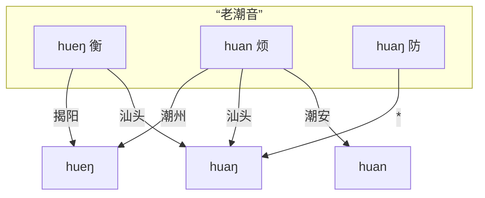

注：本文将介绍辞典内部所使用的标准音，可能涉及较多音韵学专业术语。
关于实际各地的口音，参见[各地口音及演变模式](./accents.md)文档。

## 关于辞典的标准音

市面上常见的潮州话辞典，要么以汕头音为标准，要么以潮州音为标准进行记录。
潮州是曾经的文化中心，汕头是今天的经济特区，各有所谓自诩为标准的依据，
一些辞典也为两者都提供兼容，同时标注了两者。
但对其他地区口音的朋友而言，使用起来依然有障碍。
澄海的朋友会因为“无闭口韵尾”的特点，难以查到某些字词；
同理还有揭阳的朋友“因”“英”不分，潮阳的朋友“余”“污”不分，等等。

一种可行的做法是，主要记录潮州音或汕头音，为除此之外的每个语音点都注明可能不同的发音。
诚然，字典可以这么做，但如果需要做词典，这或许不是个优雅的解决方案。
为了一劳永逸地解决口音问题，本辞典制定了一套通用的标准音，各地口音则根据不同的映射规则转读。
这套标准音，既有依然在潮安、丰顺等地得到保留的“前鼻音韵尾” [n]，也有潮阳、惠来等地“中”“隆”等字的 [i] 介音，也有在极少数地区依然保留的特殊韵母 [ə]、[eu]……
除了极个别字在某些地区存在不规则的读音（例如潮阳“莲藕”的“藕”有特殊读音 [nau<TToneLetter v=52 />]，澄海的口语中“相”字发生 [sĩẽ<TToneLetter v=33 />] 到 [sẽ<TToneLetter v=33 />] 的流变等），其他所有汉字都不需要额外记录读音，节省了人工录入的时间，也方便了计算机处理。

辞典的这套标准音，我们不妨参照“老国音”的名字，称其为“**老潮音**”，
或者，也可以称其为“共同潮州话”，它的设计基于“潮汕各地次方言源于一个共同祖先，各地语音的演变是成系统的”这一前提假设，即“音变无例外律”。
这套标准音的设计灵感和理论基础，主要源于徐馥琼老师的博士论文《粤东闽语语音研究》，以及郭必之老师的《Southern Min》一书。
需要强调的是，“老潮音”吸收了各地的特色发音，但这套标准音本身并不能真实反映今天某个特定区域的发音，也不作为一种发音规范的要求。

下面是这套标准音映射到各地口音的一些例子。

[//]: # (潮州有些人有 ueng，有些人转读成了 uang，因此暂取揭阳)

## 声母

现代潮州话共有 17 个声母（加上零声母一共 18 个），潮汕各地在声母上不存在明显差异。

| 例字       | 白话字 | 潮拼 | 国际音标 |
|----------|-----|----|------|
| 波^1^     | p   | b  | p    |
| 颇        | ph  | p  | pʰ   |
| 毛        | m   | m  | m    |
| 无^2^     | b   | bh | b    |
| 多        | t   | d  | t    |
| 胎        | th  | t  | tʰ   |
| 娜^3^     | n   | n  | n    |
| 罗        | l   | l  | l    |
| 哥        | k   | g  | k    |
| 戈        | kh  | k  | kʰ   |
| 俄        | ng  | ng | ŋ    |
| 鹅        | g   | gh | ɡ    |
| 何        | h   | h  | h    |
| 之^4^     | ts  | z  | ts   |
| 徐        | tsh | c  | tsʰ  |
| 思        | s   | s  | s    |
| 而        | j   | r  | dz   |
| (零声母)^5^ |     |    | ʔ    |

::: note

1. 在汕头、潮阳、普宁、惠来、陆丰等地（主要是西南部一些地区），近年来出现了声母 p, ph, m, b, h 在接元音 u
   时，读为唇齿音 [p̪f], [p̪fʰ], [ɱ], [b̪v]/[v], [ɸ]/[f] 的现象，例如：飞 <TPopupPujNoAccent puj="pfue1"/>，梅 <TPopupPujNoAccent puj="bvue5"/>，
   皮 <TPopupPujNoAccent puj="pfhue5"/>，糜 <TPopupPujNoAccent puj="mvue5"/>，化 <TPopupPujNoAccent puj="fue3"/>。
   但唇齿音目前还在扩散过程中，仅在 u 元音之前作为声母的自由变体，并没有产生音位对立，因此本辞典拼音中不予区分，依然记为 p,
   ph, m, b, h。

2. 与其他闽南语方言类似，潮州话中的浊塞音 [b], [ɡ] 实际上音值接近于 [ᵐb], [ᵑɡ]，即鼻冠音，是来源于 [m], [ŋ] 的塞化，并非来源于中古全浊塞音。
3. 现代潮州话中，n, l 声母接 -m 韵尾的阳声韵时，在部分地区依然区分 n, l，而部分地区则 n, l
   声母混淆。虽然说话人惯用的声母可以用于区分地区口音，但随着各地沟通交流的深入，听话人很难预设说话人的口音，n, l
   声母在这些情况下已经基本无法用于辨义，例如：林 <TPopupPujNoAccent puj="lim5"/> = <TPopupPujNoAccent puj="nim5"/>，
   念 <TPopupPujNoAccent puj="niam7"/> = <TPopupPujNoAccent puj="liam7"/>，男 <TPopupPujNoAccent puj="nam5"/> = <TPopupPujNoAccent puj="lam5"/>，
   蓝 <TPopupPujNoAccent puj="lam5"/> = <TPopupPujNoAccent puj="nam5"/>
   ——“蓝色”等于“男色”。本辞典记录时，这些字的声母依然以中古泥（娘）、来母作为记录依据（简单来说，与普通话中对应声母相同）。
4. 齿头音 ts, tsh, s, j 在接介音 i 时可以发生腭化读作 [tɕ], [tɕʰ], [ɕ], [dʑ]
   ，同样是自由变体，不产生音位对立。(不过在潮剧戏腔中，要求字正腔圆，不允许腭化）。
   在传统白话字拼音方案中，ts/tsh 也有 ch/chh 或 c/ch 的写法，用于区分腭化的读音，为减少记忆负担，本辞典与台罗方案保持一致，只采用 ts/tsh 进行标注。
5. 零声母拼音中不予标注，可以不发音，但在潮州话中通常将喉塞音 [ʔ] 读出来。

:::

## 韵母

### 单元音

现代潮州话共有以下 7 个单元音：

| 例字     | 白话字      | 潮拼 | 国际音标 |
|--------|----------|----|------|
| 亚^1^   | a        | a  | a    |
| 窝      | o        | o  | o    |
| 余^2^   | ṳ/ur/ir  | e  | ɯ    |
| (短)^3^ | o̤/or/er | er | ə    |
| 哑      | e        | ê  | e    |
| 衣^4^   | i        | i  | i    |
| 污      | u        | u  | u    |

::: note

1. 上述表中的国际音标是一种“宽式”的记法。
   a 的实际发音可以是 [a]/[ᴀ]/[ɐ]，特别地，在 <TPopupPujNoAccent puj="-iam0"/> <TPopupPujNoAccent puj="-iap0"/> <TPopupPujNoAccent puj="-ian0"/> <TPopupPujNoAccent puj="-iat0"/> 一组韵母中，受到介音和韵尾的双重影响发生高化，从而实际发音更接近于 [ɛ]/[ɜ]，辞典标准音为了音系的系统性仍将主元音记为 <TPopupPujNoAccent puj="a"/>，各保留该韵母的地区口音则记为 <TPopupPujNoAccent puj="e"/>；
   e 的实际发音可以是 [e]/[ɛ] 等，特别地，揭阳地区在接 -ng/-k 韵尾时 e 与 i 相混，可一并读同 [ɪ]；
   在多数不保留 <TPopupPujNoAccent puj="or0"/> 韵母的地区，<TPopupPujNoAccent puj="ur0"/> 的实际发音可以是 [ɯ]/[ɤ]/[ə]，特别地，在 ts/tsh/s/j 一组声母中，可读为舌尖元音 [ɿ]，这可能是受到普通话的影响。
2. 韵母 <TPopupPujNoAccent puj="ur0"/> 在潮阳等地并入 <TPopupPujNoAccent puj="u0"/>。在泉漳片闽南语，包括台湾强势腔中也多并入 u 或 i，因此该韵母在台罗中也没有明确标准。泉漳潮各地的闽南语白话字拼音方案中有许多不同写法，包括但不限于
   ṳ/ü/ɨ/ᵻ/ur/ir 等等。杜嘉德《厦英大辞典》中记为 u 上加两点，即 ü，但考虑到在字母上方标记声调时比较拥挤，本辞典采用卓威廉词典中的写法，即字母
   u 下加两点。输入不方便时，建议用 ur 或其他变体写法代替。
3. 韵母 <TPopupPujNoAccent puj="or"/> 大多数地区已丢失，例如：袋 <TPopupPujNoAccent puj="tor7"/>、块 <TPopupPujNoAccent puj="kor3"/>
   、胎 <TPopupPujNoAccent puj="thor1"/>、
   罪 <TPopupPujNoAccent puj="tsor6"/>、坐 <TPopupPujNoAccent puj="tsor6"/>、夺 <TPopupPujNoAccent puj="torh8"/>。
   今天的泉州话依然保留该韵母，潮汕片闽南语则大多将其并入 [o]，仅潮安金石等极少数地区仍然保留 [ə] 音，在陆丰、漳州、厦门、台湾强势腔中该韵母并入 [e]。
   泉州话白话字中将其记为 o 上加两点，即 ö，本辞典中，白话字记法与 ṳ 保持一致记为下加两点即 o̤，输入不方便时，建议用 or/er 或其他变体写法代替；该韵母潮拼记法遵循借用普通话拼音的原则，记为 er。
   值得一提的是，晚清时期的潮州话中仍存在该韵母——高德《汉英潮州方言字典》（1883）的序言中提到：
   > The ù in such words as 汝, 去, lù, kù is sometimes pronounced u; as lu, ku. Also ù in such words as 代, 塊 tù kù is often pronounced ò; as tò, kò; and it may be remarked that when the ù
   sound
   is given in this class of words it is a more open sound than when it occurs in the class just before mentioned; the
   difference is easily perceptible, but does not seem capable of being represented by Roman letters.
   >
   > ù 在“汝”“去” lù kù 等字中有时会被读为 u，即 lu ku（潮阳、普宁、惠来等地的口音）。另外，ù 在“代”“塊” tù kù 等字中常被读为 ò，即 tò
   kò，需要说明的是，当 ù 出现在这类字中的时候，与前文刚提到的那一类相比，它是一个开口度更大的音，区别是很容易察觉的，但似乎难以用罗马字母来表示。

   高德字典的拼音系统中，用 ù、ò 表示汉字“余”“窝”的韵母。可见“代”“块”等字中出现的韵母是一个音质类似于 [ɯ]
   但开口度更大的韵母，那么就应该是一个接近 [ə] 的发音，但彼时也已开始出现与韵母 o 的混同。  
   另外，泉州话中的科韵与潮州话的 [ə] 并不一一对应。
   潮州话中读 [ə] 的字仅出现于齿龈音声母之后（仅有“块”字特殊，“块”泉漳片声母为齿龈音，在潮汕为舌根音，应属于从泉漳地区分离之后产生的音变）。
   “倭”字虽然泉州话中读 [ə]，厦门读 [e]，但实际上应与“锅”“莴”“货”等字归为同一类，即潮州话相应的韵母应读 [ue]。
   从而，潮州话中没有读 [ə] 的单字。
4. i 和 u 可以作为齐齿呼和合口呼的介音出现。

:::

### 复元音

根据 6 个单元音，可以组合为 13 个复元音韵母：

| 例字   | 白话字 | 潮拼  | 国际音标 |
|------|-----|-----|------|
| 埃    | ai  | ai  | ai   |
| 欧^1^ | au  | ao  | au   |
| 挨    | oi  | oi  | oi   |
| 乌    | ou  | ou  | ou   |
| 梳^2^ | eu  | êu  | eu   |
| 呀    | ia  | ia  | ia   |
| 腰^3^ | io  | io  | io   |
| 忧    | iu  | iu  | iu   |
| 妖    | iau | iao | iau  |
| 娃    | ua  | ua  | ua   |
| 锅    | ue  | uê  | ue   |
| 威    | ui  | ui  | ui   |
| 歪    | uai | uai | uai  |

::: note

1. “欧”韵母白话字写作 au，潮拼则遵循借用普通话拼音的原则写作 ao，iau 和 iao 同理。除此之外的其他音节，白话字和潮拼的记法是一一对应的，参见单元音表。

2. 韵母 <TPopupPujNoAccent puj="-eu" /> 在大多数地区转读为 <TPopupPujNoAccent puj="-iu" />，仅在潮安凤凰等极少数地区保留，出现于若干鱼韵字中：
   初 <TPopupPujNoAccent puj="tsheu1"/>、
   黍 <TPopupPujNoAccent puj="seu3"/>、
   梳 <TPopupPujNoAccent puj="seu1"/>、
   疏 <TPopupPujNoAccent puj="seu1"/>、
   须 <TPopupPujNoAccent puj="tsheu1"/>、
   絮 <TPopupPujNoAccent puj="tsheu3"/>、
   苧 <TPopupPujNoAccent puj="teu6"/>、
   贮 <TPopupPujNoAccent puj="teu2"/>。

3. “妖”“腰”等字音具有口音差异，具体规则将在后文讨论。

:::

### 韵母后缀

潮州话的阳声韵、入声韵、鼻化韵，通过添加以下后缀表示：

| 白话字       | 潮拼 | 国际音标 | 例字                                  |                                      |
|-----------|----|------|-------------------------------------|--------------------------------------|
| m         | m  | m    | 甘 <TPopupPujNoAccent puj="kam1"/>  | 纤 <TPopupPujNoAccent puj="siam1"/>  |
| n^1^      | nd | n    | 干 <TPopupPujNoAccent puj="kan1"/>  | 仙 <TPopupPujNoAccent puj="sian1"/>  |
| ng        | ng | ŋ    | 刚 <TPopupPujNoAccent puj="kang1"/> | 相 <TPopupPujNoAccent puj="siang1"/> |
| nn/ⁿ ^23^ | n  | ◌̃   | 柑 <TPopupPujNoAccent puj="kann1"/> | 声 <TPopupPujNoAccent puj="siann1"/> |
| p         | b  | p̚   | 蛤 <TPopupPujNoAccent puj="kap4"/>  | 涩 <TPopupPujNoAccent puj="siap4"/>  |
| t         | d  | t̚   | 结 <TPopupPujNoAccent puj="kat4"/>  | 设 <TPopupPujNoAccent puj="siat4"/>  |
| k         | g  | k̚   | 角 <TPopupPujNoAccent puj="kak4"/>  | 削 <TPopupPujNoAccent puj="siak4"/>  |
| h^4^      | h  | ʔ    | 甲 <TPopupPujNoAccent puj="kah4"/>  | 锡 <TPopupPujNoAccent puj="siah4"/>  |

::: note

1. 包括潮汕三市市区在内的多数地区已经丢失舌尖韵尾 -n/-t，并入舌根韵尾 -ng/-k，但在少数地区仍有保留，特别是潮安凤凰、丰顺𨻧隍保留了完整的六个韵尾 <TPopupPujNoAccent puj=-an />, <TPopupPujNoAccent puj=-in />, <TPopupPujNoAccent puj=-urn />, <TPopupPujNoAccent puj=-un />, <TPopupPujNoAccent puj=-ian />, <TPopupPujNoAccent puj=-uan />，在饶平三饶、揭东西部、揭西东部、普宁西部也不同程度地保留了 <TPopupPujNoAccent puj=-an />, <TPopupPujNoAccent puj=-uan />, <TPopupPujNoAccent puj=-in />, <TPopupPujNoAccent puj=-un /> 等韵母（见【吴芳2009】）。本辞典的标准音仍保留舌尖韵尾。
   因潮拼方案中 -n 已经被用于记录鼻化韵，本辞典的潮拼记法将这一对韵尾记为 -nd/-d。

2. 潮州话中，跟在鼻辅音声母 m, n, ng 之后的韵母元音都读为鼻化元音，阴声韵与来自阳声韵的鼻化韵已经完全混同。但是否标记为鼻化
   则需要考虑韵母来源，源于阳声韵的标记为鼻化，例如：年 <TPopupPujNoAccent puj="ninn5"/>——尼 <TPopupPujNoAccent puj="ni5"/>，鳗 <TPopupPujNoAccent puj="muann5"/>——
   麻 <TPopupPujNoAccent puj="mua5"/>，尽管二者在读音上已经完全无法区分。鼻声母后的元音一律鼻化也是“潮普”口音的一大特点。
   本辞典中，为方便使用，各地口音的声韵检索时，鼻辅音声母后的元音可以用鼻化和非鼻化两种变体互查。
3. 在传统的白话字方案中，鼻化韵也常以上标的 n 即 ◌ⁿ 来记录，为了排版工整和输入方便，辞典采用和台罗方案一致的 -nn 来记录鼻化韵。
4. 鼻化韵和喉塞韵同时出现时，先写鼻化再写喉塞，例如：夗 <TPopupPujNoAccent puj="innh8"/>（睡觉）。

:::

### 声化韵

潮州话口语中存在两个声化韵：m 和 ng。
可以单独成字，
其中，ng 也可以接在其他声母后。
ng 接在其他声母后的发音可以读同单独成字的声化韵，也可以有各类不同的变读。

| 白话字               | 潮拼   | 国际音标     | 例字                                 |
|-------------------|------|----------|------------------------------------|
| m                 | m    | m̍       | 姆 <TPopupPujNoAccent puj="m2"/>   |
| ng^1^             | ng   | ŋ̍/ɯ̃    | 黄 <TPopupPujNoAccent puj="ng5"/>  |
| hng               | hng  | ŋ̊ŋ̍/hɯ̃ | 园 <TPopupPujNoAccent puj="hng5"/> |
| (唇音声母)-ng/-ṳng^2^ | -ung | ŋ̍/ɯŋ/uŋ | 饭 <TPopupPujNoAccent puj="png7"/> |
| (其他声母)-ng/-ṳng^3^ | -eng | ŋ̍/ɯŋ    | 酸 <TPopupPujNoAccent puj="sng1"/> |

::: note

1. ng 单独成字或接在 h 之后时，可读作 <TPopupPujNoAccent puj="ng"/> [ŋ̍] 或 <TPopupPujNoAccent puj="urnn"/> [ɯ̃]。

2. ng 接在唇音声母后时，在潮阳、普宁、惠来等地多直接读为 <TPopupPujNoAccent puj="ng"/> [ŋ̍] 或 <TPopupPujNoAccent puj="urng"/> [ɯŋ]。而在潮州、汕头等地口语中，唇音声母后接 <TPopupPujNoAccent puj="ng"/> 时并入了 <TPopupPujNoAccent puj="ung"/>，例如“饭”“问”“本”的白读音：饭 <TPopupPujNoAccent puj="png7"/> [pŋ̍] > <TPopupPujNoAccent puj="pung7"/> [puŋ]，
   问 <TPopupPujNoAccent puj="mng7"/> [mŋ̍] > <TPopupPujNoAccent puj="mung7"/> [muŋ]，本 <TPopupPujNoAccent puj="png2"/> [pŋ̍] > <TPopupPujNoAccent puj="pung2"/> [puŋ]。
   巧合的是，“本”字的文读音为 pún，在舌尖韵尾并入舌根韵尾后，“本”字的文读音和白读音合流了。
3. ng 也可以接在其他辅音声母后，发音同样为 [ŋ̍] 或 [ɯŋ]，例如：
   酸 <TPopupPujNoAccent puj="sng1"/>，卷 <TPopupPujNoAccent puj="kng2"/>，卵 <TPopupPujNoAccent puj="nng6"/>。
   实际上，潮汕多数地区该韵母中都有一个比较明显的 [ɯ] 音。本辞典中标准音仍记为 <TPopupPujNoAccent puj="-ng"/>，各地口音则为了方便查询，转为 <TPopupPujNoAccent puj="-urng"/>。
   需要注意 <TPopupPujNoAccent puj=-ng /> 区分于 <TPopupPujNoAccent puj=-urn />，例如：根 <TPopupPujNoAccent puj="kurn1"/>——缸 <TPopupPujNoAccent puj="kng1"/>，这两者在许多地区由于前后鼻音不分已经相混。

:::

## 声调

潮汕片闽南语具有 8 个声调，并且在平声中，阴平低，阳平高。
有些地区单字调由于调值接近，出现混同现象，导致单字调只有 7 个，
例如潮阳 3 声、6 声单字调混同，惠来 3 声、7 声单字调混同，但在连读变调时，还是能够区分混同的声调，所以依然认为具有 8 个声调。

在白话字中，八个声调分别使用不同的调号进行标记。
各地不同声调的调值有所不同，但所属声调是一致的。
<!-- 具体调值将在转读规则中给出。 -->
下面以 [hun]/[hut̚ ] 一组发音为例，说明标记方法：

| 调序 | 调类        | 白话字调符          | 例字 | 白话字    | 潮拼    |
|----|-----------|----------------|----|--------|-------|
| 1  | 阴平        |                | 分  | hun    | hund1 |
| 2  | 阴上/上声^1^  | \[／\] ◌́ (锐音符) | 粉  | hún^2^ | hund2 |
| 3  | 阴去        | \[＼\] ◌̀ (抑音符) | 奋  | 	hùn   | hund3 |
| 4  | 阴入        |                | 忽  | hut    | hud4  |
| 5  | 阳平        | \[∧\] ◌̂ (扬抑符) | 云  | hûn    | hund5 |
| 6  | 阳上/阳去A^3^ | \[～\] ◌̃ (波浪符) | 混  | hũn    | hund6 |
| 7  | 阳去/阳去B    | \[－\] ◌̄ (长音符) | 份  | hūn    | hund7 |
| 8  | 阳入^4^     | \[／\] ◌́ (锐音符) | 佛  | hút    | hud8  |

::: note

1. 较主流的声调归类中，认为 2 声、6 声分别是阴上、阳上，3 声、7 声分别是阴去、阳去。但在较晚近层次的文读音中，全清、次清、次浊上声都归入了
   2 声，全浊上声归入了 6 声，浊去声则分别归入 6 声、7 声，且归入 6 声的字更多，保留 7 声多是偏口语化的字。
   如果以传统声调归类方式，难以解释潮州话文读音中与“全浊上归去”截然相反的全浊去归阳上的现象。
   学界对此有不同看法。值得一提的是，在高德字典、斐尔德字典、林雄成《汕头方言手册》、汲约翰《潮正两音字集》等文献中，都将这几个声调记为一个上声和三个去声。
   国外传教士对声调的归类方法肯定是习自本土的教师或学者，多位编者不约而同地这样分类，可能意味着这在当时是受到认可的。
   这里采纳【戴黎刚2019】提出的观点，认为晚近层次中 6、7 声均为阳去声。
   由于全浊上归去，多数全浊上、浊去文读音归入了相同的阳去声 6 声，另外少部分浊去字仍然保留 7 声，次浊上则归入了唯一的上声即 2 声。
   为了避免分类的混淆，本辞典在需要说明调类时，将采用调序数字 1\~8 进行说明。

2. 白话字的声调记号标注在主要元音上。简单来说，就是按照 aoṳo̤eiu 的韵母顺序，找到第一个非介音 i/u 的元音。声化韵母 m、ng 则分别标注于 m、n 上。
3. 第 6 声声调记号采用波浪号 ◌̃（同林雄成和卓威廉词典），也有方案记为短音符 ◌̆（斐尔德字典）或抑扬符 ◌̌（台罗）。
4. 第 8 声声调记号采用锐音符 ◌́（同林雄成），也有方案记为竖线符 ◌̍（台罗和卓威廉词典）或扬抑符
   ◌̂（斐尔德字典）。实际上，诸位传教士所著字典使用的衬线字体中，该声调的符号是一个从上往下写、上粗下细的一个垂直撇号 '，但
   Unicode 中没有收录这样的组合上加符号。台罗采取的是上加竖线，但竖线符号在组合到字母 i 上方时会与点号合并成为
   i̍，两者区别可能很不明显，为了增强区分度本辞典默认用锐音符代替。

:::
