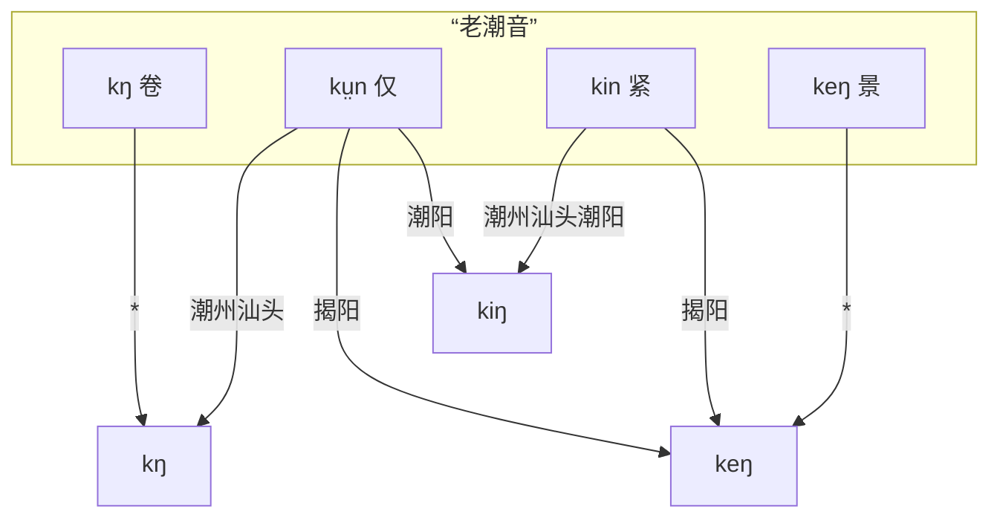

## 关于辞典的标准音

市面上常见的潮州话辞典，要么以汕头音为标准，要么以潮州音为标准进行记录。
潮州是曾经的文化中心，汕头是今天的经济特区，各有所谓自诩为标准的依据，
一些辞典也为两者都提供兼容，同时标注了两者。
但对其他地区口音的朋友而言，使用起来依然有阻碍。
澄海的朋友会因为“无闭口韵”的特点，难以查到某些字词；
同理还有揭阳的朋友“因”“英”不分，潮阳的朋友“余”“污”不分，等等。

一种可行的做法是，主要记录潮州音或汕头音，为除此之外的每个语音点都注明可能不同的发音。
诚然，字典可以这么做，但如果需要做词典，这或许不是个优雅的解决方案。
为了一劳永逸地解决口音问题，本辞典制定了一套通用的标准音，各地口音则根据不同的映射规则转读。
这套标准音，既有依然在潮安、丰顺等地得到保留的“前鼻音韵尾” [n]，也有潮阳、惠来等地“中”“隆”等字的 [i] 介音，也有在极少数地区依然保留的特殊韵母 [ə]、[eu]……
除了极个别字在某些地区存在不规则的读音（例如潮阳“莲藕”的“藕”有特殊读音 [nau<TToneLetter v=52 />]，澄海的口语中“相”字发生 [sĩẽ˧˧] 到 [sẽ˧˧] 的流变等），其他所有汉字都不需要额外记录读音，节省了人工录入的时间，也方便了计算机处理。

辞典的这套标准音，我们不妨参照“老国音”的名字，称其为“**老潮音**”，
或者，也可以称其为“共同潮州话”，它的设计基于“潮汕各地次方言源于一个共同祖先”的前提假设。
这套标准音的设计灵感和理论基础，主要源于徐馥琼老师的博士论文《粤东闽语语音研究》，以及郭必之老师的《Southern Min》一书。
需要强调的是，“老潮音”吸收了各地的特色发音，但这套标准音本身并不能真实反映今天某个特定区域的发音，也不作为一种发音规范的要求。

下面是这套标准音映射到各地口音的一些例子。

## 声母

现代潮州话共有 17 个声母（加上零声母一共 18 个），潮汕各地在声母上不存在明显差异。

| 例字       | 白话字 | 潮拼 | 国际音标 |
|----------|-----|----|------|
| 波^1^     | p   | b  | p    |
| 颇        | ph  | p  | pʰ   |
| 毛        | m   | m  | m    |
| 无^2^     | b   | bh | b    |
| 多        | t   | d  | t    |
| 胎        | th  | t  | tʰ   |
| 娜^3^     | n   | n  | n    |
| 罗        | l   | l  | l    |
| 哥        | k   | g  | k    |
| 戈        | kh  | k  | kʰ   |
| 俄        | ng  | ng | ŋ    |
| 鹅        | g   | gh | ɡ    |
| 何        | h   | h  | h    |
| 之^4^     | ts  | z  | ts   |
| 徐        | tsh | c  | tsʰ  |
| 思        | s   | s  | s    |
| 而        | j   | r  | dz   |
| (零声母)^5^ |     |    | ʔ    |

::: note

1. 在汕头、潮阳、普宁、惠来、陆丰等地（主要是西南部一些地区），近年来出现了声母 p, ph, m, b, h 在接元音 u
   时，读为唇齿音 [p̪f], [p̪fʰ], [ɱ], [b̪v]/[v], [ɸ]/[f] 的现象，例如：飞 <TPopupPuj noAccent puj="pfue1"/>，梅 <TPopupPuj noAccent puj="bvue5"/>，
   皮 <TPopupPuj noAccent puj="pfhue5"/>，糜 <TPopupPuj noAccent puj="mvue5"/>，化 <TPopupPuj noAccent puj="fue3"/>。
   但唇齿音目前还在扩散过程中，仅在 u 元音之前作为声母的自由变体，并没有产生音位对立，因此本辞典拼音中不予区分，依然记为 p,
   ph, m, b, h。

2. 与其他闽南语方言类似，潮州话中的浊塞音 [b], [ɡ] 实际上音值接近于 [ᵐb], [ᵑɡ]，即鼻冠音，是来源于 [m], [ŋ] 的塞化，并非来源于中古全浊塞音。
3. 现代潮州话中，n, l 声母接 -m 韵尾的阳声韵时，在部分地区依然区分 n, l，而部分地区则 n, l
   声母混淆。虽然说话人惯用的声母可以用于区分地区口音，但随着各地沟通交流的深入，听话人很难预设说话人的口音，n, l
   声母在这些情况下已经基本无法用于辨义，例如：林 <TPopupPuj noAccent puj="lim5"/> = <TPopupPuj noAccent puj="nim5"/>，
   念 <TPopupPuj noAccent puj="niam7"/> = <TPopupPuj noAccent puj="liam7"/>，男 <TPopupPuj noAccent puj="nam5"/> = <TPopupPuj noAccent puj="lam5"/>，
   蓝 <TPopupPuj noAccent puj="lam5"/> = <TPopupPuj noAccent puj="nam5"/>
   ——“蓝色”等于“男色”。本辞典记录时，这些字的声母依然以中古泥（娘）、来母作为记录依据（简单来说，与普通话中对应声母相同）。
4. 齿头音 ts, tsh, s, j 在接介音 i 时可以发生腭化读作 [tɕ], [tɕʰ], [ɕ], [dʑ]
   ，同样是自由变体，不产生音位对立。(不过在潮剧戏腔中，要求字正腔圆，不允许腭化）。
   在传统白话字拼音方案中，ts/tsh 也有 ch/chh 或 c/ch 的写法，用于区分腭化的读音，为减少记忆负担，本辞典与台罗方案保持一致，只采用 ts/tsh 进行标注。
5. 零声母拼音中不予标注，可以不发音，但在潮州话中通常将喉塞音 [ʔ] 读出来。

:::

## 韵母

### 单元音

现代潮州话共有以下 7 个单元音：

| 例字   | 白话字      | 潮拼 | 国际音标 |
|------|----------|----|------|
| 亚^1^ | a        | a  | a    |
| 窝    | o        | o  | o    |
| 余^2^ | ṳ/ur/ir  | e  | ɯ    |
| 倭^3^ | o̤/or/er | er | ə    |
| 哑    | e        | ê  | e    |
| 衣^4^ | i        | i  | i    |
| 污    | u        | u  | u    |

::: note

1. 上述表中的国际音标是一种“宽式”的记法。
   a 的实际发音可以是 [a]/[ᴀ]/[ɐ]，特别地，在 -iam/-iap/-ian/-iat 一组韵母中，受到介音和韵尾的双重影响发生高化，从而实际发音更接近于 [ɛ]/[ɜ]，辞典标准音为了音系的系统性仍记为 -ian/-iat，各保留该韵母的地区口音则记为 -ien/<TPopupPuj noAccent puj=-iet />；
   e 的实际发音可以是 [e]/[ɛ] 等，特别地，揭阳地区在接 -ng/-k 韵尾时 e 与 i 相混，可一并读同 [ɪ]；
   在多数不保留 o̤ 韵母的地区，ṳ 的实际发音可以是 [ɯ]/[ɤ]/[ə]，特别地，在 ts/tsh/s/j 一组声母中，可读为舌尖元音 [ɿ]，这可能是受到普通话的影响。

2. ṳ 在潮阳等地并入 u。在泉漳片闽南语，包括台湾强势腔中也多并入 u 或 i，因此该韵母在台罗中也没有明确标准。泉漳潮各地的闽南语白话字拼音方案中有许多不同写法，包括但不限于
   ṳ/ü/ɨ/ᵻ/ur/ir 等等。杜嘉德《厦英大辞典》中记为 u 上加两点，即 ü，但考虑到在字母上方标记声调时比较拥挤，本辞典采用卓威廉词典中的写法，即字母
   u 下加两点。输入不方便时，建议用 ur 或其他变体写法代替。
3. o̤ 韵母大多数地区已丢失。该韵母属于白读音，对应于泉州话中的科韵，例如：袋 <TPopupPuj noAccent puj="tor7"/>、块 <TPopupPuj noAccent puj="kor3"/>
   、胎 <TPopupPuj noAccent puj="thor1"/>、
   罪 <TPopupPuj noAccent puj="tsor6"/>、坐 <TPopupPuj noAccent puj="tsor6"/>、夺 <TPopupPuj noAccent puj="torh8"/>。
   今天的泉州话依然保留该韵母，潮汕片闽南语则大多将其并入 o，仅潮安县金石镇等极少数地区仍然保留，在陆丰、漳州、厦门、台湾强势腔中该韵母并入 e。
   泉州话白话字中将其记为 o 上加两点，即 ö，本辞典中，白话字记法与 ṳ 保持一致记为下加两点，输入不方便时，建议用 or/er 或其他变体写法代替；该韵母潮拼记法遵循借用普通话拼音的原则，记为 er。
   值得一提的是，晚清时期的潮州话中仍存在该韵母——高德《汉英潮州方言字典》（1883）的序言中提到：
   > The ù in such words as 汝, 去, lù, kù is sometimes pronounced u; as lu, ku. Also ù in such words as 代, 塊 tù kù is often pronounced ò; as tò, kò; and it may be remarked that when the ù
   sound
   is given in this class of words it is a more open sound than when it occurs in the class just before mentioned; the
   difference is easily perceptible, but does not seem capable of being represented by Roman letters.
   >
   > ù 在“汝”“去” lù kù 等字中有时会被读为 u，即 lu ku（潮阳、普宁、惠来等地的口音）。另外，ù 在“代”“塊” tù kù 等字中常被读为 ò，即 tò
   kò，需要说明的是，当 ù 出现在这类字中的时候，与前文刚提到的那一类相比，它是一个开口度更大的音，区别是很容易察觉的，但似乎难以用罗马字母来表示。

   高德字典的拼音系统中，用 ù、ò 表示汉字“余”“窝”的韵母。可见“代”“块”等字中出现的韵母是一个音质类似于 [ɯ]
   但开口度更大的韵母，那么就应该是一个接近 [ə] 的发音，但彼时也已开始出现与韵母 o 的混同。
4. i 和 u 可以作为齐齿呼和合口呼的介音出现。

:::

### 复元音

根据 6 个单元音，可以组合为 13 个复元音韵母：

| 例字   | 白话字 | 潮拼  | 国际音标 |
|------|-----|-----|------|
| 埃^1^ | ai  | ai  | ai   |
| 欧    | au  | ao  | au   |
| 挨    | oi  | oi  | oi   |
| 乌    | ou  | ou  | ou   |
| 梳^2^ | eu  | êu  | eu   |
| 呀    | ia  | ia  | ia   |
| 腰    | io  | io  | io   |
| 忧    | iu  | iu  | iu   |
| 妖    | iau | iou | iau  |
| 娃    | ua  | ua  | ua   |
| 锅    | ue  | uê  | ue   |
| 威    | ui  | ui  | ui   |
| 歪    | uai | uai | uai  |

::: note

1. “妖”“腰”等字音具有口音差异，具体规则将在后文讨论。
2. <TPopupPuj noAccent puj="-eu" /> 韵母在大多数地区转读为 <TPopupPuj noAccent puj="-iu" />，仅在潮安县凤凰镇等极少数地区保留，出现于若干鱼韵字中：
   初 <TPopupPuj noAccent puj="tsheu1"/>、
   黍 <TPopupPuj noAccent puj="seu3"/>、
   梳 <TPopupPuj noAccent puj="seu1"/>、
   疏 <TPopupPuj noAccent puj="seu1"/>、
   须 <TPopupPuj noAccent puj="tsheu1"/>、
   絮 <TPopupPuj noAccent puj="tsheu3"/>、
   苧 <TPopupPuj noAccent puj="teu6"/>、
   贮 <TPopupPuj noAccent puj="teu2"/>。

:::

### 韵母后缀

潮州话的阳声韵、入声韵、鼻化韵，通过添加以下后缀表示：

| 白话字       | 潮拼   | 国际音标 | 例字                                  |                                      |
|-----------|------|------|-------------------------------------|--------------------------------------|
| m         | m    | m    | 甘 <TPopupPuj noAccent puj="kam1"/>  | 纤 <TPopupPuj noAccent puj="siam1"/>  |
| n^1^      | (ng) | n    | 干 <TPopupPuj noAccent puj="kan1"/>  | 仙 <TPopupPuj noAccent puj="sian1"/>  |
| ng        | ng   | ŋ    | 刚 <TPopupPuj noAccent puj="kang1"/> | 相 <TPopupPuj noAccent puj="siang1"/> |
| nn/ⁿ ^23^ | n    | ◌̃   | 柑 <TPopupPuj noAccent puj="kann1"/> | 声 <TPopupPuj noAccent puj="siann1"/> |
| p         | b    | p̚   | 蛤 <TPopupPuj noAccent puj="kap4"/>  | 涩 <TPopupPuj noAccent puj="siap4"/>  |
| t         | (g)  | t̚   | 结 <TPopupPuj noAccent puj="kat4"/>  | 设 <TPopupPuj noAccent puj="siat4"/>  |
| k         | g    | k̚   | 角 <TPopupPuj noAccent puj="kak4"/>  | 削 <TPopupPuj noAccent puj="siak4"/>  |
| h^4^      | h    | ʔ    | 甲 <TPopupPuj noAccent puj="kah4"/>  | 锡 <TPopupPuj noAccent puj="siah4"/>  |

::: note

1. 包括潮汕三市市区在内的多数地区已经丢失舌尖韵尾 -n/-t，并入舌根韵尾 -ng/-k，但在少数地区仍有保留，特别是潮安县凤凰镇、丰顺县𨻧隍镇保留了完整的六个韵尾 <TPopupPuj noAccent puj=-an />, <TPopupPuj noAccent puj=-in />, <TPopupPuj noAccent puj=-urn />, <TPopupPuj noAccent puj=-un />, <TPopupPuj noAccent puj=-ian />, <TPopupPuj noAccent puj=-uan />，在饶平三饶、揭东西部、揭西东部、普宁西部也不同程度地保留了 <TPopupPuj noAccent puj=-an />, <TPopupPuj noAccent puj=-uan />, <TPopupPuj noAccent puj=-in />, <TPopupPuj noAccent puj=-un /> 等韵母（见【吴芳2009】）。本辞典的标准音仍保留舌尖韵尾。
2. 潮州话中，跟在鼻辅音声母 m, n, ng 之后的韵母元音都读为鼻化元音，阴声韵与来自阳声韵的鼻化韵已经完全混同。但是否标记为鼻化
   则需要考虑韵母来源，源于阳声韵的标记为鼻化，例如：年 <TPopupPuj noAccent puj="ninn5"/>——尼 <TPopupPuj noAccent puj="ni5"/>，鳗 <TPopupPuj noAccent puj="muann5"/>——
   麻 <TPopupPuj noAccent puj="mua5"/>，尽管二者在读音上已经完全无法区分。鼻声母后的元音一律鼻化也是“潮普”口音的一大特点。
3. 在传统的白话字方案中，鼻化韵也常以上标的 n 即 ◌ⁿ 来记录，为了排版工整和输入方便，辞典采用和台罗方案一致的 -nn 来记录鼻化韵。
4. 鼻化韵和喉塞韵同时出现时，先写鼻化再写喉塞，例如：夗 <TPopupPuj noAccent puj="innh8"/>（睡觉）。

:::

### 声化韵

潮州话口语中存在两个声化韵：m 和 ng。
可以单独成字，
其中，ng 也可以接在其他声母后。
ng 接在其他声母后的发音可以读同单独成字的声化韵，也可以有各类不同的变读。

| 白话字               | 潮拼   | 国际音标     | 例字                                 |
|-------------------|------|----------|------------------------------------|
| m                 | m    | m̍       | 姆 <TPopupPuj noAccent puj="m2"/>   |
| ng^1^             | ng   | ŋ̍/ɯ̃    | 黄 <TPopupPuj noAccent puj="ng5"/>  |
| hng               | hng  | ŋ̊ŋ̍/hɯ̃ | 园 <TPopupPuj noAccent puj="hng5"/> |
| (唇音声母)-ng/-ṳng^2^ | -ung | ŋ̍/ɯŋ/uŋ | 饭 <TPopupPuj noAccent puj="png7"/> |
| (其他声母)-ng/-ṳng^3^ | -eng | ŋ̍/ɯŋ    | 酸 <TPopupPuj noAccent puj="sng1"/> |

::: note

1. ng 单独成字或接在 h 之后时，可读作 <TPopupPuj noAccent puj="ng"/> [ŋ̍] 或 <TPopupPuj noAccent puj="urnn"/> [ɯ̃]。
2. ng 接在唇音声母后时，在潮阳、普宁、惠来等地多直接读为 <TPopupPuj noAccent puj="ng"/> [ŋ̍] 或 <TPopupPuj noAccent puj="urng"/> [ɯŋ]。而在潮州、汕头等地口语中，唇音声母后接 <TPopupPuj noAccent puj="ng"/> 时并入了 <TPopupPuj noAccent puj="ung"/>，例如“饭”“问”“本”的白读音：饭 <TPopupPuj noAccent puj="png7"/> [pŋ̍] > <TPopupPuj noAccent puj="pung7"/> [puŋ]，
   问 <TPopupPuj noAccent puj="mng7"/> [mŋ̍] > <TPopupPuj noAccent puj="mung7"/> [muŋ]，本 <TPopupPuj noAccent puj="png2"/> [pŋ̍] > <TPopupPuj noAccent puj="pung2"/> [puŋ]。
   巧合的是，“本”字的文读音为 pún，在舌尖韵尾并入舌根韵尾后，“本”字的文读音和白读音合流了。
3. ng 也可以接在其他辅音声母后，发音同样为 [ŋ̍] 或 [ɯŋ]，例如：
   酸 <TPopupPuj noAccent puj="sng1"/>，卷 <TPopupPuj noAccent puj="kng2"/>，卵 <TPopupPuj noAccent puj="nng6"/>。
   实际上，潮汕多数地区该韵母中都有一个比较明显的 [ɯ] 音。本辞典中标准音仍记为 <TPopupPuj noAccent puj="-ng"/>，各地口音则为了方便查询，转为 <TPopupPuj noAccent puj="-urng"/>。
   需要注意 <TPopupPuj noAccent puj=-ng /> 区分于 <TPopupPuj noAccent puj=-urn />，例如：根 <TPopupPuj noAccent puj="kurn1"/>——缸 <TPopupPuj noAccent puj="kng1"/>，这两者在许多地区由于前后鼻音不分已经相混。

:::

## 声调

潮汕片闽南语具有 8 个声调，并且在平声中，阴平低，阳平高。
有些地区单字调由于调值接近，出现混同现象，导致单字调只有 7 个，
例如潮阳 3 声、6 声单字调混同，惠来 3 声、7 声单字调混同，但在连读变调时，还是能够区分混同的声调，所以依然认为具有 8 个声调。

在白话字中，八个声调分别使用不同的调号进行标记。
各地不同声调的调值有所不同，但所属声调是一致的。
<!-- 具体调值将在转读规则中给出。 -->
下面以白话字拼音 <TPopupPuj noAccent puj="hun0"/> <TPopupPuj noAccent puj="hut0"/> 为例，说明标记方法：

| 调序 | 调类        | 白话字调符          | 例字 | 白话字                                 | 潮拼    |
|----|-----------|----------------|----|-------------------------------------|-------|
| 1  | 阴平        |                | 分  | <TPopupPuj noAccent puj="hun1"/>    | hung1 |
| 2  | 阴上/上声^1^  | \[／\] ◌́ (锐音符) | 粉  | <TPopupPuj noAccent puj="hun2"/>^2^ | hung2 |
| 3  | 阴去        | \[＼\] ◌̀ (抑音符) | 奋  | <TPopupPuj noAccent puj="hun3"/>    | hung3 |
| 4  | 阴入        |                | 忽  | <TPopupPuj noAccent puj="hut4"/>    | hug4  |
| 5  | 阳平        | \[∧\] ◌̂ (扬抑符) | 云  | <TPopupPuj noAccent puj="hun5"/>    | hung5 |
| 6  | 阳上/阳去A^3^ | \[～\] ◌̃ (波浪符) | 混  | <TPopupPuj noAccent puj="hun6"/>    | hung6 |
| 7  | 阳去/阳去B    | \[－\] ◌̄ (长音符) | 份  | <TPopupPuj noAccent puj="hun7"/>    | hung7 |
| 8  | 阳入^4^     | \[／\] ◌́ (锐音符) | 佛  | <TPopupPuj noAccent puj="hut8"/>    | hug8  |

::: note

1. 较主流的声调归类中，认为 2 声、6 声分别是阴上、阳上，3 声、7 声分别是阴去、阳去。但在较晚近层次的文读音中，全清、次清、次浊上声都归入了
   2 声，全浊上声归入了 6 声，浊去声则分别归入 6 声、7 声，且归入 6 声的字更多，保留 7 声多是偏口语化的字。
   如果以传统声调归类方式，难以解释潮州话文读音中与“全浊上归去”截然相反的全浊去归阳上的现象。
   学界对此有不同看法。值得一提的是，在高德字典、斐尔德字典、林雄成《汕头方言手册》等文献中，都将这几个声调记为一个上声和三个去声。
   国外传教士对声调的归类方法肯定是习自本土的教师或学者，多位编者不约而同地这样分类，可能意味着这在当时是受到认可的。
   这里采纳【戴黎刚2019】提出的观点，认为晚近层次中 6、7 声均为阳去声。
   由于全浊上归去，多数全浊上、浊去文读音归入了相同的阳去声 6 声，另外少部分浊去字仍然保留 7 声，次浊上则归入了唯一的上声即 2 声。
   为了避免分类的混淆，本辞典在需要说明调类时，将采用调序数字 1\~8 进行说明。
2. 声调记号标注在主要元音上。简单来说，就是按照 aoṳo̤eiu 的韵母顺序，找到第一个非介音 i/u 的元音。声化韵母 m、ng 则分别标注于 m、n 上。
3. 第 6 声声调记号为波浪号 ◌̃（同林雄成和卓威廉词典），也有方案记为短音符 ◌̆（斐尔德字典）或抑扬符 ◌̌（台罗）。
4. 第 8 声声调记号为锐音符 ◌́（同林雄成），也有方案记为竖线符 ◌̍（台罗和卓威廉词典）或扬抑符
   ◌̂（斐尔德字典）。实际上，诸位传教士所著字典使用的衬线字体中，该声调的符号是一个从上往下写、上粗下细的一个垂直撇号 '，但
   Unicode 中没有收录这样的组合上加符号。台罗采取的是上加竖线，但竖线符号在组合到字母 i 上方时会与点号合并成为
   i̍，两者区别可能很不明显，为了增强区分度本辞典默认用锐音符代替。

:::

## 各地口音总表

“潮州九县，县县有语”，
各地经过长时间的演变，也发展出了各具特色的音系。
但是，正所谓“十里不同音”，
即使是在同一个市、同一个县，发音也可能受个人习惯影响有很大差异，
不可能穷举每个地方的发音。
此处整理数据仅包括今天的潮汕三市市中心、传统的潮州八县、以及陆丰地区各挑选一个口音为代表，再加上唯一存在公认标准的潮剧戏腔，共有以下口音：潮州（府城）、潮剧戏腔、潮安（凤凰）、丰顺（𨻧隍）、饶平（黄冈）、澄海（澄城）、汕头（市区，汕头台播音腔）、揭阳（榕城）、潮阳（棉城）、普宁（流沙）、惠来（惠城）、陆丰（甲子）。

### 各地口音规则表

[//]: # (TODO：使用程序生成规则表)
转读规则表中，转读音一列为空的表示不需要转读。

::: tabs

@tab 潮州

| 例字      | 辞典标准音                                                                                                | 转读音                                                                                                  |
|---------|------------------------------------------------------------------------------------------------------|------------------------------------------------------------------------------------------------------|
| 余       | <TPopupPuj noAccent puj=-ur0 />                                                                      |                                                                                                      |
| 退^1^    | <TPopupPuj noAccent puj=-or0 />                                                                      | <TPopupPuj noAccent puj=-o0 />                                                                       |
| 梳       | <TPopupPuj noAccent puj=-eu0 />                                                                      | <TPopupPuj noAccent puj=-iu0 />                                                                      |
| 买鞋^2^   | <TPopupPuj noAccent puj=-oi0 />                                                                      |                                                                                                      |
| 反间      | <TPopupPuj noAccent puj=-oinn0 />                                                                    |                                                                                                      |
| 八狭      | <TPopupPuj noAccent puj=-oih0 />                                                                     |                                                                                                      |
| 县悬^3^   | <TPopupPuj noAccent puj=-uoinn0 />                                                                   | <TPopupPuj noAccent puj=-uinn0 />                                                                    |
| 乌       | <TPopupPuj noAccent puj=-ou0 />                                                                      |                                                                                                      |
| 腰阳药     | <TPopupPuj noAccent puj=-io0 />, <TPopupPuj noAccent puj=-ionn0 />, <TPopupPuj noAccent puj=-ioh0 /> | <TPopupPuj noAccent puj=-ie0 />, <TPopupPuj noAccent puj=-ienn0 />, <TPopupPuj noAccent puj=-ieh0 /> |
| 妖跃^4^   | <TPopupPuj noAccent puj=-iau0 />, <TPopupPuj noAccent puj=-iauh0 />                                  | <TPopupPuj noAccent puj=-ieu0 />, <TPopupPuj noAccent puj=-ieh0 />                                   |
| 话关划     | <TPopupPuj noAccent puj=-ue0 />, <TPopupPuj noAccent puj=-uenn0 />, <TPopupPuj noAccent puj=-ueh0 /> |                                                                                                      |
| 英易^5^   | <TPopupPuj noAccent puj=-eng0 />, <TPopupPuj noAccent puj=-ek0 />                                    |                                                                                                      |
| 音邑      | <TPopupPuj noAccent puj=-im0 />, <TPopupPuj noAccent puj=-ip0 />                                     |                                                                                                      |
| 因乙      | <TPopupPuj noAccent puj=-in0 />, <TPopupPuj noAccent puj=-it0 />                                     | <TPopupPuj noAccent puj=-ing0 />, <TPopupPuj noAccent puj=-ik0 />                                    |
| 恩乞      | <TPopupPuj noAccent puj=-urn0 />, <TPopupPuj noAccent puj=-urt0 />                                   | <TPopupPuj noAccent puj=-urng0 />  <TPopupPuj noAccent puj=-urk0 />                                  |
| 温熨      | <TPopupPuj noAccent puj=-un0 />, <TPopupPuj noAccent puj=-ut0 />                                     | <TPopupPuj noAccent puj=-ung0 />, <TPopupPuj noAccent puj=-uk0 />                                    |
| 庵盒      | <TPopupPuj noAccent puj=-am0 />, <TPopupPuj noAccent puj=-ap0 />                                     |                                                                                                      |
| 安抑      | <TPopupPuj noAccent puj=-an0 />, <TPopupPuj noAccent puj=-at0 />                                     | <TPopupPuj noAccent puj=-ang0 />, <TPopupPuj noAccent puj=-ak0 />                                    |
| 奄压      | <TPopupPuj noAccent puj=-iam0 />, <TPopupPuj noAccent puj=-iap0 />                                   | <TPopupPuj noAccent puj=-iem0 />, <TPopupPuj noAccent puj=-iep0 />                                   |
| 嫣设      | <TPopupPuj noAccent puj=-ian0 />, <TPopupPuj noAccent puj=-iat0 />                                   | <TPopupPuj noAccent puj=-ieng0 /> , <TPopupPuj noAccent puj=-iek0 />                                 |
| 凡法      | <TPopupPuj noAccent puj=-uam0 />, <TPopupPuj noAccent puj=-uap0 />                                   |                                                                                                      |
| 弯阅      | <TPopupPuj noAccent puj=-uan0 />, <TPopupPuj noAccent puj=-uat0 />                                   | <TPopupPuj noAccent puj=-ueng0 />, <TPopupPuj noAccent puj=-uek0 />                                  |
| 莹衡      | <TPopupPuj noAccent puj=-ueng0 />                                                                    |                                                                                                      |
| 获       | <TPopupPuj noAccent puj=-uek0 />                                                                     |                                                                                                      |
| 饭问      | (双唇音)<TPopupPuj noAccent puj=-ng0 />                                                                 | (双唇音)<TPopupPuj noAccent puj=-ung0 />                                                                |
| 中筑茸辱^6^ | (齿龈音)<TPopupPuj noAccent puj=-iong0 />, <TPopupPuj noAccent puj=-iok0 />                             | (齿龈音)<TPopupPuj noAccent puj=-ong0 />, <TPopupPuj noAccent puj=-ok0 />                               |
| 万亡文^7^  | <TPopupPuj noAccent puj=bu- />(阳声韵)                                                                  |                                                                                                      |
| 漫闷      | <TPopupPuj noAccent puj=mu- />(阳声韵)                                                                  | <TPopupPuj noAccent puj=bu- />                                                                       |
| 男念      | <TPopupPuj noAccent puj=n- /> (m 尾阳声韵)                                                               | <TPopupPuj noAccent puj=l- />                                                                        |
| 难能      | <TPopupPuj noAccent puj=n- /> (n, ng 尾阳声韵)                                                           | <TPopupPuj noAccent puj=l- />                                                                        |
| 蓝林帘     | <TPopupPuj noAccent puj=l- /> (m 尾阳声韵)                                                               |                                                                                                      |

@tab 戏腔^8^

| 例字      | 辞典标准音                                                                                                | 转读音                                                                                                  |
|---------|------------------------------------------------------------------------------------------------------|------------------------------------------------------------------------------------------------------|
| 余       | <TPopupPuj noAccent puj=-ur0 />                                                                      |                                                                                                      |
| 退^1^    | <TPopupPuj noAccent puj=-or0 />                                                                      | <TPopupPuj noAccent puj=-o0 />                                                                       |
| 梳       | <TPopupPuj noAccent puj=-eu0 />                                                                      | <TPopupPuj noAccent puj=-iu0 />                                                                      |
| 买鞋^2^   | <TPopupPuj noAccent puj=-oi0 />                                                                      |                                                                                                      |
| 反间      | <TPopupPuj noAccent puj=-oinn0 />                                                                    |                                                                                                      |
| 八狭      | <TPopupPuj noAccent puj=-oih0 />                                                                     |                                                                                                      |
| 县悬^3^   | <TPopupPuj noAccent puj=-uoinn0 />                                                                   | <TPopupPuj noAccent puj=-uinn0 />                                                                    |
| 乌       | <TPopupPuj noAccent puj=-ou0 />                                                                      |                                                                                                      |
| 腰阳药     | <TPopupPuj noAccent puj=-io0 />, <TPopupPuj noAccent puj=-ionn0 />, <TPopupPuj noAccent puj=-ioh0 /> | <TPopupPuj noAccent puj=-ie0 />, <TPopupPuj noAccent puj=-ienn0 />, <TPopupPuj noAccent puj=-ieh0 /> |
| 妖跃^4^   | <TPopupPuj noAccent puj=-iau0 />, <TPopupPuj noAccent puj=-iauh0 />                                  | <TPopupPuj noAccent puj=-iou0 />, <TPopupPuj noAccent puj=-iouh0 />                                  |
| 话关划     | <TPopupPuj noAccent puj=-ue0 />, <TPopupPuj noAccent puj=-uenn0 />, <TPopupPuj noAccent puj=-ueh0 /> |                                                                                                      |
| 英易^5^   | <TPopupPuj noAccent puj=-eng0 />, <TPopupPuj noAccent puj=-ek0 />                                    |                                                                                                      |
| 音邑      | <TPopupPuj noAccent puj=-im0 />, <TPopupPuj noAccent puj=-ip0 />                                     |                                                                                                      |
| 因乙      | <TPopupPuj noAccent puj=-in0 />, <TPopupPuj noAccent puj=-it0 />                                     | (<TPopupPuj noAccent puj=-ing0 />, <TPopupPuj noAccent puj=-ik0 />)                                  |
| 恩乞      | <TPopupPuj noAccent puj=-urn0 />, <TPopupPuj noAccent puj=-urt0 />                                   | (<TPopupPuj noAccent puj=-urng0 />  <TPopupPuj noAccent puj=-urk0 />)                                |
| 温熨      | <TPopupPuj noAccent puj=-un0 />, <TPopupPuj noAccent puj=-ut0 />                                     | (<TPopupPuj noAccent puj=-ung0 />,-uk)                                                               |
| 庵盒      | <TPopupPuj noAccent puj=-am0 />, <TPopupPuj noAccent puj=-ap0 />                                     |                                                                                                      |
| 安抑      | <TPopupPuj noAccent puj=-an0 />, <TPopupPuj noAccent puj=-at0 />                                     | (<TPopupPuj noAccent puj=-ang0 />, <TPopupPuj noAccent puj=-ak0 />)                                  |
| 奄压      | <TPopupPuj noAccent puj=-iam0 />, <TPopupPuj noAccent puj=-iap0 />                                   |                                                                                                      |
| 嫣设      | <TPopupPuj noAccent puj=-ian0 />, <TPopupPuj noAccent puj=-iat0 />                                   | (<TPopupPuj noAccent puj=-iang0 />, -iak)                                                            |
| 凡法      | <TPopupPuj noAccent puj=-uam0 />, <TPopupPuj noAccent puj=-uap0 />                                   |                                                                                                      |
| 弯阅      | <TPopupPuj noAccent puj=-uan0 />, <TPopupPuj noAccent puj=-uat0 />                                   | (-uang, -uak)                                                                                        |
| 莹衡      | <TPopupPuj noAccent puj=-ueng0 />                                                                    |                                                                                                      |
| 获       | <TPopupPuj noAccent puj=-uek0 />                                                                     |                                                                                                      |
| 饭问      | (双唇音)<TPopupPuj noAccent puj=-ng0 />                                                                 |                                                                                                      |
| 中筑茸辱^6^ | (齿龈音)<TPopupPuj noAccent puj=-iong0 />, <TPopupPuj noAccent puj=-iok0 />                             | (齿龈音)<TPopupPuj noAccent puj=-ong0 />, <TPopupPuj noAccent puj=-ok0 />                               |
| 万亡文^7^  | <TPopupPuj noAccent puj=bu- />(阳声韵)                                                                  |                                                                                                      |
| 漫闷      | <TPopupPuj noAccent puj=mu- />(阳声韵)                                                                  | <TPopupPuj noAccent puj=bu- />                                                                       |
| 男念      | <TPopupPuj noAccent puj=n- /> (m 尾阳声韵)                                                               | <TPopupPuj noAccent puj=l- />                                                                        |
| 难能      | <TPopupPuj noAccent puj=n- /> (n, ng 尾阳声韵)                                                           | <TPopupPuj noAccent puj=l- />                                                                        |
| 蓝林帘     | <TPopupPuj noAccent puj=l- /> (m 尾阳声韵)                                                               |                                                                                                      |

@tab 潮安

| 例字      | 辞典标准音                                                                                                | 转读音                                                                            |
|---------|------------------------------------------------------------------------------------------------------|--------------------------------------------------------------------------------|
| 余       | <TPopupPuj noAccent puj=-ur0 />                                                                      |                                                                                |
| 退^1^    | <TPopupPuj noAccent puj=-or0 />                                                                      | <TPopupPuj noAccent puj=-o0 />                                                 |
| 梳       | <TPopupPuj noAccent puj=-eu0 />                                                                      |                                                                                |
| 买鞋^2^   | <TPopupPuj noAccent puj=-oi0 />                                                                      | (双唇音)<TPopupPuj noAccent puj=-ue0 />, (其他音)<TPopupPuj noAccent puj=-oi0 />     |
| 反间      | <TPopupPuj noAccent puj=-oinn0 />                                                                    | (双唇音)<TPopupPuj noAccent puj=-uenn0 />, (其他音)<TPopupPuj noAccent puj=-oinn0 /> |
| 八狭      | <TPopupPuj noAccent puj=-oih0 />                                                                     | (双唇音)<TPopupPuj noAccent puj=-ueh0 />, (其他音)<TPopupPuj noAccent puj=-oih0 />   |
| 县悬^3^   | <TPopupPuj noAccent puj=-uoinn0 />                                                                   | <TPopupPuj noAccent puj=-uinn0 />                                              |
| 乌       | <TPopupPuj noAccent puj=-ou0 />                                                                      |                                                                                |
| 腰阳药     | <TPopupPuj noAccent puj=-io0 />, <TPopupPuj noAccent puj=-ionn0 />, <TPopupPuj noAccent puj=-ioh0 /> |                                                                                |
| 妖跃^4^   | <TPopupPuj noAccent puj=-iau0 />, <TPopupPuj noAccent puj=-iauh0 />                                  |                                                                                |
| 话关划     | <TPopupPuj noAccent puj=-ue0 />, <TPopupPuj noAccent puj=-uenn0 />, <TPopupPuj noAccent puj=-ueh0 /> |                                                                                |
| 英易^5^   | <TPopupPuj noAccent puj=-eng0 />, <TPopupPuj noAccent puj=-ek0 />                                    |                                                                                |
| 音邑      | <TPopupPuj noAccent puj=-im0 />, <TPopupPuj noAccent puj=-ip0 />                                     |                                                                                |
| 因乙      | <TPopupPuj noAccent puj=-in0 />, <TPopupPuj noAccent puj=-it0 />                                     |                                                                                |
| 恩乞      | <TPopupPuj noAccent puj=-urn0 />, <TPopupPuj noAccent puj=-urt0 />                                   |                                                                                |
| 温熨      | <TPopupPuj noAccent puj=-un0 />, <TPopupPuj noAccent puj=-ut0 />                                     |                                                                                |
| 庵盒      | <TPopupPuj noAccent puj=-am0 />, <TPopupPuj noAccent puj=-ap0 />                                     |                                                                                |
| 安抑      | <TPopupPuj noAccent puj=-an0 />, <TPopupPuj noAccent puj=-at0 />                                     |                                                                                |
| 奄压      | <TPopupPuj noAccent puj=-iam0 />, <TPopupPuj noAccent puj=-iap0 />                                   |                                                                                |
| 嫣设      | <TPopupPuj noAccent puj=-ian0 />, <TPopupPuj noAccent puj=-iat0 />                                   | <TPopupPuj noAccent puj=-ien0 />, <TPopupPuj noAccent puj=-iet0 />             |
| 凡法      | <TPopupPuj noAccent puj=-uam0 />, <TPopupPuj noAccent puj=-uap0 />                                   |                                                                                |
| 弯阅      | <TPopupPuj noAccent puj=-uan0 />, <TPopupPuj noAccent puj=-uat0 />                                   |                                                                                |
| 莹衡      | <TPopupPuj noAccent puj=-ueng0 />                                                                    |                                                                                |
| 获       | <TPopupPuj noAccent puj=-uek0 />                                                                     |                                                                                |
| 饭问      | (双唇音)<TPopupPuj noAccent puj=-ng0 />                                                                 |                                                                                |
| 中筑茸辱^6^ | (齿龈音)<TPopupPuj noAccent puj=-iong0 />, <TPopupPuj noAccent puj=-iok0 />                             | (齿龈音)<TPopupPuj noAccent puj=-ong0 />, <TPopupPuj noAccent puj=-ok0 />         |
| 万亡文^7^  | <TPopupPuj noAccent puj=bu- />(阳声韵)                                                                  |                                                                                |
| 漫闷      | <TPopupPuj noAccent puj=mu- />(阳声韵)                                                                  | <TPopupPuj noAccent puj=bu- />                                                 |
| 男念      | <TPopupPuj noAccent puj=n- /> (m 尾阳声韵)                                                               | <TPopupPuj noAccent puj=l- />                                                  |
| 难能      | <TPopupPuj noAccent puj=n- /> (n, ng 尾阳声韵)                                                           | <TPopupPuj noAccent puj=l- />                                                  |
| 蓝林帘     | <TPopupPuj noAccent puj=l- /> (m 尾阳声韵)                                                               |                                                                                |

@tab 丰顺

| 例字      | 辞典标准音                                                                                                | 转读音                                                                                                  |
|---------|------------------------------------------------------------------------------------------------------|------------------------------------------------------------------------------------------------------|
| 余       | <TPopupPuj noAccent puj=-ur0 />                                                                      |                                                                                                      |
| 退^1^    | <TPopupPuj noAccent puj=-or0 />                                                                      | <TPopupPuj noAccent puj=-o0 />                                                                       |
| 梳       | <TPopupPuj noAccent puj=-eu0 />                                                                      | <TPopupPuj noAccent puj=-iu0 />                                                                      |
| 买鞋^2^   | <TPopupPuj noAccent puj=-oi0 />                                                                      |                                                                                                      |
| 反间      | <TPopupPuj noAccent puj=-oinn0 />                                                                    |                                                                                                      |
| 八狭      | <TPopupPuj noAccent puj=-oih0 />                                                                     |                                                                                                      |
| 县悬^3^   | <TPopupPuj noAccent puj=-uoinn0 />                                                                   | <TPopupPuj noAccent puj=-uinn0 />                                                                    |
| 乌       | <TPopupPuj noAccent puj=-ou0 />                                                                      |                                                                                                      |
| 腰阳药     | <TPopupPuj noAccent puj=-io0 />, <TPopupPuj noAccent puj=-ionn0 />, <TPopupPuj noAccent puj=-ioh0 /> | <TPopupPuj noAccent puj=-ie0 />, <TPopupPuj noAccent puj=-ienn0 />, <TPopupPuj noAccent puj=-ieh0 /> |
| 妖跃^4^   | <TPopupPuj noAccent puj=-iau0 />, <TPopupPuj noAccent puj=-iauh0 />                                  | <TPopupPuj noAccent puj=-ieu0 />, <TPopupPuj noAccent puj=-ieh0 />                                   |
| 话关划     | <TPopupPuj noAccent puj=-ue0 />, <TPopupPuj noAccent puj=-uenn0 />, <TPopupPuj noAccent puj=-ueh0 /> |                                                                                                      |
| 英易^5^   | <TPopupPuj noAccent puj=-eng0 />, <TPopupPuj noAccent puj=-ek0 />                                    | <TPopupPuj noAccent puj=-en0 />, <TPopupPuj noAccent puj=-et0 />                                     |
| 音邑      | <TPopupPuj noAccent puj=-im0 />, <TPopupPuj noAccent puj=-ip0 />                                     |                                                                                                      |
| 因乙      | <TPopupPuj noAccent puj=-in0 />, <TPopupPuj noAccent puj=-it0 />                                     |                                                                                                      |
| 恩乞      | <TPopupPuj noAccent puj=-urn0 />, <TPopupPuj noAccent puj=-urt0 />                                   |                                                                                                      |
| 温熨      | <TPopupPuj noAccent puj=-un0 />, <TPopupPuj noAccent puj=-ut0 />                                     |                                                                                                      |
| 庵盒      | <TPopupPuj noAccent puj=-am0 />, <TPopupPuj noAccent puj=-ap0 />                                     |                                                                                                      |
| 安抑      | <TPopupPuj noAccent puj=-an0 />, <TPopupPuj noAccent puj=-at0 />                                     |                                                                                                      |
| 奄压      | <TPopupPuj noAccent puj=-iam0 />, <TPopupPuj noAccent puj=-iap0 />                                   | <TPopupPuj noAccent puj=-iem0 />, <TPopupPuj noAccent puj=-iep0 />                                   |
| 嫣设      | <TPopupPuj noAccent puj=-ian0 />, <TPopupPuj noAccent puj=-iat0 />                                   | <TPopupPuj noAccent puj=-ien0 />, <TPopupPuj noAccent puj=-iet0 />                                   |
| 凡法      | <TPopupPuj noAccent puj=-uam0 />, <TPopupPuj noAccent puj=-uap0 />                                   |                                                                                                      |
| 弯阅      | <TPopupPuj noAccent puj=-uan0 />, <TPopupPuj noAccent puj=-uat0 />                                   | -uen, <TPopupPuj noAccent puj=-uet0 />                                                               |
| 莹衡      | <TPopupPuj noAccent puj=-ueng0 />                                                                    | <TPopupPuj noAccent puj=-uen0 />                                                                     |
| 获       | <TPopupPuj noAccent puj=-uek0 />                                                                     | <TPopupPuj noAccent puj=-uet0 />                                                                     |
| 饭问      | (双唇音)<TPopupPuj noAccent puj=-ng0 />                                                                 |                                                                                                      |
| 中筑茸辱^6^ | (齿龈音)<TPopupPuj noAccent puj=-iong0 />, <TPopupPuj noAccent puj=-iok0 />                             | (齿龈音)<TPopupPuj noAccent puj=-ong0 />, <TPopupPuj noAccent puj=-ok0 />                               |
| 万亡文^7^  | <TPopupPuj noAccent puj=bu- />(阳声韵)                                                                  |                                                                                                      |
| 漫闷      | <TPopupPuj noAccent puj=mu- />(阳声韵)                                                                  | <TPopupPuj noAccent puj=bu- />                                                                       |
| 男念      | <TPopupPuj noAccent puj=n- /> (m 尾阳声韵)                                                               | <TPopupPuj noAccent puj=l- />                                                                        |
| 难能      | <TPopupPuj noAccent puj=n- /> (n, ng 尾阳声韵)                                                           | <TPopupPuj noAccent puj=l- />                                                                        |
| 蓝林帘     | <TPopupPuj noAccent puj=l- /> (m 尾阳声韵)                                                               |                                                                                                      |

@tab 饶平

| 例字      | 辞典标准音                                                                                                | 转读音                                                                            |
|---------|------------------------------------------------------------------------------------------------------|--------------------------------------------------------------------------------|
| 余       | <TPopupPuj noAccent puj=-ur0 />                                                                      |                                                                                |
| 退^1^    | <TPopupPuj noAccent puj=-or0 />                                                                      | <TPopupPuj noAccent puj=-o0 />                                                 |
| 梳       | <TPopupPuj noAccent puj=-eu0 />                                                                      |                                                                                |
| 买鞋^2^   | <TPopupPuj noAccent puj=-oi0 />                                                                      | (双唇音)<TPopupPuj noAccent puj=-ue0 />, (其他音)<TPopupPuj noAccent puj=-oi0 />     |
| 反间      | <TPopupPuj noAccent puj=-oinn0 />                                                                    | (双唇音)<TPopupPuj noAccent puj=-uenn0 />, (其他音)<TPopupPuj noAccent puj=-oinn0 /> |
| 八狭      | <TPopupPuj noAccent puj=-oih0 />                                                                     | (双唇音)<TPopupPuj noAccent puj=-ueh0 />, (其他音)<TPopupPuj noAccent puj=-oih0 />   |
| 县悬^3^   | <TPopupPuj noAccent puj=-uoinn0 />                                                                   | <TPopupPuj noAccent puj=-uinn0 />                                              |
| 乌       | <TPopupPuj noAccent puj=-ou0 />                                                                      |                                                                                |
| 腰阳药     | <TPopupPuj noAccent puj=-io0 />, <TPopupPuj noAccent puj=-ionn0 />, <TPopupPuj noAccent puj=-ioh0 /> |                                                                                |
| 妖跃^4^   | <TPopupPuj noAccent puj=-iau0 />, <TPopupPuj noAccent puj=-iauh0 />                                  |                                                                                |
| 话关划     | <TPopupPuj noAccent puj=-ue0 />, <TPopupPuj noAccent puj=-uenn0 />, <TPopupPuj noAccent puj=-ueh0 /> |                                                                                |
| 英易^5^   | <TPopupPuj noAccent puj=-eng0 />, <TPopupPuj noAccent puj=-ek0 />                                    |                                                                                |
| 音邑      | <TPopupPuj noAccent puj=-im0 />, <TPopupPuj noAccent puj=-ip0 />                                     |                                                                                |
| 因乙      | <TPopupPuj noAccent puj=-in0 />, <TPopupPuj noAccent puj=-it0 />                                     | <TPopupPuj noAccent puj=-ing0 />, <TPopupPuj noAccent puj=-ik0 />              |
| 恩乞      | <TPopupPuj noAccent puj=-urn0 />, <TPopupPuj noAccent puj=-urt0 />                                   | <TPopupPuj noAccent puj=-urng0 />  <TPopupPuj noAccent puj=-urk0 />            |
| 温熨      | <TPopupPuj noAccent puj=-un0 />, <TPopupPuj noAccent puj=-ut0 />                                     | <TPopupPuj noAccent puj=-ung0 />, <TPopupPuj noAccent puj=-uk0 />              |
| 庵盒      | <TPopupPuj noAccent puj=-am0 />, <TPopupPuj noAccent puj=-ap0 />                                     |                                                                                |
| 安抑      | <TPopupPuj noAccent puj=-an0 />, <TPopupPuj noAccent puj=-at0 />                                     | <TPopupPuj noAccent puj=-ang0 />, <TPopupPuj noAccent puj=-ak0 />              |
| 奄压      | <TPopupPuj noAccent puj=-iam0 />, <TPopupPuj noAccent puj=-iap0 />                                   |                                                                                |
| 嫣设      | <TPopupPuj noAccent puj=-ian0 />, <TPopupPuj noAccent puj=-iat0 />                                   | <TPopupPuj noAccent puj=-iang0 />, <TPopupPuj noAccent puj=-iak0 />            |
| 凡法      | <TPopupPuj noAccent puj=-uam0 />, <TPopupPuj noAccent puj=-uap0 />                                   |                                                                                |
| 弯阅      | <TPopupPuj noAccent puj=-uan0 />, <TPopupPuj noAccent puj=-uat0 />                                   | <TPopupPuj noAccent puj=-uang0 />, <TPopupPuj noAccent puj=-uak0 />            |
| 莹衡      | <TPopupPuj noAccent puj=-ueng0 />                                                                    |                                                                                |
| 获       | <TPopupPuj noAccent puj=-uek0 />                                                                     |                                                                                |
| 饭问      | (双唇音)<TPopupPuj noAccent puj=-ng0 />                                                                 |                                                                                |
| 中筑茸辱^6^ | (齿龈音)<TPopupPuj noAccent puj=-iong0 />, <TPopupPuj noAccent puj=-iok0 />                             | (齿龈音)<TPopupPuj noAccent puj=-ong0 />, <TPopupPuj noAccent puj=-ok0 />         |
| 万亡文^7^  | <TPopupPuj noAccent puj=bu- />(阳声韵)                                                                  | <TPopupPuj noAccent puj=mu- />(阳声韵)                                            |
| 漫闷      | <TPopupPuj noAccent puj=mu- />(阳声韵)                                                                  |                                                                                |
| 男念      | <TPopupPuj noAccent puj=n- /> (m 尾阳声韵)                                                               | <TPopupPuj noAccent puj=l- />                                                  |
| 难能      | <TPopupPuj noAccent puj=n- /> (n, ng 尾阳声韵)                                                           | <TPopupPuj noAccent puj=l- />                                                  |
| 蓝林帘     | <TPopupPuj noAccent puj=l- /> (m 尾阳声韵)                                                               |                                                                                |

@tab 澄海

| 例字      | 辞典标准音                                                                                                | 转读音                                                                                                  |
|---------|------------------------------------------------------------------------------------------------------|------------------------------------------------------------------------------------------------------|
| 余       | <TPopupPuj noAccent puj=-ur0 />                                                                      |                                                                                                      |
| 退^1^    | <TPopupPuj noAccent puj=-or0 />                                                                      | <TPopupPuj noAccent puj=-o0 />                                                                       |
| 梳       | <TPopupPuj noAccent puj=-eu0 />                                                                      | <TPopupPuj noAccent puj=-iu0 />                                                                      |
| 买鞋^2^   | <TPopupPuj noAccent puj=-oi0 />                                                                      |                                                                                                      |
| 反间      | <TPopupPuj noAccent puj=-oinn0 />                                                                    |                                                                                                      |
| 八狭      | <TPopupPuj noAccent puj=-oih0 />                                                                     |                                                                                                      |
| 县悬^3^   | <TPopupPuj noAccent puj=-uoinn0 />                                                                   | <TPopupPuj noAccent puj=-uinn0 />                                                                    |
| 乌       | <TPopupPuj noAccent puj=-ou0 />                                                                      |                                                                                                      |
| 腰阳药     | <TPopupPuj noAccent puj=-io0 />, <TPopupPuj noAccent puj=-ionn0 />, <TPopupPuj noAccent puj=-ioh0 /> | <TPopupPuj noAccent puj=-ie0 />, <TPopupPuj noAccent puj=-ienn0 />, <TPopupPuj noAccent puj=-ieh0 /> |
| 妖跃^4^   | <TPopupPuj noAccent puj=-iau0 />, <TPopupPuj noAccent puj=-iauh0 />                                  | <TPopupPuj noAccent puj=-iou0 />, <TPopupPuj noAccent puj=-iouh0 />                                  |
| 话关划     | <TPopupPuj noAccent puj=-ue0 />, <TPopupPuj noAccent puj=-uenn0 />, <TPopupPuj noAccent puj=-ueh0 /> |                                                                                                      |
| 英易^5^   | <TPopupPuj noAccent puj=-eng0 />, <TPopupPuj noAccent puj=-ek0 />                                    |                                                                                                      |
| 音邑      | <TPopupPuj noAccent puj=-im0 />, <TPopupPuj noAccent puj=-ip0 />                                     | <TPopupPuj noAccent puj=-ing0 />, <TPopupPuj noAccent puj=-ik0 />                                    |
| 因乙      | <TPopupPuj noAccent puj=-in0 />, <TPopupPuj noAccent puj=-it0 />                                     | <TPopupPuj noAccent puj=-ing0 />, <TPopupPuj noAccent puj=-ik0 />                                    |
| 恩乞      | <TPopupPuj noAccent puj=-urn0 />, <TPopupPuj noAccent puj=-urt0 />                                   | <TPopupPuj noAccent puj=-urng0 />  <TPopupPuj noAccent puj=-urk0 />                                  |
| 温熨      | <TPopupPuj noAccent puj=-un0 />, <TPopupPuj noAccent puj=-ut0 />                                     | <TPopupPuj noAccent puj=-ung0 />, <TPopupPuj noAccent puj=-uk0 />                                    |
| 庵盒      | <TPopupPuj noAccent puj=-am0 />, <TPopupPuj noAccent puj=-ap0 />                                     | <TPopupPuj noAccent puj=-ang0 />, <TPopupPuj noAccent puj=-ak0 />                                    |
| 安抑      | <TPopupPuj noAccent puj=-an0 />, <TPopupPuj noAccent puj=-at0 />                                     | <TPopupPuj noAccent puj=-ang0 />, <TPopupPuj noAccent puj=-ak0 />                                    |
| 奄压      | <TPopupPuj noAccent puj=-iam0 />, <TPopupPuj noAccent puj=-iap0 />                                   | <TPopupPuj noAccent puj=-iang0 />, <TPopupPuj noAccent puj=-iak0 />                                  |
| 嫣设      | <TPopupPuj noAccent puj=-ian0 />, <TPopupPuj noAccent puj=-iat0 />                                   | <TPopupPuj noAccent puj=-iang0 />, <TPopupPuj noAccent puj=-iak0 />                                  |
| 凡法      | <TPopupPuj noAccent puj=-uam0 />, <TPopupPuj noAccent puj=-uap0 />                                   | <TPopupPuj noAccent puj=-uang0 />, <TPopupPuj noAccent puj=-uak0 />                                  |
| 弯阅      | <TPopupPuj noAccent puj=-uan0 />, <TPopupPuj noAccent puj=-uat0 />                                   | <TPopupPuj noAccent puj=-uang0 />, <TPopupPuj noAccent puj=-uak0 />                                  |
| 莹衡      | <TPopupPuj noAccent puj=-ueng0 />                                                                    | (零声母)<TPopupPuj noAccent puj=-eng0 />, (其他音)<TPopupPuj noAccent puj=-uang0 />                        |
| 获       | <TPopupPuj noAccent puj=-uek0 />                                                                     | <TPopupPuj noAccent puj=-uak0 />                                                                     |
| 饭问      | (双唇音)<TPopupPuj noAccent puj=-ng0 />                                                                 | (双唇音)<TPopupPuj noAccent puj=-ung0 />                                                                |
| 中筑茸辱^6^ | (齿龈音)<TPopupPuj noAccent puj=-iong0 />, <TPopupPuj noAccent puj=-iok0 />                             | (齿龈音)<TPopupPuj noAccent puj=-ong0 />, <TPopupPuj noAccent puj=-ok0 />                               |
| 万亡文^7^  | <TPopupPuj noAccent puj=bu- />(阳声韵)                                                                  |                                                                                                      |
| 漫闷      | <TPopupPuj noAccent puj=mu- />(阳声韵)                                                                  | <TPopupPuj noAccent puj=bu- />                                                                       |
| 男念      | <TPopupPuj noAccent puj=n- /> (m 尾阳声韵)                                                               |                                                                                                      |
| 难能      | <TPopupPuj noAccent puj=n- /> (n, ng 尾阳声韵)                                                           | <TPopupPuj noAccent puj=l- />                                                                        |
| 蓝林帘     | <TPopupPuj noAccent puj=l- /> (m 尾阳声韵)                                                               | <TPopupPuj noAccent puj=n- />                                                                        |

@tab 汕头

| 例字      | 辞典标准音                                                                                                | 转读音                                                                           |
|---------|------------------------------------------------------------------------------------------------------|-------------------------------------------------------------------------------|
| 余       | <TPopupPuj noAccent puj=-ur0 />                                                                      |                                                                               |
| 退^1^    | <TPopupPuj noAccent puj=-or0 />                                                                      | <TPopupPuj noAccent puj=-o0 />                                                |
| 梳       | <TPopupPuj noAccent puj=-eu0 />                                                                      | <TPopupPuj noAccent puj=-iu0 />                                               |
| 买鞋^2^   | <TPopupPuj noAccent puj=-oi0 />                                                                      |                                                                               |
| 反间      | <TPopupPuj noAccent puj=-oinn0 />                                                                    |                                                                               |
| 八狭      | <TPopupPuj noAccent puj=-oih0 />                                                                     |                                                                               |
| 县悬^3^   | <TPopupPuj noAccent puj=-uoinn0 />                                                                   | <TPopupPuj noAccent puj=-uinn0 />                                             |
| 乌       | <TPopupPuj noAccent puj=-ou0 />                                                                      |                                                                               |
| 腰阳药     | <TPopupPuj noAccent puj=-io0 />, <TPopupPuj noAccent puj=-ionn0 />, <TPopupPuj noAccent puj=-ioh0 /> |                                                                               |
| 妖跃^4^   | <TPopupPuj noAccent puj=-iau0 />, <TPopupPuj noAccent puj=-iauh0 />                                  | <TPopupPuj noAccent puj=-iou0 />, <TPopupPuj noAccent puj=-iouh0 />           |
| 话关划     | <TPopupPuj noAccent puj=-ue0 />, <TPopupPuj noAccent puj=-uenn0 />, <TPopupPuj noAccent puj=-ueh0 /> |                                                                               |
| 英易^5^   | <TPopupPuj noAccent puj=-eng0 />, <TPopupPuj noAccent puj=-ek0 />                                    |                                                                               |
| 音邑      | <TPopupPuj noAccent puj=-im0 />, <TPopupPuj noAccent puj=-ip0 />                                     |                                                                               |
| 因乙      | <TPopupPuj noAccent puj=-in0 />, <TPopupPuj noAccent puj=-it0 />                                     | <TPopupPuj noAccent puj=-ing0 />, <TPopupPuj noAccent puj=-ik0 />             |
| 恩乞      | <TPopupPuj noAccent puj=-urn0 />, <TPopupPuj noAccent puj=-urt0 />                                   | <TPopupPuj noAccent puj=-urng0 />  <TPopupPuj noAccent puj=-urk0 />           |
| 温熨      | <TPopupPuj noAccent puj=-un0 />, <TPopupPuj noAccent puj=-ut0 />                                     | <TPopupPuj noAccent puj=-ung0 />, <TPopupPuj noAccent puj=-uk0 />             |
| 庵盒      | <TPopupPuj noAccent puj=-am0 />, <TPopupPuj noAccent puj=-ap0 />                                     |                                                                               |
| 安抑      | <TPopupPuj noAccent puj=-an0 />, <TPopupPuj noAccent puj=-at0 />                                     | <TPopupPuj noAccent puj=-ang0 />, <TPopupPuj noAccent puj=-ak0 />             |
| 奄压      | <TPopupPuj noAccent puj=-iam0 />, <TPopupPuj noAccent puj=-iap0 />                                   |                                                                               |
| 嫣设      | <TPopupPuj noAccent puj=-ian0 />, <TPopupPuj noAccent puj=-iat0 />                                   | <TPopupPuj noAccent puj=-iang0 />, <TPopupPuj noAccent puj=-iak0 />           |
| 凡法      | <TPopupPuj noAccent puj=-uam0 />, <TPopupPuj noAccent puj=-uap0 />                                   | <TPopupPuj noAccent puj=-uang0 />, <TPopupPuj noAccent puj=-uak0 />           |
| 弯阅      | <TPopupPuj noAccent puj=-uan0 />, <TPopupPuj noAccent puj=-uat0 />                                   | <TPopupPuj noAccent puj=-uang0 />, <TPopupPuj noAccent puj=-uak0 />           |
| 莹衡      | <TPopupPuj noAccent puj=-ueng0 />                                                                    | (零声母)<TPopupPuj noAccent puj=-eng0 />, (其他音)<TPopupPuj noAccent puj=-uang0 /> |
| 获       | <TPopupPuj noAccent puj=-uek0 />                                                                     | <TPopupPuj noAccent puj=-uak0 />                                              |
| 饭问      | (双唇音)<TPopupPuj noAccent puj=-ng0 />                                                                 | (双唇音)<TPopupPuj noAccent puj=-ung0 />                                         |
| 中筑茸辱^6^ | (齿龈音)<TPopupPuj noAccent puj=-iong0 />, <TPopupPuj noAccent puj=-iok0 />                             | (齿龈音)<TPopupPuj noAccent puj=-ong0 />, <TPopupPuj noAccent puj=-ok0 />        |
| 万亡文^7^  | <TPopupPuj noAccent puj=bu- />(阳声韵)                                                                  |                                                                               |
| 漫闷      | <TPopupPuj noAccent puj=mu- />(阳声韵)                                                                  | <TPopupPuj noAccent puj=bu- />                                                |
| 男念      | <TPopupPuj noAccent puj=n- /> (m 尾阳声韵)                                                               |                                                                               |
| 难能      | <TPopupPuj noAccent puj=n- /> (n, ng 尾阳声韵)                                                           | <TPopupPuj noAccent puj=l- />                                                 |
| 蓝林帘     | <TPopupPuj noAccent puj=l- /> (m 尾阳声韵)                                                               |                                                                               |

@tab 揭阳

| 例字      | 辞典标准音                                                                                                | 转读音                                                                 |
|---------|------------------------------------------------------------------------------------------------------|---------------------------------------------------------------------|
| 余       | <TPopupPuj noAccent puj=-ur0 />                                                                      |                                                                     |
| 退^1^    | <TPopupPuj noAccent puj=-or0 />                                                                      | <TPopupPuj noAccent puj=-o0 />                                      |
| 梳       | <TPopupPuj noAccent puj=-eu0 />                                                                      | <TPopupPuj noAccent puj=-iu0 />                                     |
| 买鞋^2^   | <TPopupPuj noAccent puj=-oi0 />                                                                      |                                                                     |
| 反间      | <TPopupPuj noAccent puj=-oinn0 />                                                                    | <TPopupPuj noAccent puj=-ainn0 />                                   |
| 八狭      | <TPopupPuj noAccent puj=-oih0 />                                                                     |                                                                     |
| 县悬^3^   | <TPopupPuj noAccent puj=-uoinn0 />                                                                   | <TPopupPuj noAccent puj=-uainn0 />                                  |
| 乌       | <TPopupPuj noAccent puj=-ou0 />                                                                      |                                                                     |
| 腰阳药     | <TPopupPuj noAccent puj=-io0 />, <TPopupPuj noAccent puj=-ionn0 />, <TPopupPuj noAccent puj=-ioh0 /> |                                                                     |
| 妖跃^4^   | <TPopupPuj noAccent puj=-iau0 />, <TPopupPuj noAccent puj=-iauh0 />                                  |                                                                     |
| 话关划     | <TPopupPuj noAccent puj=-ue0 />, <TPopupPuj noAccent puj=-uenn0 />, <TPopupPuj noAccent puj=-ueh0 /> |                                                                     |
| 英易^5^   | <TPopupPuj noAccent puj=-eng0 />, <TPopupPuj noAccent puj=-ek0 />                                    |                                                                     |
| 音邑      | <TPopupPuj noAccent puj=-im0 />, <TPopupPuj noAccent puj=-ip0 />                                     |                                                                     |
| 因乙      | <TPopupPuj noAccent puj=-in0 />, <TPopupPuj noAccent puj=-it0 />                                     | <TPopupPuj noAccent puj=-eng0 />, <TPopupPuj noAccent puj=-ek0 />   |
| 恩乞      | <TPopupPuj noAccent puj=-urn0 />, <TPopupPuj noAccent puj=-urt0 />                                   | <TPopupPuj noAccent puj=-eng0 />, <TPopupPuj noAccent puj=-ek0 />   |
| 温熨      | <TPopupPuj noAccent puj=-un0 />, <TPopupPuj noAccent puj=-ut0 />                                     | <TPopupPuj noAccent puj=-ung0 />, <TPopupPuj noAccent puj=-uk0 />   |
| 庵盒      | <TPopupPuj noAccent puj=-am0 />, <TPopupPuj noAccent puj=-ap0 />                                     |                                                                     |
| 安抑      | <TPopupPuj noAccent puj=-an0 />, <TPopupPuj noAccent puj=-at0 />                                     | <TPopupPuj noAccent puj=-ang0 />, <TPopupPuj noAccent puj=-ak0 />   |
| 奄压      | <TPopupPuj noAccent puj=-iam0 />, <TPopupPuj noAccent puj=-iap0 />                                   |                                                                     |
| 嫣设      | <TPopupPuj noAccent puj=-ian0 />, <TPopupPuj noAccent puj=-iat0 />                                   | <TPopupPuj noAccent puj=-iang0 />, <TPopupPuj noAccent puj=-iak0 /> |
| 凡法      | <TPopupPuj noAccent puj=-uam0 />, <TPopupPuj noAccent puj=-uap0 />                                   |                                                                     |
| 弯阅      | <TPopupPuj noAccent puj=-uan0 />, <TPopupPuj noAccent puj=-uat0 />                                   | <TPopupPuj noAccent puj=-uang0 />, <TPopupPuj noAccent puj=-uak0 /> |
| 莹衡      | <TPopupPuj noAccent puj=-ueng0 />                                                                    |                                                                     |
| 获       | <TPopupPuj noAccent puj=-uek0 />                                                                     |                                                                     |
| 饭问      | (双唇音)<TPopupPuj noAccent puj=-ng0 />                                                                 |                                                                     |
| 中筑茸辱^6^ | (齿龈音)<TPopupPuj noAccent puj=-iong0 />, <TPopupPuj noAccent puj=-iok0 />                             |                                                                     |
| 万亡文^7^  | <TPopupPuj noAccent puj=bu- />(阳声韵)                                                                  |                                                                     |
| 漫闷      | <TPopupPuj noAccent puj=mu- />(阳声韵)                                                                  | <TPopupPuj noAccent puj=bu- />                                      |
| 男念      | <TPopupPuj noAccent puj=n- /> (m 尾阳声韵)                                                               |                                                                     |
| 难能      | <TPopupPuj noAccent puj=n- /> (n, ng 尾阳声韵)                                                           | <TPopupPuj noAccent puj=l- />                                       |
| 蓝林帘     | <TPopupPuj noAccent puj=l- /> (m 尾阳声韵)                                                               |                                                                     |

@tab 潮阳

| 例字      | 辞典标准音                                                                                                | 转读音                                                                 |
|---------|------------------------------------------------------------------------------------------------------|---------------------------------------------------------------------|
| 余       | <TPopupPuj noAccent puj=-ur0 />                                                                      | <TPopupPuj noAccent puj=-u0 />                                      |
| 退^1^    | <TPopupPuj noAccent puj=-or0 />                                                                      | <TPopupPuj noAccent puj=-o0 />                                      |
| 梳       | <TPopupPuj noAccent puj=-eu0 />                                                                      | <TPopupPuj noAccent puj=-iu0 />                                     |
| 买鞋^2^   | <TPopupPuj noAccent puj=-oi0 />                                                                      |                                                                     |
| 反间      | <TPopupPuj noAccent puj=-oinn0 />                                                                    | <TPopupPuj noAccent puj=-ainn0 />                                   |
| 八狭      | <TPopupPuj noAccent puj=-oih0 />                                                                     |                                                                     |
| 县悬^3^   | <TPopupPuj noAccent puj=-uoinn0 />                                                                   | <TPopupPuj noAccent puj=-uainn0 />                                  |
| 乌       | <TPopupPuj noAccent puj=-ou0 />                                                                      |                                                                     |
| 腰阳药     | <TPopupPuj noAccent puj=-io0 />, <TPopupPuj noAccent puj=-ionn0 />, <TPopupPuj noAccent puj=-ioh0 /> |                                                                     |
| 妖跃^4^   | <TPopupPuj noAccent puj=-iau0 />, <TPopupPuj noAccent puj=-iauh0 />                                  |                                                                     |
| 话关划     | <TPopupPuj noAccent puj=-ue0 />, <TPopupPuj noAccent puj=-uenn0 />, <TPopupPuj noAccent puj=-ueh0 /> |                                                                     |
| 英易^5^   | <TPopupPuj noAccent puj=-eng0 />, <TPopupPuj noAccent puj=-ek0 />                                    |                                                                     |
| 音邑      | <TPopupPuj noAccent puj=-im0 />, <TPopupPuj noAccent puj=-ip0 />                                     |                                                                     |
| 因乙      | <TPopupPuj noAccent puj=-in0 />, <TPopupPuj noAccent puj=-it0 />                                     | <TPopupPuj noAccent puj=-ing0 />, <TPopupPuj noAccent puj=-ik0 />   |
| 恩乞      | <TPopupPuj noAccent puj=-urn0 />, <TPopupPuj noAccent puj=-urt0 />                                   | <TPopupPuj noAccent puj=-ing0 />, <TPopupPuj noAccent puj=-ik0 />   |
| 温熨      | <TPopupPuj noAccent puj=-un0 />, <TPopupPuj noAccent puj=-ut0 />                                     | <TPopupPuj noAccent puj=-ung0 />, <TPopupPuj noAccent puj=-uk0 />   |
| 庵盒      | <TPopupPuj noAccent puj=-am0 />, <TPopupPuj noAccent puj=-ap0 />                                     |                                                                     |
| 安抑      | <TPopupPuj noAccent puj=-an0 />, <TPopupPuj noAccent puj=-at0 />                                     | <TPopupPuj noAccent puj=-ang0 />, <TPopupPuj noAccent puj=-ak0 />   |
| 奄压      | <TPopupPuj noAccent puj=-iam0 />, <TPopupPuj noAccent puj=-iap0 />                                   |                                                                     |
| 嫣设      | <TPopupPuj noAccent puj=-ian0 />, <TPopupPuj noAccent puj=-iat0 />                                   | <TPopupPuj noAccent puj=-iang0 />, <TPopupPuj noAccent puj=-iak0 /> |
| 凡法      | <TPopupPuj noAccent puj=-uam0 />, <TPopupPuj noAccent puj=-uap0 />                                   |                                                                     |
| 弯阅      | <TPopupPuj noAccent puj=-uan0 />, <TPopupPuj noAccent puj=-uat0 />                                   | <TPopupPuj noAccent puj=-uang0 />, <TPopupPuj noAccent puj=-uak0 /> |
| 莹衡      | <TPopupPuj noAccent puj=-ueng0 />                                                                    |                                                                     |
| 获       | <TPopupPuj noAccent puj=-uek0 />                                                                     |                                                                     |
| 饭问      | (双唇音)<TPopupPuj noAccent puj=-ng0 />                                                                 |                                                                     |
| 中筑茸辱^6^ | (齿龈音)<TPopupPuj noAccent puj=-iong0 />, <TPopupPuj noAccent puj=-iok0 />                             |                                                                     |
| 万亡文^7^  | <TPopupPuj noAccent puj=bu- />(阳声韵)                                                                  |                                                                     |
| 漫闷      | <TPopupPuj noAccent puj=mu- />(阳声韵)                                                                  | <TPopupPuj noAccent puj=bu- />                                      |
| 男念      | <TPopupPuj noAccent puj=n- /> (m 尾阳声韵)                                                               |                                                                     |
| 难能      | <TPopupPuj noAccent puj=n- /> (n, ng 尾阳声韵)                                                           |                                                                     |
| 蓝林帘     | <TPopupPuj noAccent puj=l- /> (m 尾阳声韵)                                                               |                                                                     |

@tab 普宁

| 例字      | 辞典标准音                                                                                                | 转读音                                                                 |
|---------|------------------------------------------------------------------------------------------------------|---------------------------------------------------------------------|
| 余       | <TPopupPuj noAccent puj=-ur0 />                                                                      |                                                                     |
| 退^1^    | <TPopupPuj noAccent puj=-or0 />                                                                      | <TPopupPuj noAccent puj=-o0 />                                      |
| 梳       | <TPopupPuj noAccent puj=-eu0 />                                                                      | <TPopupPuj noAccent puj=-iu0 />                                     |
| 买鞋^2^   | <TPopupPuj noAccent puj=-oi0 />                                                                      |                                                                     |
| 反间      | <TPopupPuj noAccent puj=-oinn0 />                                                                    | <TPopupPuj noAccent puj=-ainn0 />                                   |
| 八狭      | <TPopupPuj noAccent puj=-oih0 />                                                                     |                                                                     |
| 县悬^3^   | <TPopupPuj noAccent puj=-uoinn0 />                                                                   | <TPopupPuj noAccent puj=-uainn0 />                                  |
| 乌       | <TPopupPuj noAccent puj=-ou0 />                                                                      |                                                                     |
| 腰阳药     | <TPopupPuj noAccent puj=-io0 />, <TPopupPuj noAccent puj=-ionn0 />, <TPopupPuj noAccent puj=-ioh0 /> |                                                                     |
| 妖跃^4^   | <TPopupPuj noAccent puj=-iau0 />, <TPopupPuj noAccent puj=-iauh0 />                                  |                                                                     |
| 话关划     | <TPopupPuj noAccent puj=-ue0 />, <TPopupPuj noAccent puj=-uenn0 />, <TPopupPuj noAccent puj=-ueh0 /> |                                                                     |
| 英易^5^   | <TPopupPuj noAccent puj=-eng0 />, <TPopupPuj noAccent puj=-ek0 />                                    |                                                                     |
| 音邑      | <TPopupPuj noAccent puj=-im0 />, <TPopupPuj noAccent puj=-ip0 />                                     |                                                                     |
| 因乙      | <TPopupPuj noAccent puj=-in0 />, <TPopupPuj noAccent puj=-it0 />                                     | <TPopupPuj noAccent puj=-ing0 />, <TPopupPuj noAccent puj=-ik0 />   |
| 恩乞      | <TPopupPuj noAccent puj=-urn0 />, <TPopupPuj noAccent puj=-urt0 />                                   | <TPopupPuj noAccent puj=-ing0 />, <TPopupPuj noAccent puj=-ik0 />   |
| 温熨      | <TPopupPuj noAccent puj=-un0 />, <TPopupPuj noAccent puj=-ut0 />                                     | <TPopupPuj noAccent puj=-ung0 />, <TPopupPuj noAccent puj=-uk0 />   |
| 庵盒      | <TPopupPuj noAccent puj=-am0 />, <TPopupPuj noAccent puj=-ap0 />                                     |                                                                     |
| 安抑      | <TPopupPuj noAccent puj=-an0 />, <TPopupPuj noAccent puj=-at0 />                                     | <TPopupPuj noAccent puj=-ang0 />, <TPopupPuj noAccent puj=-ak0 />   |
| 奄压      | <TPopupPuj noAccent puj=-iam0 />, <TPopupPuj noAccent puj=-iap0 />                                   |                                                                     |
| 嫣设      | <TPopupPuj noAccent puj=-ian0 />, <TPopupPuj noAccent puj=-iat0 />                                   | <TPopupPuj noAccent puj=-iang0 />, <TPopupPuj noAccent puj=-iak0 /> |
| 凡法      | <TPopupPuj noAccent puj=-uam0 />, <TPopupPuj noAccent puj=-uap0 />                                   |                                                                     |
| 弯阅      | <TPopupPuj noAccent puj=-uan0 />, <TPopupPuj noAccent puj=-uat0 />                                   | <TPopupPuj noAccent puj=-uang0 />, <TPopupPuj noAccent puj=-uak0 /> |
| 莹衡      | <TPopupPuj noAccent puj=-ueng0 />                                                                    |                                                                     |
| 获       | <TPopupPuj noAccent puj=-uek0 />                                                                     |                                                                     |
| 饭问      | (双唇音)<TPopupPuj noAccent puj=-ng0 />                                                                 |                                                                     |
| 中筑茸辱^6^ | (齿龈音)<TPopupPuj noAccent puj=-iong0 />, <TPopupPuj noAccent puj=-iok0 />                             |                                                                     |
| 万亡文^7^  | <TPopupPuj noAccent puj=bu- />(阳声韵)                                                                  |                                                                     |
| 漫闷      | <TPopupPuj noAccent puj=mu- />(阳声韵)                                                                  |                                                                     |
| 男念      | <TPopupPuj noAccent puj=n- /> (m 尾阳声韵)                                                               |                                                                     |
| 难能      | <TPopupPuj noAccent puj=n- /> (n, ng 尾阳声韵)                                                           |                                                                     |
| 蓝林帘     | <TPopupPuj noAccent puj=l- /> (m 尾阳声韵)                                                               |                                                                     |

@tab 惠来

| 例字      | 辞典标准音                                                                                                | 转读音                                                                 |
|---------|------------------------------------------------------------------------------------------------------|---------------------------------------------------------------------|
| 余       | <TPopupPuj noAccent puj=-ur0 />                                                                      | <TPopupPuj noAccent puj=-u0 />                                      |
| 退^1^    | <TPopupPuj noAccent puj=-or0 />                                                                      | <TPopupPuj noAccent puj=-o0 />                                      |
| 梳       | <TPopupPuj noAccent puj=-eu0 />                                                                      | <TPopupPuj noAccent puj=-iu0 />                                     |
| 买鞋^2^   | <TPopupPuj noAccent puj=-oi0 />                                                                      |                                                                     |
| 反间      | <TPopupPuj noAccent puj=-oinn0 />                                                                    | <TPopupPuj noAccent puj=-ainn0 />                                   |
| 八狭      | <TPopupPuj noAccent puj=-oih0 />                                                                     |                                                                     |
| 县悬^3^   | <TPopupPuj noAccent puj=-uoinn0 />                                                                   | <TPopupPuj noAccent puj=-uainn0 />                                  |
| 乌       | <TPopupPuj noAccent puj=-ou0 />                                                                      |                                                                     |
| 腰阳药     | <TPopupPuj noAccent puj=-io0 />, <TPopupPuj noAccent puj=-ionn0 />, <TPopupPuj noAccent puj=-ioh0 /> |                                                                     |
| 妖跃^4^   | <TPopupPuj noAccent puj=-iau0 />, <TPopupPuj noAccent puj=-iauh0 />                                  |                                                                     |
| 话关划     | <TPopupPuj noAccent puj=-ue0 />, <TPopupPuj noAccent puj=-uenn0 />, <TPopupPuj noAccent puj=-ueh0 /> |                                                                     |
| 英易^5^   | <TPopupPuj noAccent puj=-eng0 />, <TPopupPuj noAccent puj=-ek0 />                                    |                                                                     |
| 音邑      | <TPopupPuj noAccent puj=-im0 />, <TPopupPuj noAccent puj=-ip0 />                                     |                                                                     |
| 因乙      | <TPopupPuj noAccent puj=-in0 />, <TPopupPuj noAccent puj=-it0 />                                     | <TPopupPuj noAccent puj=-ing0 />, <TPopupPuj noAccent puj=-ik0 />   |
| 恩乞      | <TPopupPuj noAccent puj=-urn0 />, <TPopupPuj noAccent puj=-urt0 />                                   | <TPopupPuj noAccent puj=-ing0 />, <TPopupPuj noAccent puj=-ik0 />   |
| 温熨      | <TPopupPuj noAccent puj=-un0 />, <TPopupPuj noAccent puj=-ut0 />                                     | <TPopupPuj noAccent puj=-ung0 />, <TPopupPuj noAccent puj=-uk0 />   |
| 庵盒      | <TPopupPuj noAccent puj=-am0 />, <TPopupPuj noAccent puj=-ap0 />                                     |                                                                     |
| 安抑      | <TPopupPuj noAccent puj=-an0 />, <TPopupPuj noAccent puj=-at0 />                                     | <TPopupPuj noAccent puj=-ang0 />, <TPopupPuj noAccent puj=-ak0 />   |
| 奄压      | <TPopupPuj noAccent puj=-iam0 />, <TPopupPuj noAccent puj=-iap0 />                                   |                                                                     |
| 嫣设      | <TPopupPuj noAccent puj=-ian0 />, <TPopupPuj noAccent puj=-iat0 />                                   | <TPopupPuj noAccent puj=-iang0 />, <TPopupPuj noAccent puj=-iak0 /> |
| 凡法      | <TPopupPuj noAccent puj=-uam0 />, <TPopupPuj noAccent puj=-uap0 />                                   |                                                                     |
| 弯阅      | <TPopupPuj noAccent puj=-uan0 />, <TPopupPuj noAccent puj=-uat0 />                                   | <TPopupPuj noAccent puj=-uang0 />, <TPopupPuj noAccent puj=-uak0 /> |
| 莹衡      | <TPopupPuj noAccent puj=-ueng0 />                                                                    |                                                                     |
| 获       | <TPopupPuj noAccent puj=-uek0 />                                                                     |                                                                     |
| 饭问      | (双唇音)<TPopupPuj noAccent puj=-ng0 />                                                                 |                                                                     |
| 中筑茸辱^6^ | (齿龈音)<TPopupPuj noAccent puj=-iong0 />, <TPopupPuj noAccent puj=-iok0 />                             |                                                                     |
| 万亡文^7^  | <TPopupPuj noAccent puj=bu- />(阳声韵)                                                                  |                                                                     |
| 漫闷      | <TPopupPuj noAccent puj=mu- />(阳声韵)                                                                  | <TPopupPuj noAccent puj=bu- />                                      |
| 男念      | <TPopupPuj noAccent puj=n- /> (m 尾阳声韵)                                                               |                                                                     |
| 难能      | <TPopupPuj noAccent puj=n- /> (n, ng 尾阳声韵)                                                           |                                                                     |
| 蓝林帘     | <TPopupPuj noAccent puj=l- /> (m 尾阳声韵)                                                               |                                                                     |

@tab 陆丰

| 例字      | 辞典标准音                                                                                                | 转读音                                                                                                     |
|---------|------------------------------------------------------------------------------------------------------|---------------------------------------------------------------------------------------------------------|
| 余       | <TPopupPuj noAccent puj=-ur0 />                                                                      | <TPopupPuj noAccent puj=-u0 />                                                                          |
| 退^1^    | <TPopupPuj noAccent puj=-or0 />                                                                      | <TPopupPuj noAccent puj=-e0 />                                                                          |
| 梳       | <TPopupPuj noAccent puj=-eu0 />                                                                      | <TPopupPuj noAccent puj=-iu0 />                                                                         |
| 买鞋^2^   | <TPopupPuj noAccent puj=-oi0 />                                                                      |                                                                                                         |
| 反间      | <TPopupPuj noAccent puj=-oinn0 />                                                                    | <TPopupPuj noAccent puj=-ainn0 />                                                                       |
| 八狭      | <TPopupPuj noAccent puj=-oih0 />                                                                     |                                                                                                         |
| 县悬^3^   | <TPopupPuj noAccent puj=-uoinn0 />                                                                   | <TPopupPuj noAccent puj=-uainn0 />                                                                      |
| 乌       | <TPopupPuj noAccent puj=-ou0 />                                                                      | <TPopupPuj noAccent puj=-au0 />                                                                         |
| 腰阳药     | <TPopupPuj noAccent puj=-io0 />, <TPopupPuj noAccent puj=-ionn0 />, <TPopupPuj noAccent puj=-ioh0 /> |                                                                                                         |
| 妖跃^4^   | <TPopupPuj noAccent puj=-iau0 />, <TPopupPuj noAccent puj=-iauh0 />                                  |                                                                                                         |
| 话关划     | <TPopupPuj noAccent puj=-ue0 />, <TPopupPuj noAccent puj=-uenn0 />, <TPopupPuj noAccent puj=-ueh0 /> | <TPopupPuj noAccent puj=-uei0 />, <TPopupPuj noAccent puj=-ueinn0 />, <TPopupPuj noAccent puj=-ueih0 /> |
| 英易^5^   | <TPopupPuj noAccent puj=-eng0 />, <TPopupPuj noAccent puj=-ek0 />                                    | <TPopupPuj noAccent puj=-eng0 />, <TPopupPuj noAccent puj=-eh0 />                                       |
| 音邑      | <TPopupPuj noAccent puj=-im0 />, <TPopupPuj noAccent puj=-ip0 />                                     |                                                                                                         |
| 因乙      | <TPopupPuj noAccent puj=-in0 />, <TPopupPuj noAccent puj=-it0 />                                     | <TPopupPuj noAccent puj=-ing0 />, <TPopupPuj noAccent puj=-ih0 />                                       |
| 恩乞      | <TPopupPuj noAccent puj=-urn0 />, <TPopupPuj noAccent puj=-urt0 />                                   | <TPopupPuj noAccent puj=-urng0 />, <TPopupPuj noAccent puj=-urh0 />                                     |
| 温熨      | <TPopupPuj noAccent puj=-un0 />, <TPopupPuj noAccent puj=-ut0 />                                     | <TPopupPuj noAccent puj=-ung0 />, <TPopupPuj noAccent puj=-uh0 />                                       |
| 庵盒      | <TPopupPuj noAccent puj=-am0 />, <TPopupPuj noAccent puj=-ap0 />                                     |                                                                                                         |
| 安抑      | <TPopupPuj noAccent puj=-an0 />, <TPopupPuj noAccent puj=-at0 />                                     | <TPopupPuj noAccent puj=-ang0 />, <TPopupPuj noAccent puj=-ah0 />                                       |
| 奄压      | <TPopupPuj noAccent puj=-iam0 />, <TPopupPuj noAccent puj=-iap0 />                                   |                                                                                                         |
| 嫣设      | <TPopupPuj noAccent puj=-ian0 />, <TPopupPuj noAccent puj=-iat0 />                                   | <TPopupPuj noAccent puj=-iang0 />, <TPopupPuj noAccent puj=-iah0 />                                     |
| 凡法      | <TPopupPuj noAccent puj=-uam0 />, <TPopupPuj noAccent puj=-uap0 />                                   |                                                                                                         |
| 弯阅      | <TPopupPuj noAccent puj=-uan0 />, <TPopupPuj noAccent puj=-uat0 />                                   | <TPopupPuj noAccent puj=-uang0 />, <TPopupPuj noAccent puj=-uah0 />                                     |
| 莹衡      | <TPopupPuj noAccent puj=-ueng0 />                                                                    |                                                                                                         |
| 获       | <TPopupPuj noAccent puj=-uek0 />                                                                     | <TPopupPuj noAccent puj=-ueh0 />                                                                        |
| 饭问      | (双唇音)<TPopupPuj noAccent puj=-ng0 />                                                                 |                                                                                                         |
| 中筑茸辱^6^ | (齿龈音)<TPopupPuj noAccent puj=-iong0 />, <TPopupPuj noAccent puj=-iok0 />                             | <TPopupPuj noAccent puj=-iong0 />, <TPopupPuj noAccent puj=-ioh0 />                                     |
| 万亡文^7^  | <TPopupPuj noAccent puj=bu- />(阳声韵)                                                                  |                                                                                                         |
| 漫闷      | <TPopupPuj noAccent puj=mu- />(阳声韵)                                                                  | <TPopupPuj noAccent puj=bu- />                                                                          |
| 男念      | <TPopupPuj noAccent puj=n- /> (m 尾阳声韵)                                                               |                                                                                                         |
| 难能      | <TPopupPuj noAccent puj=n- /> (n, ng 尾阳声韵)                                                           |                                                                                                         |
| 蓝林帘     | <TPopupPuj noAccent puj=l- /> (m 尾阳声韵)                                                               |                                                                                                         |

:::

::: note

1. 该韵母在今天潮州话中仅有少数地区保留，详见[单元音](#单元音)一节的讨论。
2. 为了音系的系统性，本辞典将蟹、山、咸摄二、四等字白读层这些对应韵母的元音部分都记为
   oi，即 <TPopupPuj noAccent puj=-oi /> <TPopupPuj noAccent puj=-oinn /> <TPopupPuj noAccent puj=-oih />。需要注意的是，阳声韵鼻化后的 <TPopupPuj noAccent puj=-oinn /> 和 <TPopupPuj noAccent puj=-ainn /> 各地是一一对应的，但是，由于潮州话出现一些阴声韵鼻化的现象，-oi,
   -ai 的鼻化后，元音依然保持不变，例如：爱 <TPopupPuj noAccent puj="ainn3"/>，各地均读为 <TPopupPuj noAccent puj="ainn3"/>；
   睇 <TPopupPuj noAccent puj="thoinn2"/>，各地均读为 <TPopupPuj noAccent puj="thoinn2"/>，并不需要转读。
3. 该韵母有且仅有三个辖字：
   县 <TPopupPuj noAccent puj="kuoinn7"/>、
   悬 <TPopupPuj noAccent puj="kuoinn5"/>（形容词，高）、悬 <TPopupPuj noAccent puj="huoinn5"/>（动词，挂）、惯 <TPopupPuj noAccent puj="kuoinn3"/>（用于“惯势”一词，习惯），
   在西南部多转读为 <TPopupPuj noAccent puj=-uainn />，在东北部多转读为 <TPopupPuj noAccent puj=-uinn />。
   该韵母来自山摄合口字白读层，为了音系的系统性，与开口字的 <TPopupPuj noAccent puj=-oinn /> 一组相对应，本辞典中记为 <TPopupPuj noAccent puj=-uoinn />。
4. 在 <TPopupPuj noAccent puj=-iau /> <TPopupPuj noAccent puj=-iauh0 /> <TPopupPuj noAccent puj=-iam /> <TPopupPuj noAccent puj=-iap0 /> <TPopupPuj noAccent puj=-ian /> <TPopupPuj noAccent puj=-iat0 /> 等韵母中，元音 a 受韵尾的影响，各地发生不同程度的变化。
   例如 <TPopupPuj noAccent puj=-iam /> 中的 a 在潮州等地的高化为 [ɜ]/[ɤ]，
   在 <TPopupPuj noAccent puj=-ian /> 中又进一步前化为 [e]；
   而 <TPopupPuj noAccent puj=-iau /> 中的 a 在澄海等地则进一步圆唇化为 [o]。
5. 韵母 <TPopupPuj noAccent puj=-eng /> <TPopupPuj noAccent puj=-ek0 /> 来自曾、梗摄文读音，
   泉漳片闽南语各地基本读为 <TPopupPuj noAccent puj=-ing /> <TPopupPuj noAccent puj=-ik0 />，
   丰顺（𨻧隍）地区读为 <TPopupPuj noAccent puj=-en /> <TPopupPuj noAccent puj=-et0 /> 有可能是受客语音系的影响，有待进一步考究。
   潮州话中该韵母的开口度更大，因而大部分地区在 -n/-t 韵尾混入 -ng/-k 后，会形成 <TPopupPuj noAccent puj=-ing /> <TPopupPuj noAccent puj=-ik0 /> 和 <TPopupPuj noAccent puj=-eng /> <TPopupPuj noAccent puj=-ek0 /> 的对立。
   因此，本辞典中不选择与泉漳片一样将 <TPopupPuj noAccent puj=-eng /> <TPopupPuj noAccent puj=-ek0 /> 韵母记为 <TPopupPuj noAccent puj=-ing /> <TPopupPuj noAccent puj=-ik0 />。
   不过，在唱戏、讲古等创作中，<TPopupPuj noAccent puj=-eng /> <TPopupPuj noAccent puj=-ek0 /> 和 <TPopupPuj noAccent puj=-in /> <TPopupPuj noAccent puj=-it0 /> 韵母的韵腹也可以都读为 [ɪ] 并进行押韵。
   揭阳地区的 <TPopupPuj noAccent puj=-in /> <TPopupPuj noAccent puj=-it0 /> 转为 <TPopupPuj noAccent puj=-eng /> <TPopupPuj noAccent puj=-ek0 /> 实际上音质也接近于 [ɪ] 音。
6. 通摄三等字文读音韵母为 <TPopupPuj noAccent puj=-iong />, <TPopupPuj noAccent puj=-iok0 />，当接在齿龈音后时，
   包括三市市中心在内的东北部多数地区都读为 <TPopupPuj noAccent puj=-ong />, <TPopupPuj noAccent puj=-ok />，西南部潮阳、普宁、惠来、陆丰等地则保留介音 i——这是潮普小片或练江腔的标志性读音。
   例如：中 <TPopupPuj noAccent puj="tiong1"/>，宠 <TPopupPuj noAccent puj="thiong2"/>，龙 <TPopupPuj noAccent puj="liong5"/>，终 <TPopupPuj noAccent puj="tsiong1"/>，
   从 <TPopupPuj noAccent puj="tshiong5"/>，松 <TPopupPuj noAccent puj="siong1"/>，茸 <TPopupPuj noAccent puj="jiong5"/>，
   筑 <TPopupPuj noAccent puj="tiok4"/>，六 <TPopupPuj noAccent puj="liok8"/>，属 <TPopupPuj noAccent puj="siok8"/>，辱 <TPopupPuj noAccent puj="jiok8"/>。
   但有且仅有一组例外：<TPopupPuj noAccent puj="thiok"/> 的辖字（“畜”“蓄”“慉”“搐”等）在东北部地区依然保留介音 i。  
   另外值得一提的是，近年来在潮州湘桥、澄海盐鸿等老派依然保留闭口韵尾的地区，出现了一种丢失闭口韵尾的新派读法 <TPopupPuj noAccent puj="-iam"/> > <TPopupPuj noAccent puj="-iorm"/> > <TPopupPuj noAccent puj="-iong"/>, <TPopupPuj noAccent puj="-iap0"/> > <TPopupPuj noAccent puj="-iorp0"/> > <TPopupPuj noAccent puj="-iok0"/>，因 [a] 元音在介音和韵尾双重影响下实际音值接近 [ə]，而丢失闭口韵后不稳定的中央元音 [ə] 与现有音系中的 [o] 合流，因此，出现了 <TPopupPuj noAccent puj=-iong />, <TPopupPuj noAccent puj=-iok0 /> 的新音节，例如：
   严 <TPopupPuj noAccent puj="ngiam5"/> > <TPopupPuj noAccent puj="ngiong5"/>，
   点 <TPopupPuj noAccent puj="tiam2"/> > <TPopupPuj noAccent puj="tiong2"/>，
   粒 <TPopupPuj noAccent puj="liap8"/> > <TPopupPuj noAccent puj="liok8"/>，
   森 <TPopupPuj noAccent puj="siam1"/> > <TPopupPuj noAccent puj="siong1"/>，
   尖 <TPopupPuj noAccent puj="tsiam1"/> > <TPopupPuj noAccent puj="tsiong1"/>，
   这种模式下产生的介音 i，并非源于中古通摄三等字，不遵循在齿龈音后丢失介音的规则。
7. 微母文读音接阳声韵时，在多数地区读 <TPopupPuj noAccent puj=bu- />，但在饶平（黄冈）一律读为 <TPopupPuj noAccent puj=mu- />，而阴声韵和入声韵则与其他地区相同。
8. 潮剧戏腔要求字正腔圆，整体发音接近于未丢失闭口韵的澄海口音，但偶尔会引入来自其他地区的一些口音进行艺术化处理。
   戏腔中，-n/-t 韵尾与 -ng/-k 韵尾一般不要求区分，是否保留 -n/-t
   取决于演员个人的发音习惯（例如方展荣老师的唱词就保留了 -n/-t），但 -m/-p 韵尾一定会保留。

:::

### 各地声调调值表

潮汕各地的声调，大致可总结为几种类型：

- Ⅰ 型（主流调型）——包括潮汕三市市中心在内大多数地区的调型。这一类型按照前变调的形式也可以进一步细分——汕头、饶平音变调非常“规矩”，每个字只有一套前变调，后字声调不会随前字调整；潮州、潮安、揭阳、澄海音前变调有丰富的变化，第 2、3、4 声根据后字声调的高低，会相应地调整前字的变调，甚至后字的声调也会随之调整，听感上显得更加“连绵”，整体语音语调的起伏变化更小。
- Ⅱ 型（南北部调型）——分布于潮安北部、饶平北部、普宁、惠来的调型，与 Ⅰ 型类似，不同之处主要在于：第 1 声的单字调末尾相较于 Ⅰ 型带上了一个升调；第 2 声的前变调是一个低曲折调，而非 Ⅰ 型的升调。
- Ⅲ 型（潮阳调型）——潮阳、潮南、达濠等地的调型，相较于其他各地，最显著的特征是大量的降调（不论是单字调还是变调），使其听起来“充满力量感”。

[//]: # (TODO：使用程序生成声调表)
以下声调调值采用五度标记法。
潮州、戏腔（潮剧腔）、澄海、汕头、揭阳的声调调值经过笔者调查。
其余口音声调调值参考【徐馥琼2010】以及【佐蔵瑾2022】记录。

::: tabs

@tab 潮州^1^

| 例字 | 声调 | 单字调（本调）                                          | 连读变调（前变调）                                                      | 轻声调                              |
|----|----|--------------------------------------------------|----------------------------------------------------------------|----------------------------------|
| 分  | 1  | 33 <TToneLetter v=33 />                          | 23 <TToneLetter sandhi v=23 />                                 | 21 <TToneLetter sandhi v=21 />   |
| 粉  | 2  | 52 <TToneLetter v=52 />, 21 <TToneLetter v=21 /> | 25 <TToneLetter sandhi v=25 />, 23 <TToneLetter sandhi v=23 /> | 212 <TToneLetter sandhi v=212 /> |
| 奋  | 3  | 212 <TToneLetter v=212 />                        | 52 <TToneLetter sandhi v=52 />, 32 <TToneLetter sandhi v=32 /> | 21 <TToneLetter sandhi v=21 />   |
| 忽  | 4  | 2 <TToneLetter v=2 />                            | 5 <TToneLetter sandhi v=5 />, 3 <TToneLetter sandhi v=3 />     | 2 <TToneLetter sandhi v=2 />     |
| 云  | 5  | 55 <TToneLetter v=55 />                          | 212 <TToneLetter sandhi v=212 />                               | 21 <TToneLetter sandhi v=21 />   |
| 混  | 6  | 25 <TToneLetter v=25 />                          | 21 <TToneLetter sandhi v=21 />                                 | 21 <TToneLetter sandhi v=21 />   |
| 份  | 7  | 22 <TToneLetter v=22 />                          | 212 <TToneLetter sandhi v=212 />                               | 22 <TToneLetter sandhi v=22 />   |
| 佛  | 8  | 5 <TToneLetter v=5 />                            | 2 <TToneLetter sandhi v=2 />                                   | 2 <TToneLetter sandhi v=2 />     |

@tab 戏腔^2^

| 例字 | 声调 | 单字调（本调）                                              | 连读变调（前变调）                                                         | 轻声调                              |
|----|----|------------------------------------------------------|-------------------------------------------------------------------|----------------------------------|
| 分  | 1  | 33 <TToneLetter v=33 /> (332 <TToneLetter v=332 />)  | 33 <TToneLetter sandhi v=33 />                                    | 21 <TToneLetter sandhi v=21 />   |
| 粉  | 2  | 52 <TToneLetter v=52 />, 21 <TToneLetter v=21 />     | 25 <TToneLetter sandhi v=25 />, 23 <TToneLetter sandhi v=23 />    | 212 <TToneLetter sandhi v=212 /> |
| 奋  | 3  | 212 <TToneLetter v=212 />                            | 52 <TToneLetter sandhi v=52 />, 32 <TToneLetter sandhi v=32 />    | 21 <TToneLetter sandhi v=21 />   |
| 忽  | 4  | 2 <TToneLetter v=2 />                                | 5 <TToneLetter sandhi v=5 />, 3 <TToneLetter sandhi v=3 />        | 2 <TToneLetter sandhi v=2 />     |
| 云  | 5  | 55 <TToneLetter v=55 /> (554, <TToneLetter v=554 />) | 22 <TToneLetter sandhi v=22 /> (212 <TToneLetter sandhi v=212 />) | 21 <TToneLetter sandhi v=21 />   |
| 混  | 6  | 25 <TToneLetter v=25 /> (254, <TToneLetter v=254 />) | 21 <TToneLetter sandhi v=21 />                                    | 21 <TToneLetter sandhi v=21 />   |
| 份  | 7  | 22 <TToneLetter v=22 />                              | 22 <TToneLetter sandhi v=22 /> (21 <TToneLetter sandhi v=21 /> )  | 22 <TToneLetter sandhi v=22 />   |
| 佛  | 8  | 5 <TToneLetter v=5 /> (54 <TToneLetter v=54 />)      | 2 <TToneLetter sandhi v=2 />                                      | 2 <TToneLetter sandhi v=2 />     |

@tab 潮安

| 例字 | 声调 | 单字调（本调）                   | 连读变调（前变调）                        | 轻声调 |
|----|----|---------------------------|----------------------------------|-----|
| 分  | 1  | 334 <TToneLetter v=334 /> | 33 <TToneLetter sandhi v=33 />   |     |
| 粉  | 2  | 52 <TToneLetter v=52 />   | 212 <TToneLetter sandhi v=212 /> |     |
| 奋  | 3  | 212 <TToneLetter v=212 /> | 442 <TToneLetter sandhi v=442 /> |     |
| 忽  | 4  | 2 <TToneLetter v=2 />     | 5 <TToneLetter sandhi v=5 />     |     |
| 云  | 5  | 55 <TToneLetter v=55 />   | 21 <TToneLetter sandhi v=21 />   |     |
| 混  | 6  | 25 <TToneLetter v=25 />   | 21 <TToneLetter sandhi v=21 />   |     |
| 份  | 7  | 22 <TToneLetter v=22 />   | 21 <TToneLetter sandhi v=21 />   |     |
| 佛  | 8  | 5 <TToneLetter v=5 />     | 2 <TToneLetter sandhi v=2 />     |     |

@tab 丰顺

| 例字 | 声调 | 单字调（本调）                                          | 连读变调（前变调）                                                      | 轻声调                              |
|----|----|--------------------------------------------------|----------------------------------------------------------------|----------------------------------|
| 分  | 1  | 33 <TToneLetter v=33 />                          | 23 <TToneLetter sandhi v=23 />                                 | 21 <TToneLetter sandhi v=21 />   |
| 粉  | 2  | 52 <TToneLetter v=52 />, 21 <TToneLetter v=21 /> | 25 <TToneLetter sandhi v=25 />, 23 <TToneLetter sandhi v=23 /> | 212 <TToneLetter sandhi v=212 /> |
| 奋  | 3  | 212 <TToneLetter v=212 />                        | 52 <TToneLetter sandhi v=52 />, 32 <TToneLetter sandhi v=32 /> | 21 <TToneLetter sandhi v=21 />   |
| 忽  | 4  | 2 <TToneLetter v=2 />                            | 5  <TToneLetter sandhi v=5 />, 3 <TToneLetter sandhi v=3 />    | 2 <TToneLetter sandhi v=2 />     |
| 云  | 5  | 55 <TToneLetter v=55 />                          | 212 <TToneLetter sandhi v=212 />                               | 21 <TToneLetter sandhi v=21 />   |
| 混  | 6  | 25 <TToneLetter v=25 />                          | 21 <TToneLetter sandhi v=21 />                                 | 21 <TToneLetter sandhi v=21 />   |
| 份  | 7  | 22 <TToneLetter v=22 />                          | 212 <TToneLetter sandhi v=212 />                               | 22 <TToneLetter sandhi v=22 />   |
| 佛  | 8  | 5 <TToneLetter v=5 />                            | 2 <TToneLetter sandhi v=2 />                                   | 2 <TToneLetter sandhi v=2 />     |

@tab 饶平

| 例字 | 声调 | 单字调（本调）                   | 连读变调（前变调）                      | 轻声调                              |
|----|----|---------------------------|--------------------------------|----------------------------------|
| 分  | 1  | 33 <TToneLetter v=33 />   | 33 <TToneLetter sandhi v=33 /> | 21 <TToneLetter sandhi v=21 />   |
| 粉  | 2  | 52 <TToneLetter v=52 />   | 25 <TToneLetter sandhi v=25 /> | 212 <TToneLetter sandhi v=212 /> |
| 奋  | 3  | 212 <TToneLetter v=212 /> | 55 <TToneLetter sandhi v=55 /> | 21 <TToneLetter sandhi v=21 />   |
| 忽  | 4  | 2 <TToneLetter v=2 />     | 5 <TToneLetter sandhi v=5 />   | 2 <TToneLetter sandhi v=2 />     |
| 云  | 5  | 55 <TToneLetter v=55 />   | 22 <TToneLetter sandhi v=22 /> | 21 <TToneLetter sandhi v=21 />   |
| 混  | 6  | 25 <TToneLetter v=25 />   | 21 <TToneLetter sandhi v=21 /> | 21 <TToneLetter sandhi v=21 />   |
| 份  | 7  | 22 <TToneLetter v=22 />   | 21 <TToneLetter sandhi v=21 /> | 21 <TToneLetter sandhi v=21 />   |
| 佛  | 8  | 5 <TToneLetter v=5 />     | 2 <TToneLetter sandhi v=2 />   | 2 <TToneLetter sandhi v=2 />     |

@tab 澄海

| 例字 | 声调 | 单字调（本调）                                          | 连读变调（前变调）                                                                                       | 轻声调                              |
|----|----|--------------------------------------------------|-------------------------------------------------------------------------------------------------|----------------------------------|
| 分  | 1  | 33 <TToneLetter v=33 />                          | 23 <TToneLetter sandhi v=23 />                                                                  | 21 <TToneLetter sandhi v=21 />   |
| 粉  | 2  | 52 <TToneLetter v=52 />, 21 <TToneLetter v=21 /> | 25 <TToneLetter sandhi v=25 />, 23 <TToneLetter sandhi v=23 />                                  | 212 <TToneLetter sandhi v=212 /> |
| 奋  | 3  | 212 <TToneLetter v=212 />                        | 52 <TToneLetter sandhi v=52 /> (25 <TToneLetter sandhi v=25 />), 32 <TToneLetter sandhi v=32 /> | 21 <TToneLetter sandhi v=21 />   |
| 忽  | 4  | 2 <TToneLetter v=2 />                            | 5  <TToneLetter sandhi v=5 />, 3 <TToneLetter sandhi v=3 />                                     | 2 <TToneLetter sandhi v=2 />     |
| 云  | 5  | 55 <TToneLetter v=55 />                          | 212 <TToneLetter sandhi v=212 />                                                                | 21 <TToneLetter sandhi v=21 />   |
| 混  | 6  | 25 <TToneLetter v=25 />                          | 21 <TToneLetter sandhi v=21 />                                                                  | 21 <TToneLetter sandhi v=21 />   |
| 份  | 7  | 22 <TToneLetter v=22 />                          | 212 <TToneLetter sandhi v=212 />                                                                | 22 <TToneLetter sandhi v=22 />   |
| 佛  | 8  | 5 <TToneLetter v=5 />                            | 2 <TToneLetter sandhi v=2 />                                                                    | 2 <TToneLetter sandhi v=2 />     |

@tab 汕头

| 例字 | 声调 | 单字调（本调）                   | 连读变调（前变调）                      | 轻声调                              |
|----|----|---------------------------|--------------------------------|----------------------------------|
| 分  | 1  | 33 <TToneLetter v=33 />   | 33 <TToneLetter sandhi v=33 /> | 21 <TToneLetter sandhi v=21 />   |
| 粉  | 2  | 52 <TToneLetter v=52 />   | 25 <TToneLetter sandhi v=25 /> | 212 <TToneLetter sandhi v=212 /> |
| 奋  | 3  | 212 <TToneLetter v=212 /> | 55 <TToneLetter sandhi v=55 /> | 21 <TToneLetter sandhi v=21 />   |
| 忽  | 4  | 2 <TToneLetter v=2 />     | 5 <TToneLetter sandhi v=5 />   | 2 <TToneLetter sandhi v=2 />     |
| 云  | 5  | 55 <TToneLetter v=55 />   | 22 <TToneLetter sandhi v=22 /> | 21 <TToneLetter sandhi v=21 />   |
| 混  | 6  | 25 <TToneLetter v=25 />   | 21 <TToneLetter sandhi v=21 /> | 21 <TToneLetter sandhi v=21 />   |
| 份  | 7  | 22 <TToneLetter v=22 />   | 21 <TToneLetter sandhi v=21 /> | 22 <TToneLetter sandhi v=22 />   |
| 佛  | 8  | 5 <TToneLetter v=5 />     | 2 <TToneLetter sandhi v=2 />   | 2 <TToneLetter sandhi v=2 />     |

@tab 揭阳

| 例字 | 声调 | 单字调（本调）                                          | 连读变调（前变调）                                                      | 轻声调                              |
|----|----|--------------------------------------------------|----------------------------------------------------------------|----------------------------------|
| 分  | 1  | 33 <TToneLetter v=33 />                          | 33 <TToneLetter sandhi v=33 />                                 | 22 <TToneLetter sandhi v=22 />   |
| 粉  | 2  | 52 <TToneLetter v=52 />, 21 <TToneLetter v=21 /> | 25 <TToneLetter sandhi v=25 />, 23 <TToneLetter sandhi v=23 /> | 212 <TToneLetter sandhi v=212 /> |
| 奋  | 3  | 212 <TToneLetter v=212 />                        | 52 <TToneLetter sandhi v=52 />, 32 <TToneLetter sandhi v=32 /> | 21 <TToneLetter sandhi v=21 />   |
| 忽  | 4  | 2 <TToneLetter v=2 />                            | 5 <TToneLetter sandhi v=5 />, 3 <TToneLetter sandhi v=3 />     | 2 <TToneLetter sandhi v=2 />     |
| 云  | 5  | 55 <TToneLetter v=55 />                          | 212 <TToneLetter sandhi v=212 />                               | 22 <TToneLetter sandhi v=22 />   |
| 混  | 6  | 25 <TToneLetter v=25 />                          | 21 <TToneLetter sandhi v=21 />                                 | 21 <TToneLetter sandhi v=21 />   |
| 份  | 7  | 22 <TToneLetter v=22 />                          | 212 <TToneLetter sandhi v=212 />                               | 21 <TToneLetter sandhi v=21 />   |
| 佛  | 8  | 5 <TToneLetter v=5 />                            | 2 <TToneLetter sandhi v=2 />                                   | 2 <TToneLetter sandhi v=2 />     |

@tab 潮阳^3^

| 例字 | 声调 | 单字调（本调）                                           | 连读变调（前变调）                        | 轻声调                               |
|----|----|---------------------------------------------------|----------------------------------|-----------------------------------|
| 分  | 1  | 21 <TToneLetter v=21 />                           | 21 <TToneLetter sandhi v=21 />   | 332  <TToneLetter sandhi v=332 /> |
| 粉  | 2  | 45 <TToneLetter v=45 />                           | 52 <TToneLetter sandhi v=52 />   | 32 <TToneLetter sandhi v=32 />    |
| 奋  | 3  | 41 <TToneLetter v=41 /> (52 <TToneLetter v=52 />) | 33 <TToneLetter sandhi v=33 />   | 332  <TToneLetter sandhi v=332 /> |
| 忽  | 4  | 2 <TToneLetter v=2 />                             | 5 <TToneLetter sandhi v=5 />     | 2 <TToneLetter sandhi v=2 />      |
| 云  | 5  | 33 <TToneLetter v=33 />                           | 332 <TToneLetter sandhi v=332 /> | 332  <TToneLetter sandhi v=332 /> |
| 混  | 6  | 52 <TToneLetter v=52 />                           | 32 <TToneLetter sandhi v=32 />   | 332  <TToneLetter sandhi v=332 /> |
| 份  | 7  | 332 <TToneLetter v=332 />                         | 21 <TToneLetter sandhi v=21 />   | 332  <TToneLetter sandhi v=332 /> |
| 佛  | 8  | 5 <TToneLetter v=5 />                             | 3 <TToneLetter sandhi v=3 />     | 2 <TToneLetter sandhi v=2 />      |

@tab 普宁

| 例字 | 声调 | 单字调（本调）                   | 连读变调（前变调）                        | 轻声调 |
|----|----|---------------------------|----------------------------------|-----|
| 分  | 1  | 335 <TToneLetter v=335 /> | 33 <TToneLetter sandhi v=33 />   |     |
| 粉  | 2  | 52 <TToneLetter v=52 />   | 212 <TToneLetter sandhi v=212 /> |     |
| 奋  | 3  | 212 <TToneLetter v=212 /> | 55 <TToneLetter sandhi v=55 />   |     |
| 忽  | 4  | 32 <TToneLetter v=32 />   | 54 <TToneLetter sandhi v=54 />   |     |
| 云  | 5  | 44 <TToneLetter v=44 />   | 31 <TToneLetter sandhi v=31 />   |     |
| 混  | 6  | 25 <TToneLetter v=25 />   | 33 <TToneLetter sandhi v=33 />   |     |
| 份  | 7  | 31 <TToneLetter v=31 />   | 33 <TToneLetter sandhi v=33 />   |     |
| 佛  | 8  | 54 <TToneLetter v=54 />   | 32 <TToneLetter sandhi v=32 />   |     |

@tab 惠来^4^

| 例字 | 声调 | 单字调（本调）                   | 连读变调（前变调）                        | 轻声调 |
|----|----|---------------------------|----------------------------------|-----|
| 分  | 1  | 24 <TToneLetter v=24 />   | 33 <TToneLetter sandhi v=33 />   |     |
| 粉  | 2  | 552 <TToneLetter v=552 /> | 213 <TToneLetter sandhi v=213 /> |     |
| 奋  | 3  | 31 <TToneLetter v=31 />   | 44 <TToneLetter sandhi v=44 />   |     |
| 忽  | 4  | 21 <TToneLetter v=21 />   | 43 <TToneLetter sandhi v=43 />   |     |
| 云  | 5  | 44 <TToneLetter v=44 />   | 31 <TToneLetter sandhi v=31 />   |     |
| 混  | 6  | 213 <TToneLetter v=213 /> | 33 <TToneLetter sandhi v=33 />   |     |
| 份  | 7  | 31 <TToneLetter v=31 />   | 33 <TToneLetter sandhi v=33 />   |     |
| 佛  | 8  | 43 <TToneLetter v=43 />   | 21 <TToneLetter sandhi v=21 />   |     |

@tab 陆丰

| 例字 | 声调 | 单字调（本调）                   | 连读变调（前变调）                      | 轻声调 |
|----|----|---------------------------|--------------------------------|-----|
| 分  | 1  | 334 <TToneLetter v=334 /> | 33 <TToneLetter sandhi v=33 /> |     |
| 粉  | 2  | 552 <TToneLetter v=552 /> | 24 <TToneLetter sandhi v=24 /> |     |
| 奋  | 3  | 212 <TToneLetter v=212 /> | 55 <TToneLetter sandhi v=55 /> |     |
| 忽  | 4  | 3 <TToneLetter v=3 />     | 5 <TToneLetter sandhi v=5 />   |     |
| 云  | 5  | 55 <TToneLetter v=55 />   | 31 <TToneLetter sandhi v=31 /> |     |
| 混  | 6  | 24 <TToneLetter v=24 />   | 33 <TToneLetter sandhi v=33 /> |     |
| 份  | 7  | 41 <TToneLetter v=41 />   | 33 <TToneLetter sandhi v=33 /> |     |
| 佛  | 8  | 5 <TToneLetter v=5 />     | 3 <TToneLetter sandhi v=3 />   |     |

:::

::: note

1. 在潮州、澄海、揭阳等地，2、3、4 声三个声调根据前后字声调高低发生相应变化：
    - 二字词组中，如果后字的单字调起调较高（2 声 <TToneLetter v=52 />，5 声 <TToneLetter v=55 />，8 声 <TToneLetter v=5 />），
      则 2、3、4 声前变调对应使用音高较高的一组（2 声 <TToneLetter sandhi v=25 />，3 声 <TToneLetter sandhi v=52 />，4 声  <TToneLetter sandhi v=5 />），
      否则前变调对应使用音高较低的一组（2 声 <TToneLetter sandhi v=23 />，3 声 <TToneLetter sandhi v=32 />，4 声 <TToneLetter sandhi v=3 />）。
      例如：
      粉色 <TToneLetter sandhi v=23 /> <TToneLetter v=2 />，粉红 <TToneLetter sandhi v=25 /> <TToneLetter v=55 />；
      色素 <TToneLetter sandhi v=3 /> <TToneLetter v=212 />，色泽 <TToneLetter sandhi v=5 /> <TToneLetter v=5 />；
      照样 <TToneLetter sandhi v=32 /> <TToneLetter v=22 />，照常 <TToneLetter sandhi v=52 /> <TToneLetter v=55 />。
    - 二字词组中，2 声如果是后一个字，且其前字为 2、3、4 声，则后字 2 声会变为一个低降调 <TToneLetter v=21 />，前字相应使用较高的一组变调。
      例如：
      火腿 <TToneLetter sandhi v=25 /> <TToneLetter v=21 />；
      政委 <TToneLetter sandhi v=52 /> <TToneLetter v=21 />；
      得手 <TToneLetter sandhi v=5 /> <TToneLetter v=21 />。
    - 三字词组中，如果第 1 个字是 2、3、4 声，不管后面的字声调如何，它总是使用较低的一组变调；后两个字的变调规律则与一般的二字词组相同。
      例如：
      气气死 <TToneLetter sandhi v=32 /> <TToneLetter sandhi v=52 /> <TToneLetter v=21 />；
      拭拭白 <TToneLetter sandhi v=3 /> <TToneLetter sandhi v=5 /> <TToneLetter v=5 />；
      走走无 <TToneLetter sandhi v=23 />  <TToneLetter sandhi v=25 /> <TToneLetter v=55 />。
    - 三字以上的词组，除了读单字调的字的前一个字（即一个连调单位的倒数第二个字），其他的前变调一律取较低的一组。
      例如：
      一九九九 <TToneLetter sandhi v=3 /> <TToneLetter sandhi v=23 /> <TToneLetter sandhi v=25 /> <TToneLetter v=21 />，
      三点一四一五九 <TToneLetter sandhi v=23 /> <TToneLetter sandhi v=23 /> <TToneLetter sandhi v=3 /> <TToneLetter sandhi v=32 /> <TToneLetter sandhi v=3 /> <TToneLetter sandhi v=21 /> <TToneLetter v=52 />。
    - 澄海地区在 3 声 + 2 声的组合中，3 声的前变调可以是降调，也可以变为升调，两种前变调是自由变体。
      例如：
      奋起 <TToneLetter sandhi v=52 /> <TToneLetter v=21 /> 或 <TToneLetter sandhi v=25 /> <TToneLetter v=21 />。
2. 潮剧戏腔要求字正腔圆，1 声的前变调在任何情况下都必须保持平声，不能稍有上抬；5 声和 7
   声前变调限制较为宽松，在念白语速较快时可以带上曲折，但语速较慢时必须保持平声。此外，1、5、6、8 声在念单字拖长音时，出于艺术化处理的考虑，有可能带上一个降调。
3. 潮阳新派已经将 3、6 声两个单字调混同，但在变调中依然可区分。
4. 惠来已将 3、7 声两个单字调混同，但在变调中依然可区分。

:::
